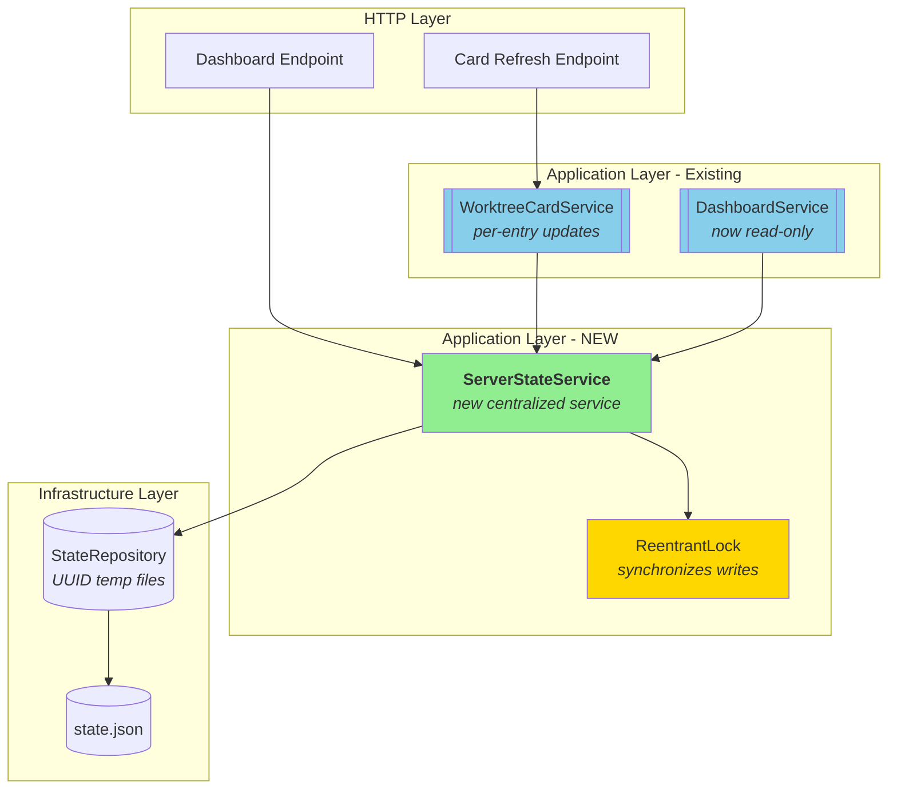
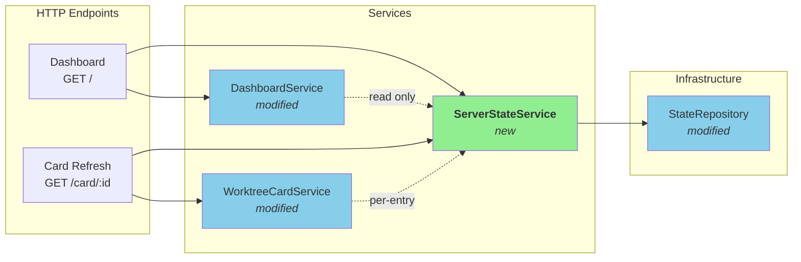
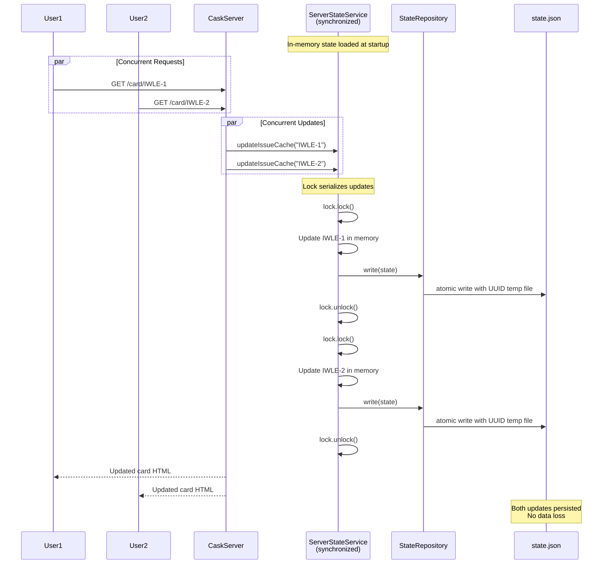

# Phase 6: State Management Refactoring

## Goals

This phase fixes critical race conditions in the dashboard server's state management that were causing file corruption and data loss under concurrent load.

Key objectives:
- Eliminate file corruption from concurrent writes to shared temp file
- Prevent data loss from non-atomic read-modify-write operations
- Fix design flaw where review state updates weren't visible via HTMX refresh
- Centralize state management with thread-safe synchronized access
- Implement per-entry cache updates instead of bulk replacement

## Scenarios

- [ ] Multiple concurrent HTMX card refreshes don't corrupt state.json
- [ ] Dashboard reload with multiple worktrees preserves all worktrees (no data loss)
- [ ] Review state updates appear immediately via HTMX card refresh without full page reload
- [ ] State persists correctly to disk after each mutation
- [ ] Concurrent state updates preserve all changes (no last-write-wins)
- [ ] Unique temp file names prevent collision during concurrent writes
- [ ] Dashboard rendering remains fast (< 100ms) with cached reads

## Entry Points

Start your review from these locations:

| File | Method/Class | Why Start Here |
|------|--------------|----------------|
| `.iw/core/ServerStateService.scala` | `ServerStateService` class | New centralized state management service with synchronized access and per-entry update API |
| `.iw/core/CaskServer.scala` | `dashboard()` endpoint | Entry point showing migration from direct repository access to ServerStateService |
| `.iw/core/StateRepository.scala` | `write()` | Fixed temp file naming with UUID to prevent concurrent write collisions |
| `.iw/core/WorktreeCardService.scala` | `renderCard()` | Per-card refresh now updates all relevant caches (issue, progress, PR, review state) |
| `.iw/core/test/ServerStateServiceTest.scala` | Concurrent test | Verifies thread safety with 20 concurrent threads updating state |

## Architecture Overview

This diagram shows how the state management architecture changed to eliminate race conditions.



**Key points for reviewer:**
- ServerStateService is the single source of truth for all state
- All writes go through synchronized lock (no concurrent modifications)
- Dashboard is now read-only (no state mutations during rendering)
- Per-card refresh updates individual cache entries (not bulk replacement)
- Unique temp file names (UUID) provide secondary protection against collisions

## Component Relationships



**Key changes:**
- ServerStateService introduced as centralized state manager
- Dashboard reads state but never writes
- Card refresh writes per-entry updates through ServerStateService
- All persistence goes through synchronized ServerStateService methods

## State Management Flow

This sequence diagram shows how concurrent card refreshes now safely update state.



**Critical design decisions:**
1. **In-memory state** - Single source of truth, eliminates read-modify-write races
2. **Synchronized writes** - ReentrantLock ensures serial updates
3. **Per-entry updates** - Only touched entries are updated, preserves other data
4. **UUID temp files** - Unique names prevent concurrent write collisions at filesystem level

## Test Summary

| Test | Type | Verifies |
|------|------|----------|
| `ServerStateServiceTest."initialize loads state from repository"` | Unit | Initialization loads existing state from disk |
| `ServerStateServiceTest."initialize creates empty state if file doesn't exist"` | Unit | Graceful handling of missing state file |
| `ServerStateServiceTest."updateWorktree adds new worktree"` | Unit | Adding new worktree updates in-memory state |
| `ServerStateServiceTest."updateWorktree removes worktree when function returns None"` | Unit | Removing worktree with None return value |
| `ServerStateServiceTest."updateWorktree persists changes"` | Unit | Updates are written to disk |
| `ServerStateServiceTest."updateIssueCache adds cache entry"` | Unit | Issue cache per-entry update |
| `ServerStateServiceTest."concurrent updates don't lose data"` | Integration | **CRITICAL**: 20 threads concurrently adding worktrees, all preserved |
| `ServerStateServiceTest."pruneWorktrees removes invalid worktrees"` | Unit | Pruning removes invalid entries and their caches |
| `ServerStateServiceTest."updateProgressCache adds progress"` | Unit | Progress cache per-entry update |
| `ServerStateServiceTest."updatePRCache adds PR data"` | Unit | PR cache per-entry update |
| `ServerStateServiceTest."updateReviewStateCache adds review state"` | Unit | Review state cache per-entry update |
| `StateRepositoryTest."write uses unique temp file"` | Unit | UUID-based temp file names prevent collisions |
| `DashboardServiceTest."renderDashboard is read-only"` | Unit | Dashboard doesn't modify state |

Coverage: 13 tests covering state management, concurrency safety, and per-entry updates

**Critical concurrency test:**
- Spawns 20 threads that simultaneously update state
- Verifies all 20 updates are preserved (no lost writes)
- Confirms persistence to disk contains all updates
- This directly tests the race condition fix

## Files Changed

**8 files** changed, +830 insertions, -352 deletions

<details>
<summary>Full file list</summary>

- `.iw/core/ServerStateService.scala` (M) +166 lines - **NEW centralized state service with lock**
- `.iw/core/test/ServerStateServiceTest.scala` (A) +313 lines - **NEW comprehensive test suite**
- `.iw/core/CaskServer.scala` (M) +129 -226 lines - Migrated to use ServerStateService
- `.iw/core/DashboardService.scala` (M) +17 -78 lines - Now read-only, no state writes
- `.iw/core/WorktreeCardService.scala` (M) +79 lines - Per-card refresh updates all caches
- `.iw/core/StateRepository.scala` (M) +15 -5 lines - UUID temp file names
- `.iw/core/test/StateRepositoryTest.scala` (M) +53 lines - Tests for unique temp files
- `.iw/core/test/DashboardServiceTest.scala` (M) +52 lines - Updated for read-only behavior
- `project-management/issues/IW-92/refactor-phase-06-R1.md` (M) - Refactoring decision doc

</details>

## Review Focus Areas

### 1. Thread Safety (CRITICAL)

**File:** `.iw/core/ServerStateService.scala`

Verify:
- All write operations acquire lock before modifying state
- Lock is released in `finally` blocks (no lock leaks)
- `@volatile` annotation on state field for safe reads
- No direct state field mutation outside synchronized blocks

**Test:** Look at `ServerStateServiceTest."concurrent updates don't lose data"` (line 174)
- 20 threads updating concurrently
- Verify all updates preserved

### 2. Per-Entry Cache Updates

**File:** `.iw/core/WorktreeCardService.scala`

Verify:
- `CardRenderResult` includes all cache types (issue, progress, PR, review state)
- Card refresh endpoint updates individual entries, not bulk replacement
- Review state cache now updates per-card (fixes HTMX visibility issue)

**Before:** Dashboard bulk-replaced reviewStateCache, HTMX refresh didn't see changes  
**After:** Per-card refresh updates specific entry in reviewStateCache

### 3. Dashboard Read-Only

**File:** `.iw/core/DashboardService.scala`

Verify:
- `renderDashboard()` return type changed from `(String, Map[...])` to `String`
- No state mutations in dashboard rendering
- No cache updates during dashboard load
- Review state read from cache only (no filesystem reads)

**Lines changed:** -62 lines (removed all cache update logic)

### 4. Unique Temp File Names

**File:** `.iw/core/StateRepository.scala`

Verify:
- Temp file name includes UUID: `state.json.tmp-{uuid}`
- `finally` block cleans up temp file on failure
- Atomic move still uses `REPLACE_EXISTING` and `ATOMIC_MOVE`

**Before:** `state.json.tmp` (shared, collision risk)  
**After:** `state.json.tmp-abc123...` (unique, no collision)

### 5. Migration Completeness

**File:** `.iw/core/CaskServer.scala`

Verify:
- ServerStateService initialized at startup
- All endpoints use `stateService.getState` (not direct repository reads)
- Worktree pruning uses `stateService.pruneWorktrees()`
- No direct `repository.write()` calls (all go through service)

**Pattern to check:**
```scala
// BAD (old way)
val state = repository.read()
repository.write(updatedState)

// GOOD (new way)
val state = stateService.getState
stateService.updateWorktree(issueId) { ... }
```

## Risk Areas

1. **Lock contention under high load**
   - Mitigation: Single-server CLI tool, expected low concurrency
   - Monitor: Dashboard response times should stay < 100ms

2. **State persistence failures**
   - Current: Best-effort writes, errors logged but not propagated
   - Review: Is this acceptable? Should we retry or alert?

3. **Memory vs disk sync**
   - In-memory state is source of truth
   - Disk write failures don't block operations
   - Risk: State loss if server crashes before write completes

## Performance Impact

**Expected:** Negligible to positive

- Dashboard reads are faster (no filesystem I/O for review state)
- Lock contention minimal (single-server, low request rate)
- Per-card updates more efficient (don't rewrite entire cache)

**Benchmark:** Dashboard load with 10 worktrees should stay < 100ms

## Breaking Changes

None. This is an internal refactoring. API and behavior unchanged from user perspective.

## Follow-up Work

Consider for future phases:
- [ ] Add retry logic for state persistence failures
- [ ] Add metrics/logging for lock contention duration
- [ ] Consider periodic background state checkpointing
- [ ] Evaluate if lock-free data structures could improve concurrency

