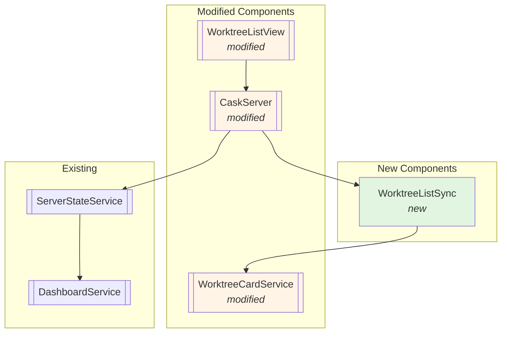
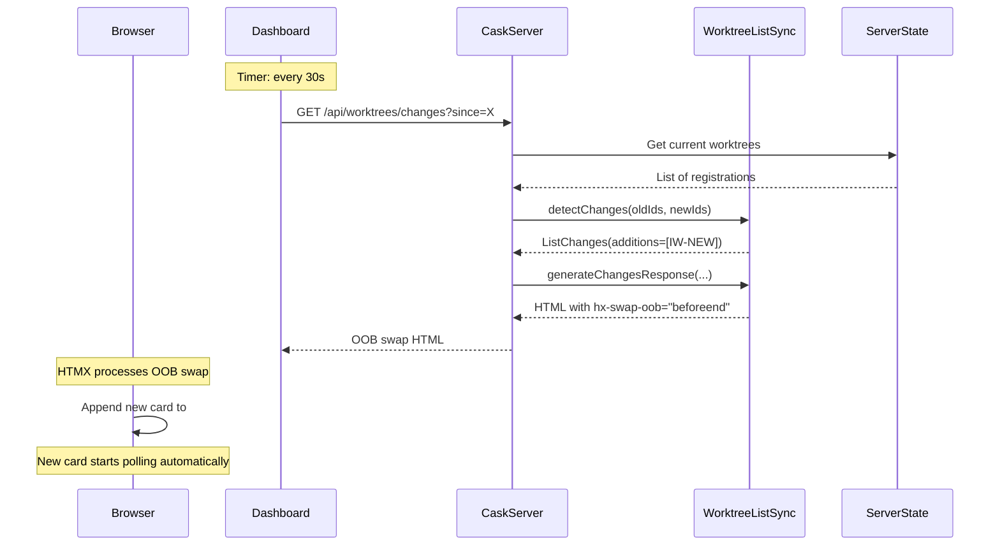
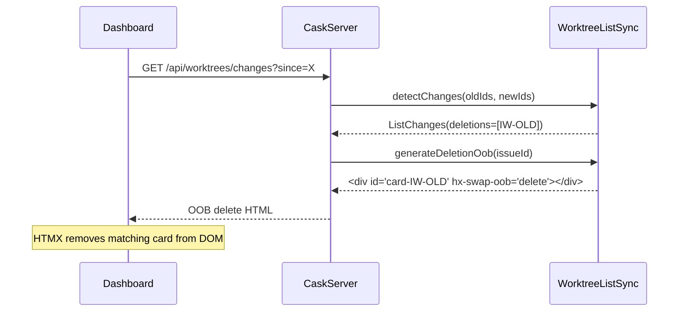

# Phase 7: Worktree List Synchronization

## Goals

This phase implements worktree list synchronization that enables the dashboard to detect when worktrees are added, removed, or should be reordered, and surgically update the DOM without replacing the entire list.

Key objectives:
- Detect additions, deletions, and reorders via server-side diff algorithm
- Use HTMX `hx-swap-oob` for surgical DOM updates (no full page refresh)
- Poll `/api/worktrees/changes` endpoint every 30 seconds
- New cards automatically inherit HTMX polling behavior from Phase 3
- Server-driven updates (HATEOAS) with no client-side JavaScript diffing

## Scenarios

- [ ] New worktree appears on dashboard within 30s of registration
- [ ] Removed worktree disappears from dashboard within 30s
- [ ] Worktrees reorder based on activity (most recent first)
- [ ] Existing cards remain unchanged during sync (no re-render)
- [ ] New cards start their own content polling automatically
- [ ] No JavaScript required for diff logic (server-driven)

## Entry Points

Start your review from these locations:

| File | Method/Class | Why Start Here |
|------|--------------|----------------|
| `.iw/core/WorktreeListSync.scala` | `detectChanges()` | Core diff algorithm for detecting additions, deletions, and reorders |
| `.iw/core/CaskServer.scala` | `worktreeChanges()` endpoint | HTTP entry point for polling worktree list changes |
| `.iw/core/WorktreeListView.scala` | Container div with polling | Dashboard integration - where HTMX polling is configured |

## Component Relationships



**Key points for reviewer:**
- `WorktreeListSync` is pure function logic - no side effects
- `CaskServer.worktreeChanges()` endpoint integrates sync logic at line 169
- `WorktreeListView` container has HTMX polling attributes (lines 36-39)
- Card IDs changed from `worktree-X` to `card-X` for OOB targeting

## Key Flows

### Worktree Addition Flow



### Worktree Deletion Flow



## Test Summary

| Test | Type | Verifies |
|------|------|----------|
| `WorktreeListSyncTest."detectChanges identifies new worktrees"` | Unit | Additions are correctly detected in diff |
| `WorktreeListSyncTest."detectChanges identifies removed worktrees"` | Unit | Deletions are correctly detected in diff |
| `WorktreeListSyncTest."detectChanges identifies order changes"` | Unit | Reorders are correctly detected when position changes |
| `WorktreeListSyncTest."detectChanges returns empty for identical lists"` | Unit | No false positives when lists match |
| `WorktreeListSyncTest."detectChanges handles empty old list"` | Unit | Initial load treated as all additions |
| `WorktreeListSyncTest."detectChanges handles empty new list"` | Unit | Full cleanup treated as all deletions |
| `WorktreeListSyncTest."detectChanges handles mixed changes"` | Unit | Combined add/delete/reorder scenarios |
| `WorktreeListSyncTest."generateAdditionOob includes hx-swap-oob"` | Unit | Addition OOB has correct HTMX attributes |
| `WorktreeListSyncTest."generateDeletionOob includes delete attribute"` | Unit | Deletion OOB has hx-swap-oob="delete" |
| `WorktreeListSyncTest."generateReorderOob generates delete + add"` | Unit | Reorder produces both delete and positional add |
| `WorktreeListSyncTest."generateChangesResponse combines all OOB swaps"` | Unit | Full response correctly combines multiple changes |
| `WorktreeListSyncTest."generateChangesResponse returns empty for no changes"` | Unit | Empty response when no changes detected |
| `WorktreeCardServiceTest."renderFullCard includes card ID"` | Unit | Card ID format changed to `card-X` |

Coverage: 12 unit tests covering diff detection and OOB generation logic

## Architecture Decisions

### HTMX hx-swap-oob Pattern

This phase uses HTMX's out-of-band (OOB) swap feature for surgical DOM updates:

- **Main response ignored**: `hx-swap="none"` on polling trigger
- **OOB elements processed**: Server includes elements with `hx-swap-oob` attribute
- **Targeted updates**: Each OOB element specifies its target and swap strategy

**Addition example:**
```html
<div id="card-IW-123" hx-swap-oob="beforeend:#worktree-list">
  <!-- Full card HTML with HTMX polling attributes -->
</div>
```

**Deletion example:**
```html
<div id="card-IW-123" hx-swap-oob="delete"></div>
```

**Reorder example:**
```html
<div id="card-IW-123" hx-swap-oob="delete"></div>
<div id="card-IW-123" hx-swap-oob="afterbegin:#worktree-list">
  <!-- Full card HTML - moves to top -->
</div>
```

### Card ID Convention

Changed from `worktree-{issueId}` to `card-{issueId}` for clarity:
- More semantic: These are cards in a list, not the worktrees themselves
- Avoids confusion with worktree path references
- Consistent with OOB targeting strategy

### Diff Algorithm

The `detectChanges()` algorithm:
1. **Additions**: Items in new list but not in old set
2. **Deletions**: Items in old list but not in new set
3. **Reorders**: Items in both lists that changed absolute position

**Important**: Reorders detect ANY position change, not just moves to top. This ensures correct ordering is maintained even for complex scenarios.

### Polling Strategy

- **Interval**: 30 seconds (matches card content polling from Phase 3)
- **Initial state**: `since=0` triggers full list as additions on first poll
- **State tracking**: Server returns `X-Worktree-Timestamp` header for next poll
- **TODO**: Current implementation doesn't track state changes with timestamps (Phase 7 limitation)

## Known Limitations

1. **State tracking not yet implemented**: The `worktreeChanges` endpoint currently only handles `since=0` (initial load). Subsequent polls return empty responses. Full state tracking with timestamps is marked as TODO at line 218 of `CaskServer.scala`.

2. **Reorder logic always moves to top**: The `generateReorderOob()` method always uses `position=0`, moving reordered items to the top. This matches "most recent first" sorting but isn't flexible for other orderings.

3. **No SSE support**: Using polling instead of Server-Sent Events. 30-second delay is acceptable but not real-time.

## Files Changed

**6 files** changed, +615 new lines, +70 insertions, -6 deletions

<details>
<summary>Full file list</summary>

- `.iw/core/WorktreeListSync.scala` (A) +427 lines - Core sync logic
- `.iw/core/test/WorktreeListSyncTest.scala` (A) +190 lines - Sync tests
- `.iw/core/CaskServer.scala` (M) +60 lines - Added changes endpoint
- `.iw/core/WorktreeListView.scala` (M) +7 -3 lines - Added polling attributes, fixed card IDs
- `.iw/core/WorktreeCardService.scala` (M) +2 -2 lines - Changed card IDs
- `.iw/core/test/WorktreeCardServiceTest.scala` (M) +1 -1 lines - Fixed test for new card ID

</details>

## Review Checklist

Before approving, verify:

- [ ] `detectChanges()` correctly handles all edge cases (empty lists, mixed changes)
- [ ] OOB HTML includes correct `hx-swap-oob` attributes for each change type
- [ ] Card IDs are consistent across all files (`card-{issueId}`)
- [ ] Dashboard container has polling attributes (`hx-get`, `hx-trigger`, `hx-swap="none"`)
- [ ] New cards inherit HTMX polling from Phase 3 (check `hx-trigger="every 30s"`)
- [ ] All 12 unit tests pass
- [ ] Existing Phase 1-6 functionality preserved (no breaking changes)
- [ ] State tracking TODO is documented for future work

