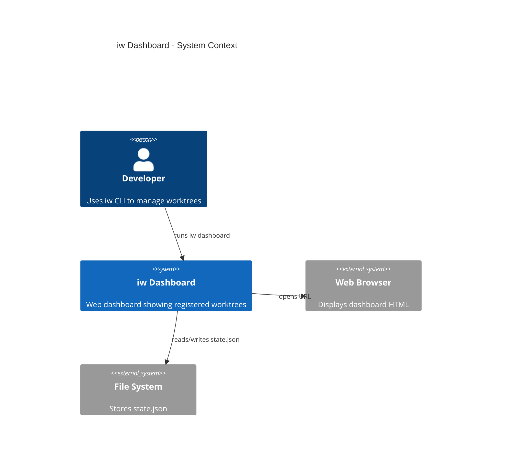
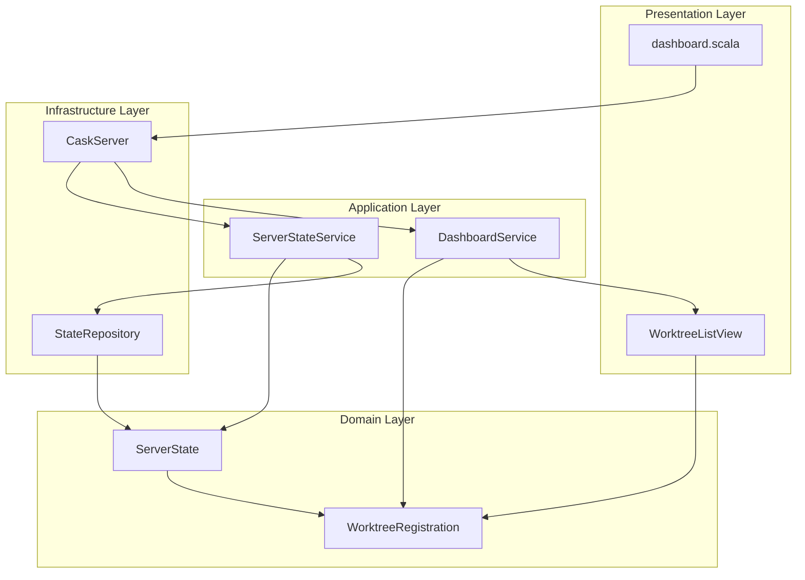
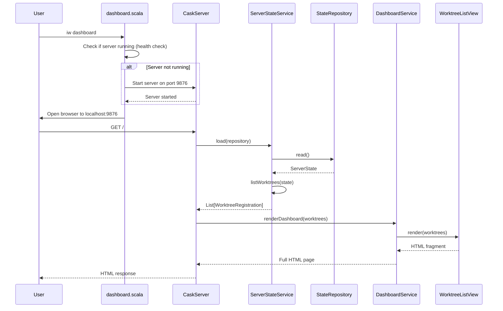
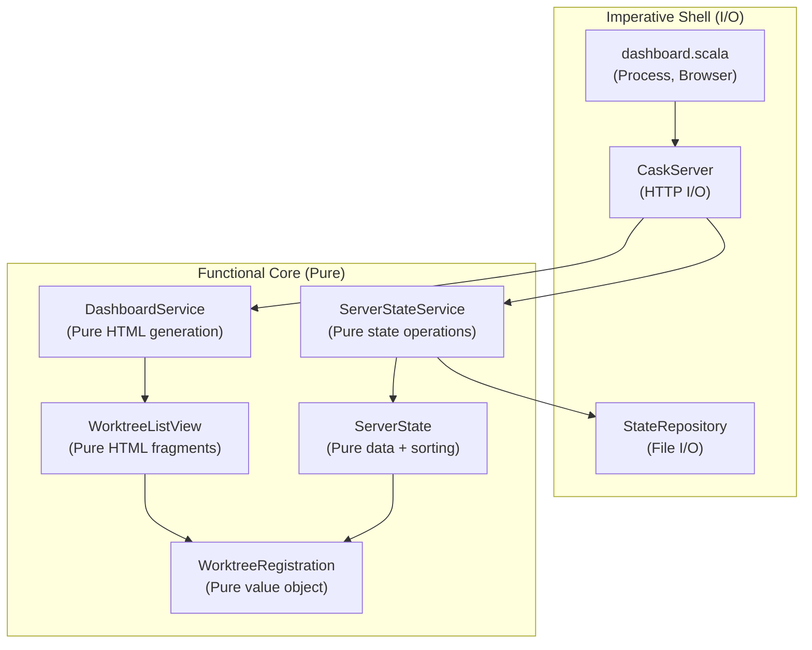

# Review Packet: Phase 1 - View basic dashboard with registered worktrees

**Issue:** IWLE-100
**Phase:** 1 of 7
**Branch:** IWLE-100-phase-01

## Goals

This phase establishes the **foundation** for the server dashboard feature:

1. **HTTP Server Infrastructure**: Set up Cask HTTP server that starts, serves routes, and responds to requests
2. **State Persistence**: Implement JSON-based state storage at `~/.local/share/iw/server/state.json`
3. **Basic Dashboard UI**: Create HTML dashboard using Scalatags that displays registered worktrees
4. **CLI Command**: Add `iw dashboard` command that opens the dashboard in a browser
5. **Health Check**: Provide `/health` endpoint for server readiness verification

**Success Criteria:** Developer can run `iw dashboard`, see a browser open to `localhost:9876`, and view a list of registered worktrees with basic information (issue ID, title placeholder, last activity).

## Scenarios

- [ ] Scenario 1: Dashboard shows registered worktrees with basic information
- [ ] Scenario 2: `iw dashboard` command starts server on port 9876 if not running
- [ ] Scenario 3: `iw dashboard` command opens browser to `http://localhost:9876`
- [ ] Scenario 4: Dashboard page loads and displays HTML with worktree cards
- [ ] Scenario 5: Each worktree card shows issue ID, title placeholder, and last activity timestamp
- [ ] Scenario 6: Worktrees are sorted by most recent activity first
- [ ] Scenario 7: `GET /health` endpoint returns 200 OK with JSON response `{"status":"ok"}`
- [ ] Scenario 8: State file is created at `~/.local/share/iw/server/state.json` if missing
- [ ] Scenario 9: Manual edits to state.json persist and display on dashboard refresh

## Entry Points

| File | Method/Class | Why Start Here |
|------|--------------|----------------|
| `.iw/commands/dashboard.scala` | `dashboard()` | CLI entry point - starts server and opens browser |
| `.iw/core/CaskServer.scala` | `CaskServer` class | HTTP server with routes `/` and `/health` |
| `.iw/core/DashboardService.scala` | `renderDashboard()` | Application service that generates full HTML page |
| `.iw/core/StateRepository.scala` | `StateRepository` | Infrastructure layer for JSON state persistence |
| `.iw/core/WorktreeRegistration.scala` | `WorktreeRegistration` | Core domain model - start here to understand data structure |

## Diagrams

### Architecture Overview (Context Diagram)

### Component Relationships

### Request Flow (Sequence Diagram)

### Layer Diagram (Functional Core / Imperative Shell)

## Test Summary

| Test | Type | Verifies |
|------|------|----------|
| `WorktreeRegistrationTest."creation with all fields"` | Unit | WorktreeRegistration stores all fields correctly |
| `WorktreeRegistrationTest."rejects empty issue ID"` | Unit | Validation prevents empty issue IDs |
| `ServerStateTest."empty worktrees map"` | Unit | Empty state returns empty list |
| `ServerStateTest."listByActivity sorting"` | Unit | Worktrees sorted by lastSeenAt descending |
| `ServerStateTest."single worktree"` | Unit | Single worktree list works correctly |
| `StateRepositoryTest."non-existent file returns empty"` | Integration | Missing file creates empty state |
| `StateRepositoryTest."write then read roundtrip"` | Integration | JSON serialization preserves all fields |
| `StateRepositoryTest."atomic writes"` | Integration | No .tmp file left after write |
| `StateRepositoryTest."malformed JSON handling"` | Integration | Graceful error for invalid JSON |

## Files Changed

**13 files changed** (all new files except project.scala modification)

Full file list

**Modified:**
- `.iw/core/project.scala` - Added Cask 0.9.4 and Scalatags 0.13.1 dependencies

**Added - Domain Layer:**
- `.iw/core/WorktreeRegistration.scala` - Value object with validation
- `.iw/core/ServerState.scala` - State model with activity sorting

**Added - Infrastructure Layer:**
- `.iw/core/StateRepository.scala` - JSON persistence with atomic writes
- `.iw/core/CaskServer.scala` - HTTP server with `/` and `/health` routes

**Added - Application Layer:**
- `.iw/core/ServerStateService.scala` - State management coordination
- `.iw/core/DashboardService.scala` - Full HTML page generation

**Added - Presentation Layer:**
- `.iw/core/WorktreeListView.scala` - Scalatags worktree cards with relative timestamps
- `.iw/commands/dashboard.scala` - CLI command with health checks and browser opening

**Added - Tests:**
- `.iw/core/test/WorktreeRegistrationTest.scala` - Domain model tests
- `.iw/core/test/ServerStateTest.scala` - State sorting tests
- `.iw/core/test/StateRepositoryTest.scala` - Persistence tests

**Added - Documentation:**
- `project-management/issues/IWLE-100/phase-01-tasks.md` - Task tracking

## Key Design Decisions

1. **Port 9876 hardcoded** for Phase 1 - will be configurable in Phase 3
2. **Issue titles show placeholder** "Issue title not yet loaded" - Phase 4 will fetch from tracker
3. **Functional Core / Imperative Shell** - Domain and Application layers are pure (no I/O)
4. **Atomic writes** - State file uses tmp file + rename to prevent corruption
5. **Platform-agnostic browser opening** - Detects macOS (`open`), Linux (`xdg-open`), Windows (`cmd /c start`)

## Review Checklist

- [ ] Domain models (`WorktreeRegistration`, `ServerState`) are pure value objects
- [ ] Application services have no side effects
- [ ] Infrastructure layer properly handles errors with `Either`
- [ ] Atomic writes implemented correctly (tmp file + rename)
- [ ] All files have PURPOSE comments
- [ ] Unit tests cover edge cases (empty state, validation, sorting)
- [ ] Integration tests verify JSON roundtrip
