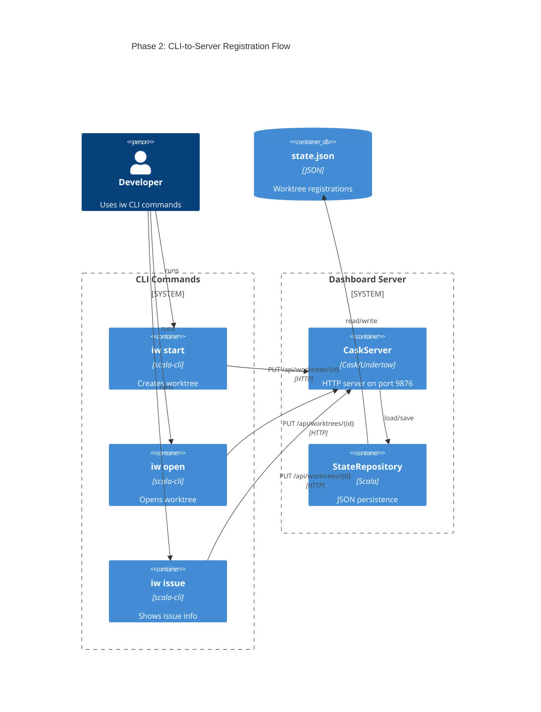
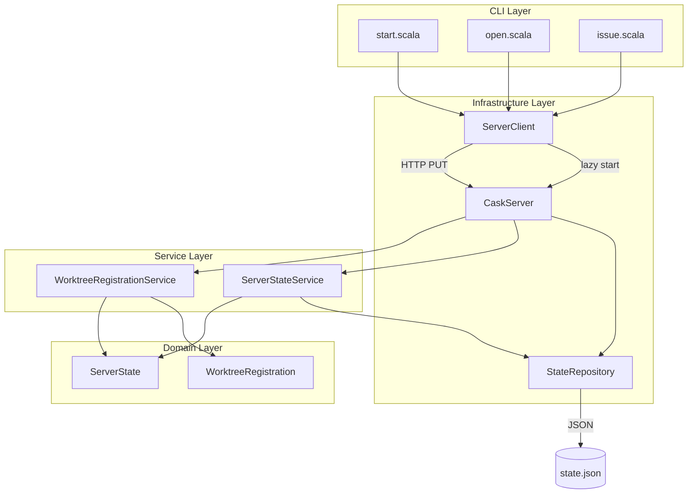
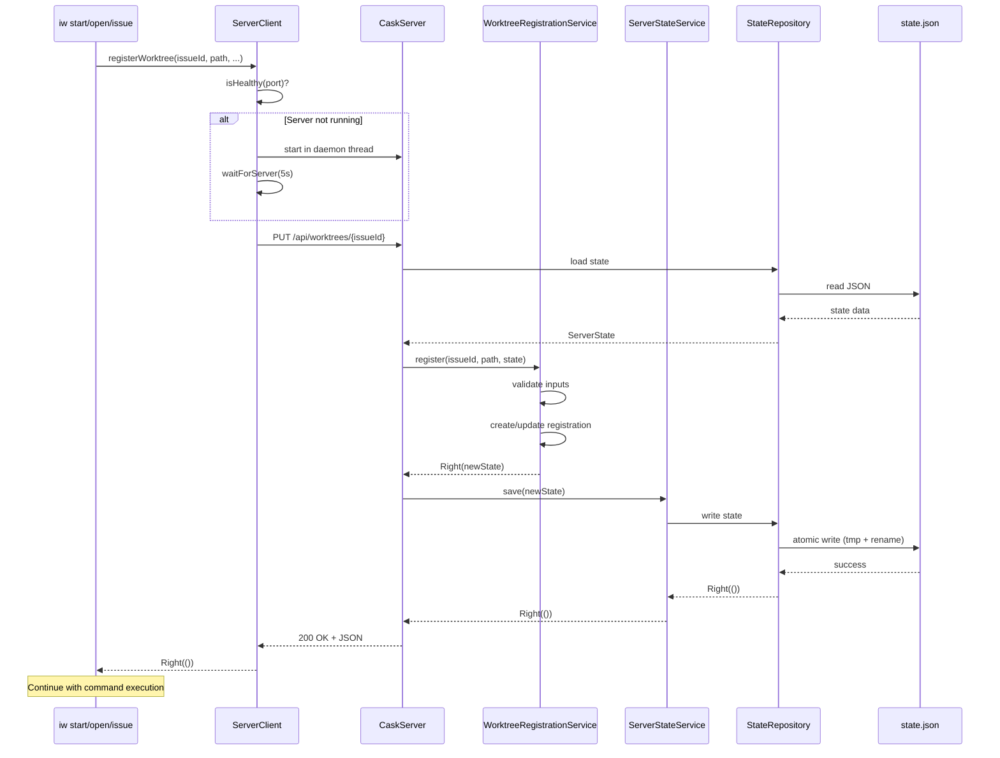
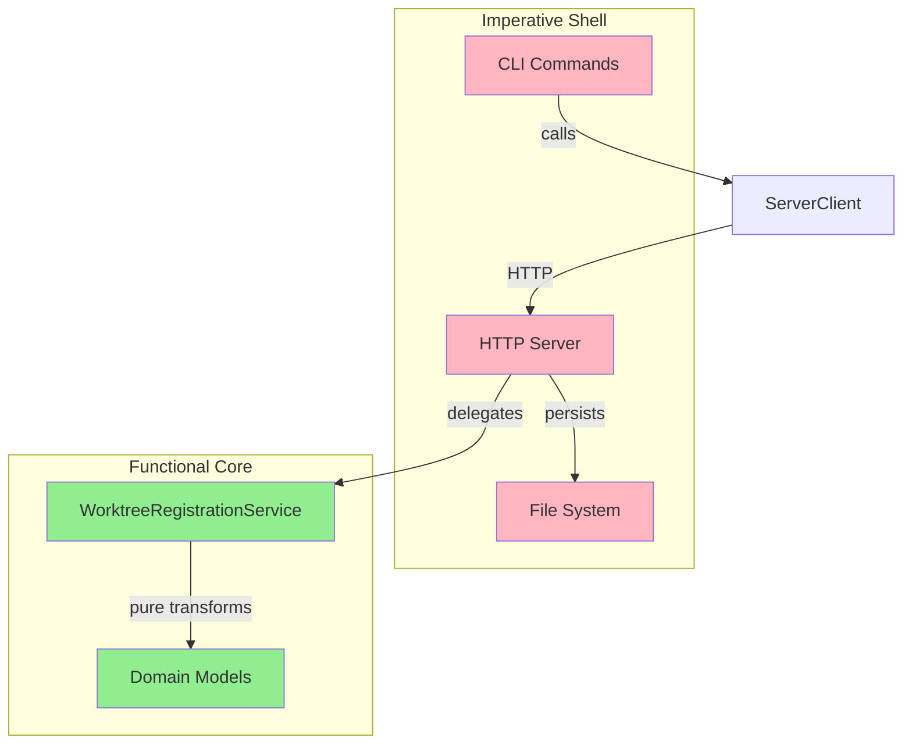

# Review Packet: Phase 2 - Automatic Worktree Registration

**Issue:** IWLE-100
**Phase:** 2 of 7
**Branch:** `IWLE-100-phase-02`

---

## Goals

This phase makes the dashboard feature usable in normal workflow by implementing automatic worktree registration. The objectives are:

1. **Server registration endpoint**: Add `PUT /api/worktrees/{issueId}` to register/update worktrees
2. **HTTP client for CLI commands**: Create `ServerClient` for CLI-to-server communication
3. **Auto-registration in `iw start`**: Register new worktrees after successful creation
4. **Auto-registration in `iw open`**: Register/update existing worktrees when opened
5. **Update timestamp in `iw issue`**: Refresh `lastSeenAt` timestamp for current worktree
6. **Best-effort registration**: Failures must not break CLI command functionality
7. **Lazy server start**: If server isn't running, trigger auto-start before registration

After this phase, developers will have worktrees automatically appear on the dashboard without manual API calls.

---

## Scenarios

- [ ] Creating a worktree with `iw start` registers it automatically with the dashboard
- [ ] Opening a worktree with `iw open` updates its lastSeenAt timestamp
- [ ] Running `iw issue` updates the current worktree's lastSeenAt timestamp
- [ ] Registration failure shows warning but does not break the CLI command
- [ ] Server auto-starts if not running when registration is attempted
- [ ] PUT endpoint creates new registration if worktree doesn't exist
- [ ] PUT endpoint updates existing registration (upsert semantics)
- [ ] PUT endpoint preserves `registeredAt` timestamp on updates

---

## Entry Points

| File | Method/Class | Why Start Here |
|------|--------------|----------------|
| `.iw/core/WorktreeRegistrationService.scala` | `WorktreeRegistrationService.register` | Pure business logic - no I/O, easy to understand domain rules |
| `.iw/core/CaskServer.scala` | `registerWorktree` (PUT endpoint) | HTTP entry point - orchestrates registration flow |
| `.iw/core/ServerClient.scala` | `ServerClient.registerWorktree` | CLI-to-server communication - shows lazy start pattern |
| `.iw/commands/start.scala` | `createWorktreeForIssue` | Primary integration point - see registration in context |
| `.iw/core/test/WorktreeRegistrationServiceTest.scala` | Test suite | Verify expected behavior through test cases |

---

## Diagrams

### Architecture Overview



### Component Relationships



### Registration Flow Sequence



### Layer Architecture (FCIS)



---

## Test Summary

| Test | Type | Verifies |
|------|------|----------|
| `register creates new WorktreeRegistration with current timestamp` | Unit | New registration gets both timestamps set to now |
| `register adds WorktreeRegistration to ServerState.worktrees map` | Unit | Registration is stored in state |
| `register returns Right with new ServerState on success` | Unit | Success returns new immutable state |
| `register updates existing worktree's lastSeenAt timestamp` | Unit | Update refreshes lastSeenAt |
| `register preserves registeredAt timestamp on update` | Unit | Original registration time preserved |
| `register updates path/trackerType/team if changed` | Unit | Upsert updates all mutable fields |
| `register returns Left for invalid issue ID format` | Unit | Validation rejects empty issueId |
| `register returns Left for empty path` | Unit | Validation rejects empty path |
| `register returns Left for invalid tracker type` | Unit | Validation rejects empty trackerType |
| `updateLastSeen updates timestamp for existing worktree` | Unit | Timestamp-only update works |
| `updateLastSeen returns Left for non-existent worktree` | Unit | Error for missing registration |
| `updateLastSeen preserves all other fields unchanged` | Unit | Only lastSeenAt changes |
| `PUT /api/worktrees/{issueId} registers new worktree` | Integration | End-to-end registration via HTTP |
| `PUT /api/worktrees/{issueId} updates existing worktree` | Integration | Upsert semantics via HTTP |
| `PUT /api/worktrees/{issueId} returns 400 for malformed JSON` | Integration | Error handling for bad input |
| `PUT /api/worktrees/{issueId} returns 400 for missing fields` | Integration | Validation via HTTP |
| `PUT /api/worktrees/{issueId} returns 400 for invalid issueId` | Integration | Route validation |

---

## Files Changed

**8 files changed**, approximately **+600 insertions**

<details>
<summary>Full file list</summary>

**New Files (4):**
- `.iw/core/WorktreeRegistrationService.scala` - Pure business logic for registration
- `.iw/core/ServerClient.scala` - HTTP client with lazy server start
- `.iw/core/test/WorktreeRegistrationServiceTest.scala` - 12 unit tests
- `.iw/core/test/CaskServerTest.scala` - 5 integration tests

**Modified Files (4):**
- `.iw/core/CaskServer.scala` - Added PUT endpoint
- `.iw/commands/start.scala` - Added registration call after worktree creation
- `.iw/commands/open.scala` - Added updateLastSeen call at entry
- `.iw/commands/issue.scala` - Added updateLastSeen call at completion

</details>

---

## Key Implementation Details

### Best-Effort Registration Pattern

All CLI commands use this pattern for registration:

```scala
ServerClient.registerWorktree(...) match
  case Left(error) =>
    Output.warn(s"Failed to register worktree: $error")
  case Right(_) =>
    () // Silent success
```

Registration failures never change the command's exit code or prevent its primary function.

### Lazy Server Start

`ServerClient.ensureServerRunning` checks health first, then starts server in daemon thread if needed:

```scala
if isHealthy(port) then Right(())
else
  val serverThread = new Thread(() => CaskServer.start(...))
  serverThread.setDaemon(true)
  serverThread.start()
  if waitForServer(port, 5) then Right(())
  else Left("Server failed to start")
```

### Upsert Semantics

`WorktreeRegistrationService.register` handles both create and update:
- **New worktree**: Sets both `registeredAt` and `lastSeenAt` to now
- **Existing worktree**: Preserves `registeredAt`, updates all other fields including `lastSeenAt`

---

## Review Focus Areas

1. **Error Handling**: Verify all error paths return `Either`, no exceptions escape
2. **Best-Effort Philosophy**: Confirm registration failures don't break CLI commands
3. **Lazy Start**: Review daemon thread pattern for safety
4. **HTTP Client**: Compare with `LinearClient` pattern for consistency
5. **State Persistence**: Atomic writes via tmp + rename

---

**Ready for Review**
