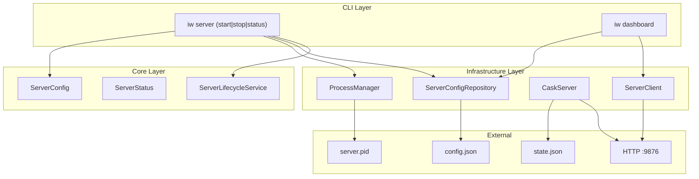
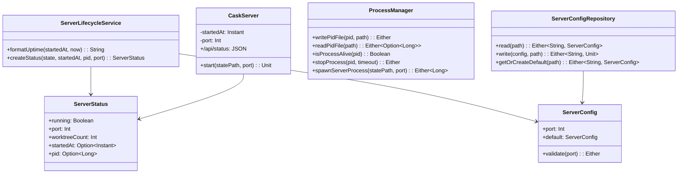
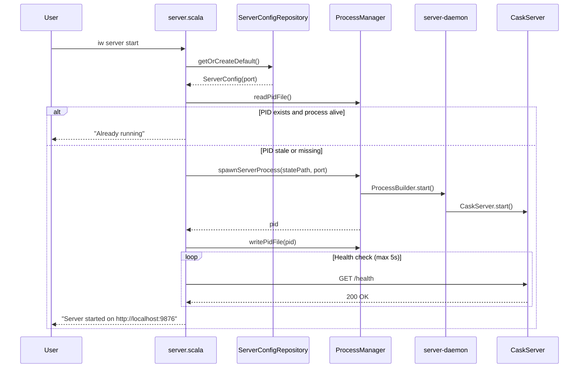
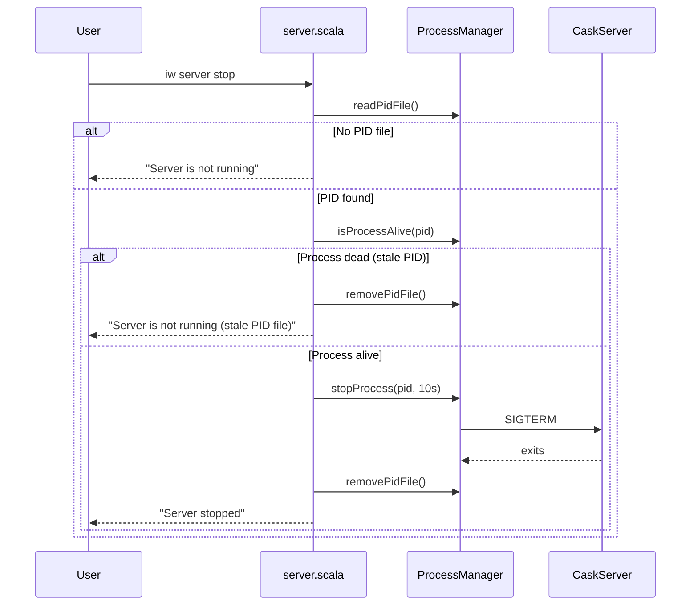
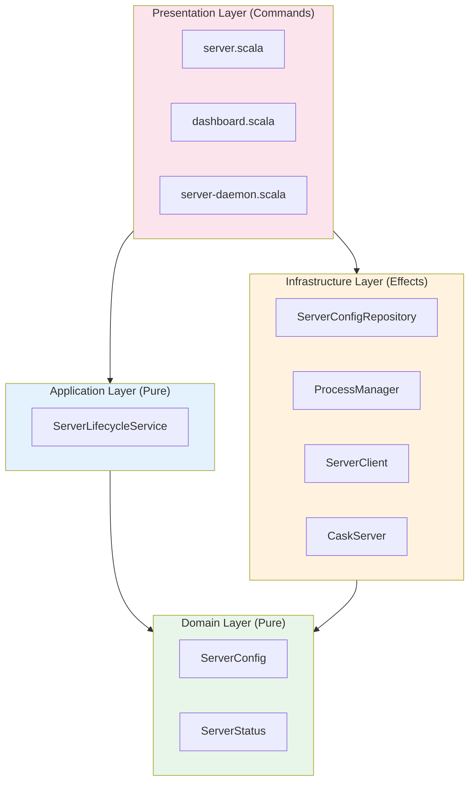

# Review Packet: Phase 3 - Server lifecycle management

**Issue:** IWLE-100
**Phase:** 3 of 7
**Story:** Story 6 - Server lifecycle management

## Goals

This phase solidifies the infrastructure by adding explicit control over the dashboard server lifecycle:

1. **Explicit server control**: Add `iw server start`, `iw server stop`, and `iw server status` commands
2. **Background daemon mode**: Server runs as a background process with PID file tracking
3. **Process management**: Spawn background process, manage PID file, detect running state
4. **Health check integration**: Verify server is responding before declaring success
5. **Graceful shutdown**: Clean shutdown that removes PID file and terminates process
6. **Port configuration**: Move from hardcoded port to config file at `~/.local/share/iw/server/config.json`
7. **Status reporting**: Show server state, port, worktree count, uptime

## Scenarios

- [ ] User runs `iw server start` and server starts in background with PID file
- [ ] User runs `iw server start` again and gets "already running" error
- [ ] User runs `iw server stop` and server shuts down gracefully
- [ ] User runs `iw server stop` when not running and gets "not running" message
- [ ] User runs `iw server status` and sees port, worktree count, uptime, PID
- [ ] User runs `iw server status` when stopped and sees "not running"
- [ ] User runs `iw dashboard` and auto-start uses configured port
- [ ] User creates custom port config and server uses that port
- [ ] Stale PID file is detected and handled (allows new server start)
- [ ] `GET /api/status` endpoint returns JSON with server runtime info

## Entry Points

| File | Method/Class | Why Start Here |
|------|--------------|----------------|
| `.iw/commands/server.scala` | `main()` | CLI entry point with start/stop/status subcommands |
| `.iw/core/ProcessManager.scala` | `ProcessManager` | Core process lifecycle: spawn, stop, PID management |
| `.iw/core/ServerConfigRepository.scala` | `ServerConfigRepository` | Port configuration persistence |
| `.iw/core/CaskServer.scala` | `@cask.get("/api/status")` | New status endpoint for runtime info |
| `.iw/core/ServerLifecycleService.scala` | `ServerLifecycleService` | Pure business logic for uptime formatting |

## Diagrams

### Architecture Overview

### Component Relationships

### Server Start Flow

### Server Stop Flow

### Layer Architecture (FCIS)

## Test Summary

| Test | Type | Verifies |
|------|------|----------|
| `ServerConfigTest."Valid port numbers parse correctly"` | Unit | Port validation accepts 1024-65535 |
| `ServerConfigTest."Invalid port 0 fails validation"` | Unit | Port 0 rejected |
| `ServerConfigTest."Invalid port 70000 fails validation"` | Unit | Port above 65535 rejected |
| `ServerConfigTest."Port below 1024 fails validation"` | Unit | Privileged ports rejected |
| `ServerConfigRepositoryTest."Write config file and read back"` | Integration | Config persistence round-trip |
| `ServerConfigRepositoryTest."Create default config if file missing"` | Integration | Default config with port 9876 |
| `ServerConfigRepositoryTest."Handle invalid JSON in config file"` | Integration | Graceful error handling |
| `ServerConfigRepositoryTest."Handle missing parent directory"` | Integration | Directory creation |
| `ServerStatusTest."Create ServerStatus with all fields"` | Unit | Status model construction |
| `ServerStatusTest."ServerStatus JSON serialization"` | Unit | Upickle serialization |
| `ServerLifecycleServiceTest."Format uptime for seconds only"` | Unit | "45s" format |
| `ServerLifecycleServiceTest."Format uptime for minutes and seconds"` | Unit | "5m 12s" format |
| `ServerLifecycleServiceTest."Format uptime for hours and minutes"` | Unit | "2h 34m" format |
| `ServerLifecycleServiceTest."Format uptime for days"` | Unit | "1d 1h" format |
| `ServerLifecycleServiceTest."Create status for running server"` | Unit | Status creation from state |
| `ProcessManagerTest."Write PID file and read back"` | Integration | PID file round-trip |
| `ProcessManagerTest."Check if current process is alive"` | Integration | ProcessHandle.isAlive() |
| `ProcessManagerTest."Detect process is not alive for invalid PID"` | Integration | Invalid PID detection |
| `ProcessManagerTest."Read non-existent PID file returns None"` | Integration | Missing file handling |
| `ProcessManagerTest."Remove PID file after write"` | Integration | PID cleanup |
| `ProcessManagerTest."Handle malformed PID file content"` | Integration | Error for non-numeric content |
| `CaskServerTest."GET /api/status returns 200 OK with status JSON"` | Integration | Status endpoint works |
| `CaskServerTest."GET /api/status shows correct worktree count"` | Integration | Worktree count in status |
| `CaskServerTest."GET /api/status startedAt is recent"` | Integration | Timestamp accuracy |

**Test Counts:**
- Unit tests: 14 tests
- Integration tests: 21 tests
- Total: 35 new tests

## Files Changed

**12 files changed** (11 new, 4 modified)

Full file list

**New Files:**
- `.iw/commands/server.scala` (A) - CLI with start/stop/status subcommands
- `.iw/commands/server-daemon.scala` (A) - Background server entry point
- `.iw/core/ServerConfig.scala` (A) - Port configuration domain model
- `.iw/core/ServerConfigRepository.scala` (A) - Config file persistence
- `.iw/core/ServerStatus.scala` (A) - Server status domain model
- `.iw/core/ServerLifecycleService.scala` (A) - Pure lifecycle business logic
- `.iw/core/ProcessManager.scala` (A) - Process spawning and PID management
- `.iw/core/test/ServerConfigTest.scala` (A) - 7 unit tests
- `.iw/core/test/ServerConfigRepositoryTest.scala` (A) - 8 integration tests
- `.iw/core/test/ServerStatusTest.scala` (A) - 3 unit tests
- `.iw/core/test/ServerLifecycleServiceTest.scala` (A) - 8 unit tests
- `.iw/core/test/ProcessManagerTest.scala` (A) - 9 integration tests

**Modified Files:**
- `.iw/core/CaskServer.scala` (M) - Added `startedAt`, `port`, `/api/status` endpoint
- `.iw/core/ServerClient.scala` (M) - Reads port from config file
- `.iw/commands/dashboard.scala` (M) - Uses config file for port
- `.iw/core/test/CaskServerTest.scala` (M) - Added 3 tests for status endpoint

## Review Checklist

Before approving, verify:

- [ ] All hardcoded port 9876 references removed (except as default in config creation)
- [ ] PID file cleanup happens in all shutdown paths (graceful stop, error cases)
- [ ] Health checks use configured port, not hardcoded
- [ ] Error messages are user-friendly and actionable
- [ ] Process spawning redirects stdout/stderr appropriately (not lost)
- [ ] Stale PID detection works correctly (doesn't prevent start)
- [ ] FCIS pattern maintained (pure domain/application, effects in infrastructure)
- [ ] Unit tests cover edge cases (invalid port, missing config, stale PID)
- [ ] Integration tests clean up resources (no orphaned processes or files)
