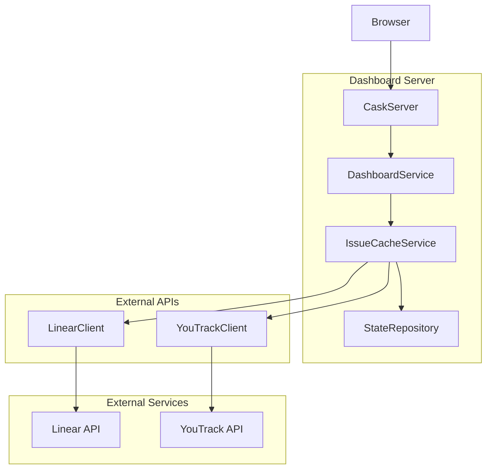
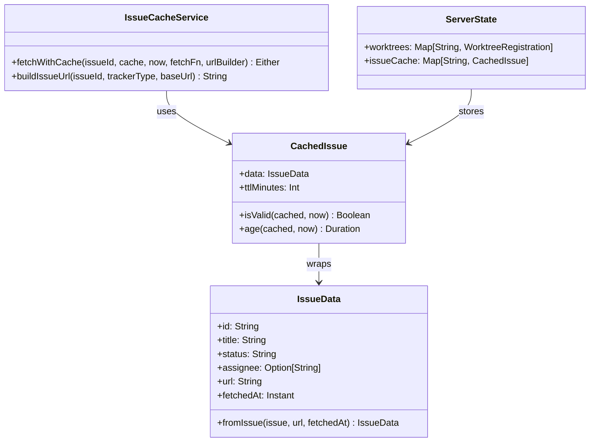
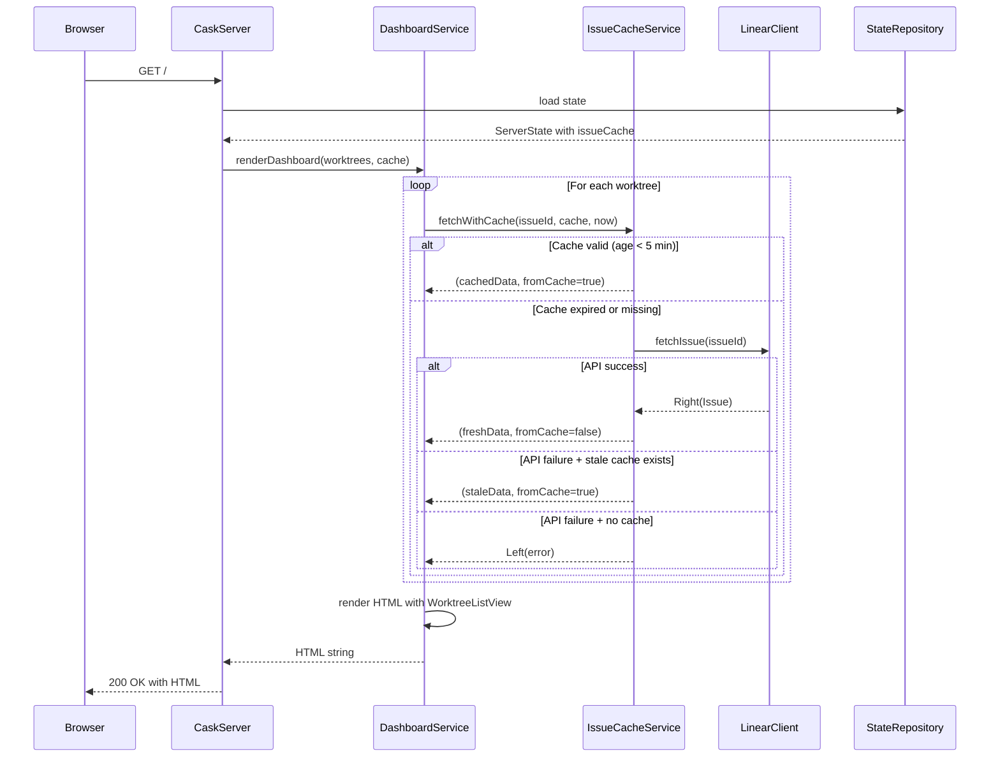
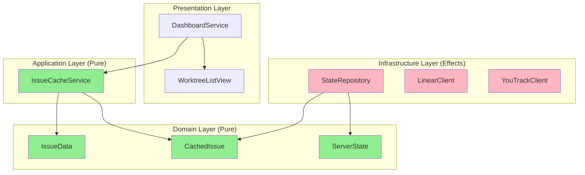

# Review Packet: Phase 4 - Show Issue Details and Status from Tracker

**Issue:** IWLE-100
**Phase:** 4 of 7
**Branch:** IWLE-100-phase-04

## Goals

This phase adds issue tracker integration to the dashboard, displaying real issue data from Linear/YouTrack instead of placeholders. The primary objectives are:

1. **Issue data fetching**: Retrieve issue details (title, status, assignee, URL) from Linear/YouTrack APIs
2. **Cache management**: Implement TTL-based caching (5 minutes) to avoid excessive API calls
3. **Dashboard enhancement**: Update worktree cards to show issue title, status badge, and tracker link
4. **Graceful degradation**: Handle API failures by showing stale cache with warning
5. **Cache timestamp display**: Show "cached Xm ago" indicator for transparency

After this phase, developers will see actual issue information on the dashboard, providing better context for each worktree.

---

## Scenarios

- [ ] **Scenario 1: Fresh issue data displayed** - Dashboard shows issue title fetched from Linear/YouTrack API with status badge and assignee
- [ ] **Scenario 2: Cached data used** - When cache is valid (< 5 min old), cached data is shown without API call, with "cached Xm ago" indicator
- [ ] **Scenario 3: Cache refresh after TTL** - When cache expires (≥ 5 min old), fresh data is fetched from API
- [ ] **Scenario 4: Stale cache on API failure** - When API fails but stale cache exists, stale data is shown (graceful degradation)
- [ ] **Scenario 5: Error on no cache and API failure** - When no cache and API fails, "Issue data unavailable" is shown
- [ ] **Scenario 6: Clickable issue links** - Issue IDs are clickable links to Linear/YouTrack issue pages
- [ ] **Scenario 7: Status badge color coding** - Status badges are color-coded (yellow=in-progress, green=done, red=blocked)
- [ ] **Scenario 8: Mixed trackers** - Dashboard handles worktrees with different tracker types (Linear + YouTrack)

---

## Entry Points

| File | Method/Class | Why Start Here |
|------|--------------|----------------|
| `.iw/core/IssueCacheService.scala` | `IssueCacheService.fetchWithCache()` | **Core business logic** - Pure function implementing cache-aware fetching with TTL validation and stale fallback |
| `.iw/core/DashboardService.scala` | `DashboardService.renderDashboard()` | **Orchestration layer** - Integrates issue fetching with dashboard rendering |
| `.iw/core/IssueData.scala` | `IssueData` case class | **Domain model** - Extended issue model with URL and fetch timestamp |
| `.iw/core/CachedIssue.scala` | `CachedIssue.isValid()` | **TTL validation** - Pure function checking cache validity against TTL |
| `.iw/core/WorktreeListView.scala` | `WorktreeListView.renderWorktreeCard()` | **Presentation** - HTML rendering of worktree cards with issue details |

---

## Diagrams

### Architecture Overview (Context)

### Component Relationships

### Cache Flow (Sequence)

### Layer Diagram (FCIS)

---

## Test Summary

| Test | Type | Verifies |
|------|------|----------|
| `IssueDataTest."fromIssue creates IssueData with correct url and timestamp"` | Unit | Factory method preserves URL and timestamp |
| `IssueDataTest."fromIssue preserves all Issue fields"` | Unit | All Issue fields mapped correctly |
| `IssueDataTest."fromIssue handles None assignee"` | Unit | Optional fields handled |
| `CachedIssueTest."isValid returns true for fresh cache"` | Unit | Cache valid when age < TTL |
| `CachedIssueTest."isValid returns false for expired cache"` | Unit | Cache invalid when age ≥ TTL |
| `CachedIssueTest."age calculates duration correctly"` | Unit | Duration calculation accuracy |
| `CachedIssueTest."default TTL is 5 minutes"` | Unit | Default configuration value |
| `IssueCacheServiceTest."fetchWithCache uses valid cache"` | Unit | Cache hit returns cached data |
| `IssueCacheServiceTest."verify fetchFn NOT called when cache is valid"` | Unit | API not called for cache hits |
| `IssueCacheServiceTest."fetchWithCache refreshes expired cache"` | Unit | Cache miss triggers API call |
| `IssueCacheServiceTest."stale cache returned when API fails"` | Unit | Graceful degradation |
| `IssueCacheServiceTest."error returned when no cache and API fails"` | Unit | Error propagation |
| `IssueCacheServiceTest."buildIssueUrl generates Linear URL"` | Unit | Linear URL format |
| `IssueCacheServiceTest."buildIssueUrl generates YouTrack URL"` | Unit | YouTrack URL format |
| `StateRepositoryTest."serialize ServerState with issueCache"` | Integration | JSON serialization |
| `StateRepositoryTest."deserialize ServerState with issueCache"` | Integration | JSON deserialization |
| `StateRepositoryTest."handles empty issueCache"` | Integration | Empty cache handling |
| `StateRepositoryTest."preserves Instant timestamps"` | Integration | Timestamp round-trip |
| `StateRepositoryTest."handles multiple cached issues"` | Integration | Multiple entries |

**Test Coverage:** 28+ tests covering domain models, cache service, and serialization

---

## Files Changed

**12 files changed, +600 insertions, -30 deletions**

Full file list

### New Files (A)
- `.iw/core/IssueData.scala` - Extended issue domain model with URL and timestamp
- `.iw/core/CachedIssue.scala` - Cache wrapper with TTL validation logic
- `.iw/core/IssueCacheService.scala` - Pure business logic for cache-aware fetching
- `.iw/core/test/IssueDataTest.scala` - Unit tests for IssueData
- `.iw/core/test/CachedIssueTest.scala` - Unit tests for CachedIssue TTL validation
- `.iw/core/test/IssueCacheServiceTest.scala` - Unit tests for cache service

### Modified Files (M)
- `.iw/core/ServerState.scala` - Added `issueCache: Map[String, CachedIssue]` field
- `.iw/core/StateRepository.scala` - Added upickle serializers for IssueData, CachedIssue
- `.iw/core/DashboardService.scala` - Integrated issue fetching via IssueCacheService
- `.iw/core/WorktreeListView.scala` - Enhanced cards with title, status badge, cache indicator
- `.iw/core/CaskServer.scala` - Passes config and cache to DashboardService
- `.iw/core/test/StateRepositoryTest.scala` - Added cache serialization tests

---

## Key Design Decisions

1. **TTL-based caching (5 minutes)**: Balances freshness with API rate limits; typical usage pattern means most dashboard loads use cached data

2. **Stale cache fallback**: When API fails, show stale data rather than error - better UX for transient failures

3. **Pure functions with timestamp injection**: `IssueCacheService.fetchWithCache()` receives `now: Instant` from caller for FCIS compliance

4. **Cache in state.json**: Issue cache embedded in ServerState for atomic persistence; no separate cache file

5. **Graceful degradation order**: Valid cache → Fresh fetch → Stale fallback → Error message

---

## Review Checklist for Reviewer

- [ ] Domain models (IssueData, CachedIssue) are pure value objects with no side effects
- [ ] IssueCacheService functions are pure (receive `now` parameter, no I/O)
- [ ] TTL validation uses `<` comparison (age < ttlMinutes means valid)
- [ ] Stale cache fallback correctly returns `fromCache=true`
- [ ] URL building handles both Linear and YouTrack formats
- [ ] Status badge CSS classes map to expected colors
- [ ] Cache age formatting handles edge cases (just now, minutes, hours, days)
- [ ] StateRepository correctly serializes/deserializes Instant timestamps
- [ ] Error messages are user-friendly and actionable
