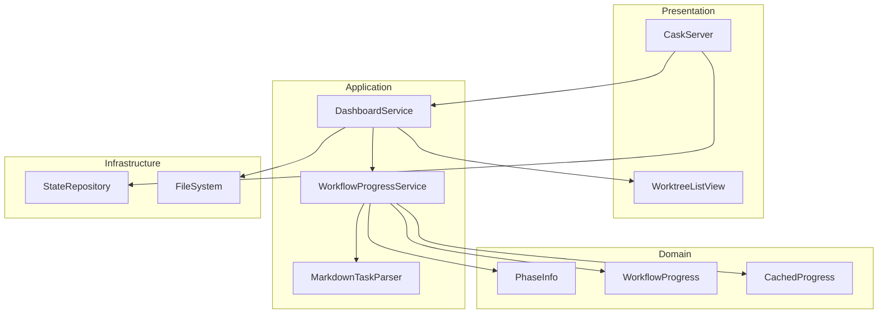
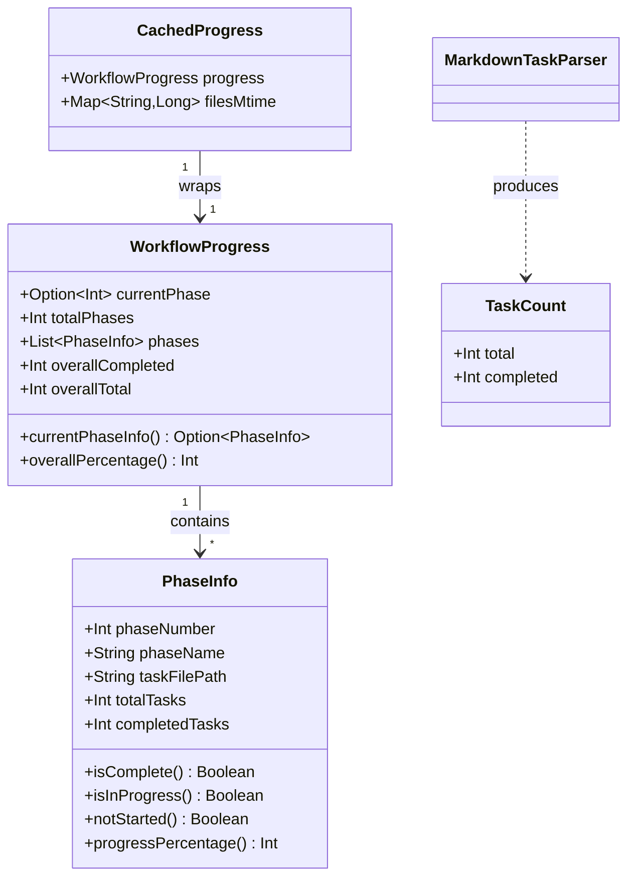
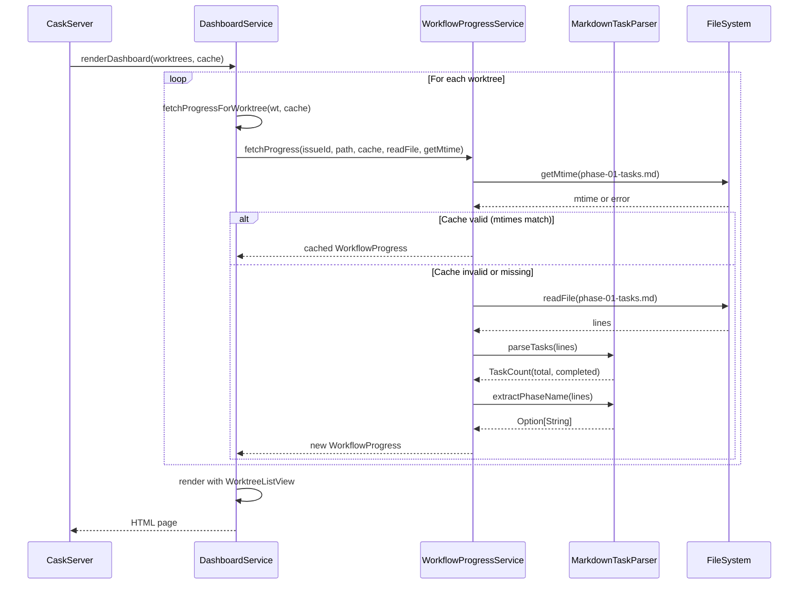
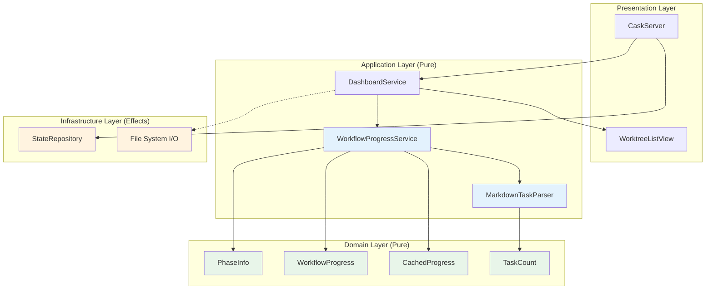

# Review Packet: Phase 5 - Display phase and task progress

## Goals

This phase adds workflow progress tracking to the dashboard by:

1. **Phase detection**: Determine current phase number and name from task file structure
2. **Task parsing**: Extract checkbox tasks from markdown files (`- [ ]`, `- [x]`)
3. **Progress calculation**: Count completed vs total tasks for percentage display
4. **Dashboard enhancement**: Add phase info and progress bar to worktree cards
5. **Error handling**: Gracefully handle missing or malformed task files
6. **Cache-aware parsing**: Don't re-parse files unless changed (use mtime)

After this phase, developers will see which implementation phase each worktree is on and how far along they are in completing tasks.

## Scenarios

- [ ] Dashboard displays current phase number and name (e.g., "Phase 2/4: Validation errors")
- [ ] Progress bar shows completion percentage (e.g., 53% for 8/15 tasks)
- [ ] Task count label displayed (e.g., "8/15 tasks")
- [ ] Progress derived from checkbox parsing in markdown files
- [ ] Standard checkbox format recognized: `- [ ]` and `- [x]` (case-insensitive)
- [ ] Other bullet styles ignored (`*`, `+`, numbered lists)
- [ ] Phase name extracted from file header or derived from filename
- [ ] Current phase determined as first phase with incomplete tasks
- [ ] Progress cache stored in state.json with file mtimes
- [ ] Cache invalidated when any task file modified (mtime check)
- [ ] Missing task files show no progress (graceful fallback, no error)
- [ ] Empty task files show 0/0 tasks or no progress bar

## Entry Points

| File | Method/Class | Why Start Here |
|------|--------------|----------------|
| `.iw/core/WorkflowProgressService.scala` | `fetchProgress()` | Main orchestrator: fetches progress with cache support, coordinates file I/O |
| `.iw/core/MarkdownTaskParser.scala` | `parseTasks()` | Core parsing: counts checkbox tasks from markdown lines |
| `.iw/core/DashboardService.scala` | `fetchProgressForWorktree()` | Integration point: wraps file I/O and calls WorkflowProgressService |
| `.iw/core/WorktreeListView.scala` | `renderWorktreeCard()` | Presentation: renders progress bar and phase label in HTML |
| `.iw/core/PhaseInfo.scala` | `PhaseInfo` case class | Domain model: represents single phase with computed properties |

## Diagrams

### Architecture Overview

### Component Relationships

### Progress Fetch Flow

### Layer Diagram (FCIS)

## Test Summary

| Test | Type | Verifies |
|------|------|----------|
| `PhaseInfoTest."isComplete returns true when all tasks done"` | Unit | Phase completion status |
| `PhaseInfoTest."isInProgress returns true for partial completion"` | Unit | In-progress detection |
| `PhaseInfoTest."notStarted returns true when zero tasks done"` | Unit | Not-started detection |
| `PhaseInfoTest."progressPercentage calculates correctly"` | Unit | Percentage calculation (8/15 = 53%) |
| `PhaseInfoTest."progressPercentage returns 0 for empty phase"` | Unit | Empty phase handling |
| `WorkflowProgressTest."currentPhaseInfo returns current phase details"` | Unit | Current phase lookup |
| `WorkflowProgressTest."overallPercentage calculates across all phases"` | Unit | Overall progress aggregation |
| `CachedProgressTest."isValid returns true when all mtimes match"` | Unit | Cache validity (no changes) |
| `CachedProgressTest."isValid returns false when any mtime changed"` | Unit | Cache invalidation on change |
| `CachedProgressTest."isValid returns false when new file added"` | Unit | Cache invalidation on new file |
| `CachedProgressTest."isValid returns false when file removed"` | Unit | Cache invalidation on removal |
| `MarkdownTaskParserTest."parseTasks counts incomplete checkbox"` | Unit | Parsing `- [ ]` format |
| `MarkdownTaskParserTest."parseTasks counts completed checkbox"` | Unit | Parsing `- [x]` format |
| `MarkdownTaskParserTest."parseTasks counts completed checkbox case-insensitive"` | Unit | Parsing `- [X]` format |
| `MarkdownTaskParserTest."parseTasks counts mixed checkboxes correctly"` | Unit | Mixed task counting |
| `MarkdownTaskParserTest."parseTasks ignores non-checkbox bullets"` | Unit | Ignoring *, +, numbered |
| `MarkdownTaskParserTest."parseTasks handles indented checkboxes"` | Unit | Nested task support |
| `MarkdownTaskParserTest."parseTasks handles empty input"` | Unit | Empty file handling |
| `MarkdownTaskParserTest."extractPhaseName parses header"` | Unit | Phase name extraction |
| `MarkdownTaskParserTest."extractPhaseName returns None for missing header"` | Unit | Missing header fallback |
| `WorkflowProgressServiceTest."computeProgress sums task counts across phases"` | Unit | Task aggregation |
| `WorkflowProgressServiceTest."determineCurrentPhase returns first incomplete phase"` | Unit | Current phase detection |
| `WorkflowProgressServiceTest."determineCurrentPhase returns last phase if all complete"` | Unit | All-complete edge case |
| `WorkflowProgressServiceTest."fetchProgress uses cache when mtimes match"` | Unit | Cache hit path |
| `WorkflowProgressServiceTest."fetchProgress re-parses when mtime changed"` | Unit | Cache miss path |
| `StateRepositoryTest."ServerState with progressCache serializes to JSON"` | Integration | State serialization |
| `StateRepositoryTest."ServerState with progressCache deserializes from JSON"` | Integration | State deserialization |
| `StateRepositoryTest."Old state.json without progressCache loads successfully"` | Integration | Backward compatibility |

## Files Changed

**18 files changed**, +1565 insertions, -21 deletions

Full file list

**New Files (A):**
- `.iw/core/CachedProgress.scala` - Cache wrapper with mtime validation
- `.iw/core/MarkdownTaskParser.scala` - Markdown checkbox parsing
- `.iw/core/PhaseInfo.scala` - Phase domain model
- `.iw/core/WorkflowProgress.scala` - Workflow progress domain model
- `.iw/core/WorkflowProgressService.scala` - Progress computation service
- `.iw/core/test/CachedProgressTest.scala` - Cache validation tests
- `.iw/core/test/MarkdownTaskParserTest.scala` - Parser tests
- `.iw/core/test/PhaseInfoTest.scala` - PhaseInfo model tests
- `.iw/core/test/WorkflowProgressServiceTest.scala` - Service tests
- `.iw/core/test/WorkflowProgressTest.scala` - WorkflowProgress model tests

**Modified Files (M):**
- `.iw/core/CaskServer.scala` - Pass progressCache to DashboardService
- `.iw/core/DashboardService.scala` - Add progress fetching and CSS
- `.iw/core/ServerState.scala` - Add progressCache field
- `.iw/core/StateRepository.scala` - Add upickle serializers
- `.iw/core/WorktreeListView.scala` - Add progress bar rendering
- `.iw/core/test/StateRepositoryTest.scala` - Add serialization tests

## Design Decisions

1. **mtime-based cache invalidation** - Simple and efficient; avoids re-parsing unchanged files
2. **File I/O injection pattern** - Pure service logic with effects injected from caller (FCIS)
3. **Strict checkbox parsing** - Only `- [ ]` and `- [x]` recognized; ignores other formats
4. **Graceful degradation** - Missing files show no progress rather than errors
5. **Phase name fallback** - Try header first, fall back to filename-derived name
