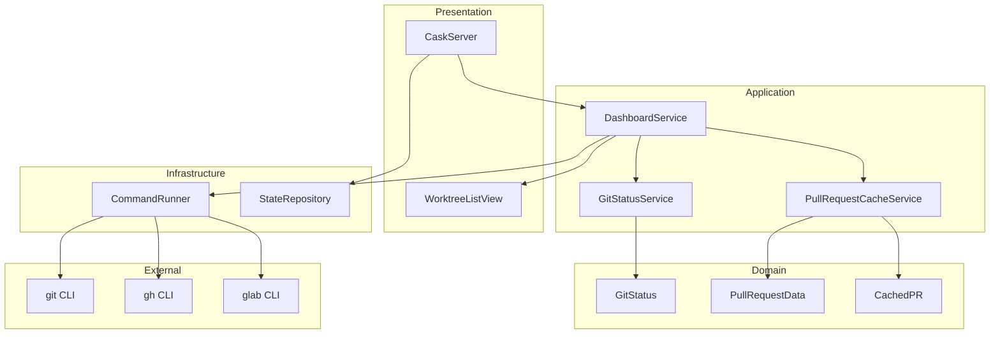
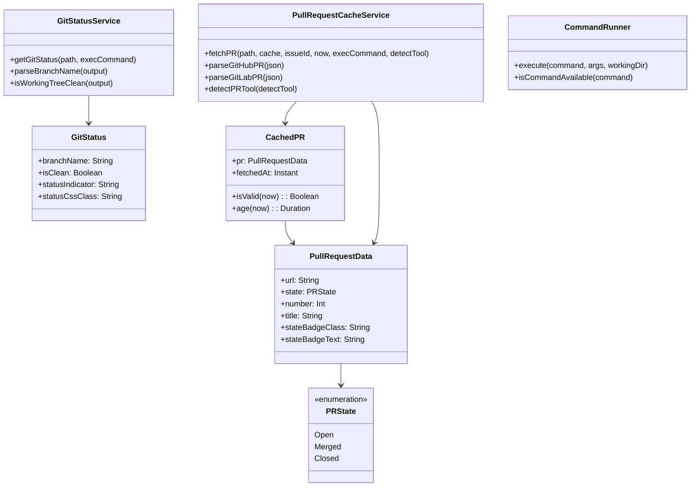
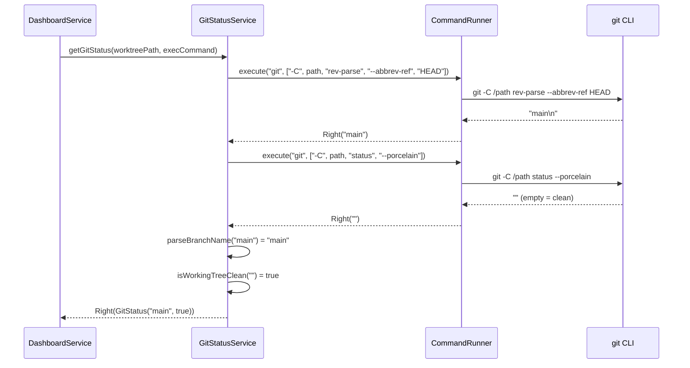
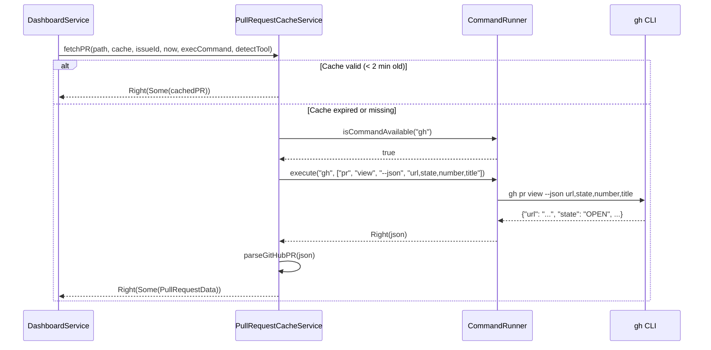
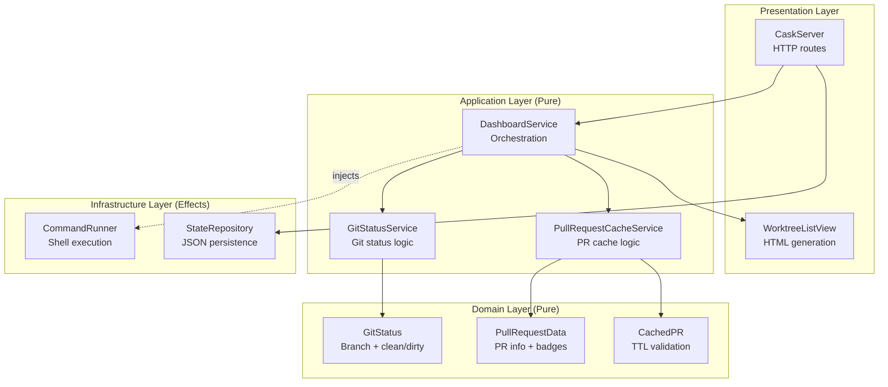

# Review Packet: Phase 6 - Show Git Status and PR Links

## Goals

This phase adds git repository status and pull request information to the dashboard:

1. **Git status detection**: Display branch name and working directory state (clean/dirty) for each worktree
2. **Clean/dirty indication**: Visual indicators with color-coded badges (green for clean, yellow for uncommitted changes)
3. **PR link discovery**: Detect and display GitHub/GitLab pull request URLs using `gh`/`glab` CLI tools
4. **PR state badges**: Show PR status (Open/Merged/Closed) with visual styling
5. **Cache-aware fetching**: PR data cached with 2-minute TTL to avoid excessive API calls
6. **Graceful error handling**: Dashboard works correctly when git or PR tools are unavailable

## Scenarios

- [ ] **Scenario 1: Clean working directory** - Worktree with no uncommitted changes shows "Branch: main ✓ clean" with green styling
- [ ] **Scenario 2: Uncommitted changes** - Worktree with uncommitted changes shows "Branch: feature ⚠ uncommitted" with yellow styling
- [ ] **Scenario 3: PR links displayed** - Worktree with open PR shows "View PR ↗" button with blue "Open" badge
- [ ] **Scenario 4: Merged PR badge** - Merged PR shows purple "Merged" badge
- [ ] **Scenario 5: PR cache validity** - Cached PR data used when under 2-minute TTL, re-fetched when expired
- [ ] **Scenario 6: No git repo** - Dashboard renders without git status when directory is not a git repository
- [ ] **Scenario 7: No PR tools** - Dashboard renders without PR link when `gh`/`glab` not installed

## Entry Points

| File | Method/Class | Why Start Here |
|------|--------------|----------------|
| `.iw/core/DashboardService.scala` | `renderDashboard()` | Main orchestrator that fetches git status and PR data for each worktree |
| `.iw/core/GitStatusService.scala` | `getGitStatus()` | Pure business logic for git status detection with injected command execution |
| `.iw/core/PullRequestCacheService.scala` | `fetchPR()` | Pure business logic for PR fetching with cache support |
| `.iw/core/WorktreeListView.scala` | `renderWorktreeCard()` | Presentation layer that renders git status and PR link UI elements |
| `.iw/core/CommandRunner.scala` | `execute()` | Infrastructure layer for shell command execution |

## Diagrams

### Architecture Overview



### Component Relationships



### Data Flow: Git Status Detection



### Data Flow: PR Detection with Cache



### Layer Diagram (FCIS Pattern)



## Test Summary

| Test | Type | Verifies |
|------|------|----------|
| `GitStatusTest."statusIndicator returns '✓ clean' when isClean is true"` | Unit | Clean indicator text |
| `GitStatusTest."statusIndicator returns '⚠ uncommitted' when isClean is false"` | Unit | Dirty indicator text |
| `GitStatusTest."statusCssClass returns 'git-clean' when isClean is true"` | Unit | Clean CSS class |
| `GitStatusTest."statusCssClass returns 'git-dirty' when isClean is false"` | Unit | Dirty CSS class |
| `PullRequestDataTest."stateBadgeClass returns 'pr-open' for Open state"` | Unit | Open badge styling |
| `PullRequestDataTest."stateBadgeClass returns 'pr-merged' for Merged state"` | Unit | Merged badge styling |
| `PullRequestDataTest."stateBadgeClass returns 'pr-closed' for Closed state"` | Unit | Closed badge styling |
| `CachedPRTest."isValid returns true when within TTL"` | Unit | Cache validity check |
| `CachedPRTest."isValid returns false when TTL expired"` | Unit | Cache expiry check |
| `CachedPRTest."age calculates duration correctly"` | Unit | Cache age calculation |
| `CommandRunnerTest."execute returns stdout when command succeeds"` | Unit | Command success path |
| `CommandRunnerTest."execute returns Left when command fails"` | Unit | Command failure handling |
| `CommandRunnerTest."isCommandAvailable returns true for existing command"` | Unit | Tool detection (exists) |
| `CommandRunnerTest."isCommandAvailable returns false for non-existent command"` | Unit | Tool detection (missing) |
| `GitStatusServiceTest."getGitStatus returns status when git commands succeed"` | Unit | Git status retrieval |
| `GitStatusServiceTest."getGitStatus handles dirty working tree"` | Unit | Dirty detection |
| `GitStatusServiceTest."parseBranchName extracts branch from output"` | Unit | Branch name parsing |
| `GitStatusServiceTest."isWorkingTreeClean returns true for empty output"` | Unit | Clean status parsing |
| `GitStatusServiceTest."isWorkingTreeClean returns false for modified file"` | Unit | Modified file detection |
| `PullRequestCacheServiceTest."fetchPR uses cache when valid"` | Unit | Cache hit path |
| `PullRequestCacheServiceTest."fetchPR re-fetches when cache expired"` | Unit | Cache miss path |
| `PullRequestCacheServiceTest."fetchPR returns None when no PR tool available"` | Unit | Missing tool handling |
| `PullRequestCacheServiceTest."parseGitHubPR extracts url, state, number, title"` | Unit | GitHub JSON parsing |
| `PullRequestCacheServiceTest."parseGitLabPR extracts url, state, iid, title"` | Unit | GitLab JSON parsing |
| `PullRequestCacheServiceTest."detectPRTool returns Some(gh) when gh available"` | Unit | gh detection |
| `PullRequestCacheServiceTest."detectPRTool prefers gh when both available"` | Unit | Tool preference |
| `StateRepositoryTest."serialize ServerState with prCache field"` | Integration | PR cache persistence |
| `StateRepositoryTest."deserialize ServerState with prCache correctly"` | Integration | PR cache loading |

## Files Changed

**19 files changed**, +1513 insertions, -18 deletions

<details>
<summary>Full file list</summary>

**New Files (A):**
- `.iw/core/CachedPR.scala` - Cache wrapper with TTL validation
- `.iw/core/CommandRunner.scala` - Shell command execution infrastructure
- `.iw/core/GitStatus.scala` - Git status domain model
- `.iw/core/GitStatusService.scala` - Git status detection service
- `.iw/core/PullRequestCacheService.scala` - PR fetching with cache
- `.iw/core/PullRequestData.scala` - PR data model with state enum
- `.iw/core/test/CachedPRTest.scala` - CachedPR unit tests
- `.iw/core/test/CommandRunnerTest.scala` - CommandRunner unit tests
- `.iw/core/test/GitStatusServiceTest.scala` - GitStatusService unit tests
- `.iw/core/test/GitStatusTest.scala` - GitStatus unit tests
- `.iw/core/test/PullRequestCacheServiceTest.scala` - PullRequestCacheService unit tests
- `.iw/core/test/PullRequestDataTest.scala` - PullRequestData unit tests

**Modified Files (M):**
- `.iw/core/CaskServer.scala` - Pass prCache to DashboardService
- `.iw/core/DashboardService.scala` - Integrate git status and PR fetching
- `.iw/core/ServerState.scala` - Add prCache field
- `.iw/core/StateRepository.scala` - Add upickle serializers for new types
- `.iw/core/WorktreeListView.scala` - Render git status and PR links
- `.iw/core/test/StateRepositoryTest.scala` - Add prCache serialization tests

</details>

## Key Implementation Details

### FCIS Pattern
- **Domain layer** (GitStatus, PullRequestData, CachedPR): Pure data models with computed properties
- **Application layer** (GitStatusService, PullRequestCacheService): Pure business logic with injected command execution
- **Infrastructure layer** (CommandRunner): Effects encapsulated in single location

### Command Execution Injection
Services receive command execution as a function parameter rather than calling CommandRunner directly:
```scala
def getGitStatus(
  worktreePath: String,
  execCommand: (String, Array[String]) => Either[String, String]
): Either[String, GitStatus]
```

### PR Cache TTL
- 2-minute TTL (shorter than issue cache) because PR state changes more frequently
- Pure validation: `CachedPR.isValid(cached, now)` receives current time as parameter

### Graceful Degradation
- No git repo → No git status section displayed
- No gh/glab installed → No PR link displayed
- PR command fails → No PR link (not an error)
