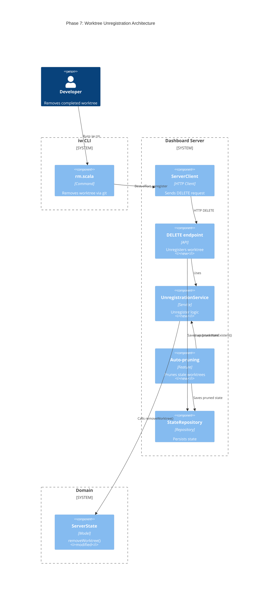
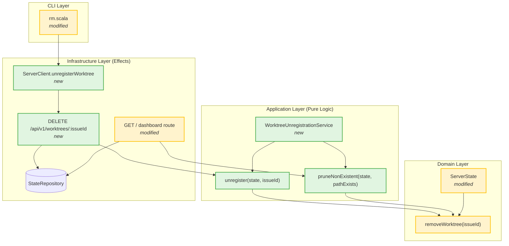
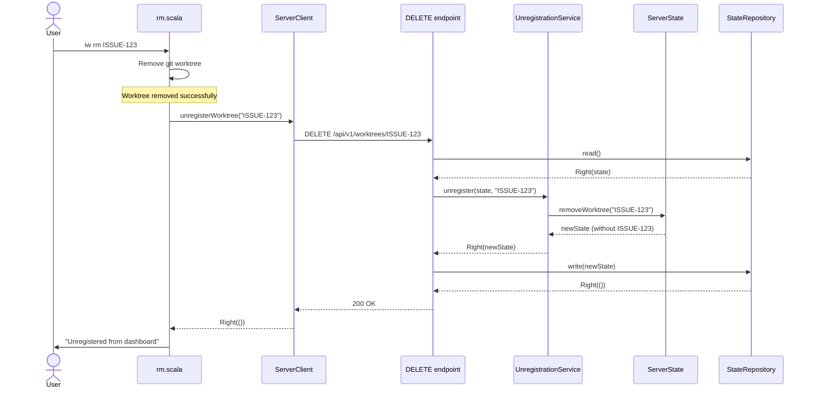
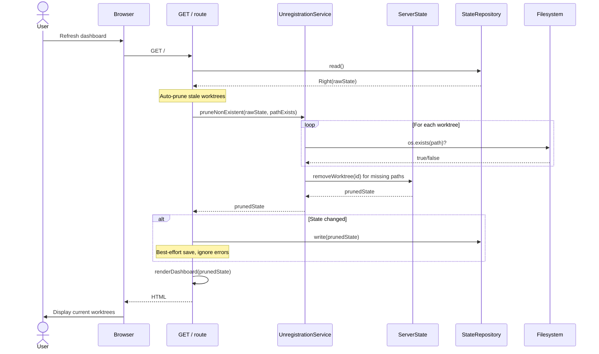

# Phase 7: Unregister worktrees when removed

## Goals

This phase completes the dashboard feature by ensuring worktrees are removed from the dashboard when they are deleted. This is the cleanup phase that keeps the dashboard current and accurate.

Key objectives:
- Add DELETE endpoint (`/api/v1/worktrees/:issueId`) for explicit worktree unregistration
- Integrate unregistration into the `iw rm` command as best-effort cleanup
- Implement auto-pruning of non-existent worktrees when dashboard loads
- Clean removal of associated caches (issue cache, progress cache, PR cache)

## Scenarios

Review that these scenarios work correctly:

- [ ] User runs `iw rm ISSUE-123` and worktree disappears from dashboard immediately
- [ ] When unregistration fails (server down), `iw rm` command still succeeds with warning
- [ ] Manually deleted worktree directories are automatically pruned from dashboard on next page load
- [ ] DELETE endpoint returns 404 for non-existent worktrees (graceful handling)
- [ ] Unregistering a worktree removes all associated caches (issue, progress, PR)
- [ ] Auto-pruning only removes worktrees whose filesystem paths no longer exist

## Entry Points

Start your review from these locations:

| File | Method/Class | Why Start Here |
|------|--------------|----------------|
| `.iw/core/WorktreeUnregistrationService.scala` | `unregister()` | Pure function implementing core unregistration logic |
| `.iw/core/CaskServer.scala` | `@cask.delete("/api/v1/worktrees/:issueId")` | HTTP endpoint for explicit worktree removal |
| `.iw/commands/rm.scala` | Lines 89-94 | CLI integration showing best-effort unregistration |
| `.iw/core/CaskServer.scala` | `dashboard()` (lines 19-27) | Auto-pruning integration on state load |
| `.iw/core/ServerState.scala` | `removeWorktree()` | Domain method removing worktree and all caches |

## Architecture Overview

This diagram shows where the unregistration components fit within the system architecture.

**Key points for reviewer:**
- Unregistration is best-effort - failures don't break `iw rm`
- Auto-pruning happens on every dashboard page load
- All cache cleanup is atomic with worktree removal

## Component Relationships

**Key points for reviewer:**
- Pure functions in WorktreeUnregistrationService delegate to ServerState.removeWorktree
- Infrastructure layer handles effects (HTTP, filesystem checks)
- Functional Core / Imperative Shell pattern maintained

## Key Flow: Explicit Unregistration via iw rm

**Key points for reviewer:**
- Unregistration happens AFTER git worktree removal succeeds
- If unregistration fails, warning is printed but command exits successfully
- State update is atomic - worktree and all caches removed together

## Key Flow: Auto-Pruning on Dashboard Load

**Key points for reviewer:**
- Pruning runs on EVERY dashboard page load
- Only worktrees with non-existent paths are removed
- State save is best-effort - dashboard renders even if save fails
- Cache cleanup is automatic when pruning worktrees

## Test Summary

| Test | Type | Verifies |
|------|------|----------|
| `ServerState.removeWorktree removes entry from worktrees map` | Unit | Domain method removes worktree |
| `ServerState.removeWorktree removes entry from all cache maps` | Unit | Cache cleanup (issue, progress, PR) |
| `ServerState.removeWorktree is idempotent for non-existent issueId` | Unit | Safe to call with missing IDs |
| `unregister returns Right when worktree exists` | Unit | Success path for unregister |
| `unregister returns Left when worktree not found` | Unit | Error handling for missing worktree |
| `unregister removes associated issue cache entry` | Unit | Issue cache cleanup |
| `unregister removes associated progress cache entry` | Unit | Progress cache cleanup |
| `unregister removes associated PR cache entry` | Unit | PR cache cleanup |
| `pruneNonExistent removes worktrees with missing paths` | Unit | Auto-pruning removes stale entries |
| `pruneNonExistent keeps worktrees with existing paths` | Unit | Auto-pruning preserves valid entries |
| `pruneNonExistent removes associated caches for pruned worktrees` | Unit | Cache cleanup during pruning |
| `pruneNonExistent handles empty state gracefully` | Unit | Edge case handling |
| `DELETE /api/v1/worktrees/:issueId returns 200 and removes worktree` | Integration | HTTP endpoint success path |
| `DELETE /api/v1/worktrees/:issueId returns 404 for non-existent` | Integration | HTTP 404 error handling |
| `DELETE endpoint removes associated cache entries` | Integration | End-to-end cache removal via API |

**Coverage:** 15 tests (12 unit + 3 integration)
- Pure logic: Comprehensive unit test coverage for all scenarios
- API layer: Integration tests verify HTTP contract and persistence
- E2E: Manual verification via `iw rm` command and dashboard inspection

## Files Changed

**6 files** changed, +318 insertions, -2 deletions

Full file list with descriptions

### New Files

- `.iw/core/WorktreeUnregistrationService.scala` (A) +43 lines
  - Pure functions for unregistering worktrees
  - Implements `unregister(state, issueId)` and `pruneNonExistent(state, pathExists)`
  - No side effects - delegates to ServerState.removeWorktree

- `.iw/core/test/WorktreeUnregistrationServiceTest.scala` (A) +265 lines
  - Unit tests for WorktreeUnregistrationService
  - Tests all unregister scenarios (success, failure, cache cleanup)
  - Tests all pruning scenarios (missing paths, existing paths, empty state)

### Modified Files

- `.iw/core/ServerState.scala` (M) +8 lines
  - Added `removeWorktree(issueId)` method
  - Removes worktree and all associated caches atomically
  - Idempotent operation (safe to call multiple times)

- `.iw/core/CaskServer.scala` (M) +42 lines, -2 lines
  - Added DELETE `/api/v1/worktrees/:issueId` endpoint
  - Integrated auto-pruning into dashboard route (lines 19-27)
  - Returns 200 on success, 404 if not found, 500 on errors

- `.iw/core/ServerClient.scala` (M) +23 lines
  - Added `unregisterWorktree(issueId)` method
  - Sends DELETE request to server
  - Treats 404 as success (already removed)

- `.iw/commands/rm.scala` (M) +9 lines
  - Added best-effort unregistration call after worktree removal
  - Prints warning on failure but doesn't fail command
  - Lines 89-94: ServerClient.unregisterWorktree integration

### Test Files

- `.iw/core/test/ServerStateTest.scala` (M) +74 lines
  - Added 3 tests for ServerState.removeWorktree method
  - Tests worktree removal, cache cleanup, idempotency

- `.iw/core/test/CaskServerTest.scala` (M) +162 lines
  - Added 3 integration tests for DELETE endpoint
  - Tests success (200), not found (404), cache removal

## Implementation Decisions

### 1. Best-Effort Unregistration

**Decision:** `iw rm` prints a warning but succeeds even if unregistration fails.

**Rationale:**
- The primary goal of `iw rm` is to remove the git worktree
- Dashboard state is secondary - should not block worktree removal
- Server might be down, restarting, or misconfigured
- Auto-pruning will clean up stale entries anyway

**Review points:**
- Check lines 89-94 in `rm.scala` - warning printed on Left, no exit
- Verify warning message is clear and actionable

### 2. Auto-Pruning on Every Dashboard Load

**Decision:** Prune non-existent worktrees on every GET / request, not on a timer.

**Rationale:**
- Simpler implementation - no background jobs or timers needed
- Pruning is fast - just filesystem checks for registered worktrees
- Dashboard is typically only accessed a few times per day
- Ensures dashboard is always current when user views it

**Review points:**
- Check CaskServer.scala lines 19-27 for pruning logic
- Verify `os.exists(os.Path(path, os.pwd))` is correct filesystem check
- Confirm state save is best-effort (line 27 - no error handling blocks render)

### 3. Atomic Cache Cleanup

**Decision:** ServerState.removeWorktree removes ALL caches in one operation.

**Rationale:**
- Prevents orphaned cache entries (issue data, progress, PRs)
- Simpler than tracking which caches exist for each worktree
- Map removal is O(1), so removing from all caches is cheap
- Safe - Map.remove is idempotent for non-existent keys

**Review points:**
- Check ServerState.scala lines 15-21 - single copy() with all cache removals
- Verify idempotency (removing non-existent key is safe)
- Confirm all three caches are removed (issueCache, progressCache, prCache)

### 4. 404 Treated as Success

**Decision:** ServerClient treats 404 from DELETE as Right(()).

**Rationale:**
- Idempotent semantics: "ensure worktree is not registered"
- Handles race conditions (worktree already pruned by dashboard)
- Matches REST semantics - DELETE is idempotent
- Simplifies client code - no special handling needed

**Review points:**
- Check ServerClient.scala line 176 - `case StatusCode.NotFound => Right(())`
- Verify comment explains this is intentional
- Consider if 404 should be logged (currently silent)

### 5. Functional Core / Imperative Shell

**Decision:** Pure logic in WorktreeUnregistrationService, effects in infrastructure layer.

**Rationale:**
- Follows project architecture guidelines
- Pure functions are easier to test (no mocks needed)
- Effects isolated to endpoints and client
- Domain remains pure (ServerState.removeWorktree is a copy())

**Review points:**
- Verify WorktreeUnregistrationService has no side effects
- Check that filesystem exists check is injected as function parameter
- Confirm tests don't mock anything - just call functions with test data

## Review Checklist

Use this checklist to guide your review:

- [ ] **Pure Functions:** WorktreeUnregistrationService functions are pure (no IO, no mutation)
- [ ] **Error Handling:** DELETE endpoint returns proper HTTP codes (200, 404, 500)
- [ ] **Best-Effort:** `iw rm` succeeds even if unregistration fails (lines 89-94 in rm.scala)
- [ ] **Cache Cleanup:** All three caches removed in ServerState.removeWorktree
- [ ] **Auto-Pruning:** Dashboard route integrates pruning before rendering (lines 19-27 in CaskServer)
- [ ] **Idempotency:** ServerState.removeWorktree safe to call with non-existent ID
- [ ] **Test Coverage:** All scenarios covered by unit tests (12 tests total)
- [ ] **Integration Tests:** DELETE endpoint tested end-to-end (3 tests)
- [ ] **Documentation:** Purpose comments explain what files do (not implementation details)

## Notes for Reviewers

This is the final phase of IWLE-100. The complete feature set now includes:

1. **Phase 1-3:** Dashboard server with worktree registration
2. **Phase 4:** Issue data caching
3. **Phase 5:** Progress tracking
4. **Phase 6:** PR status display
5. **Phase 7:** Worktree cleanup (this phase)

The dashboard is now feature-complete:
- Registers worktrees when created (`iw add`)
- Updates last-seen timestamp on `iw cd`
- Displays issue data, progress, and PR status
- Auto-refreshes every 30 seconds
- Cleans up when worktrees are removed (`iw rm`)
- Auto-prunes stale entries

**What to look for in this phase:**
- Clean separation of pure logic and effects
- Graceful degradation (best-effort unregistration)
- Atomic operations (cache cleanup with worktree removal)
- Idempotent operations (safe to retry)
- Comprehensive test coverage

**Potential issues to watch for:**
- Race condition between pruning and user viewing stale data (acceptable tradeoff)
- Performance of pruning on large worktree counts (mitigated by infrequent dashboard access)
- Error handling in auto-pruning (currently best-effort save)
