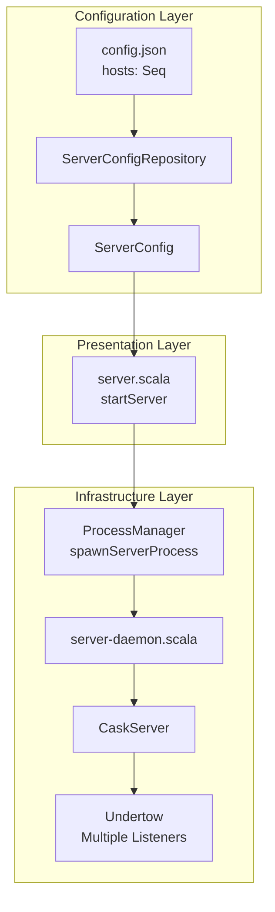
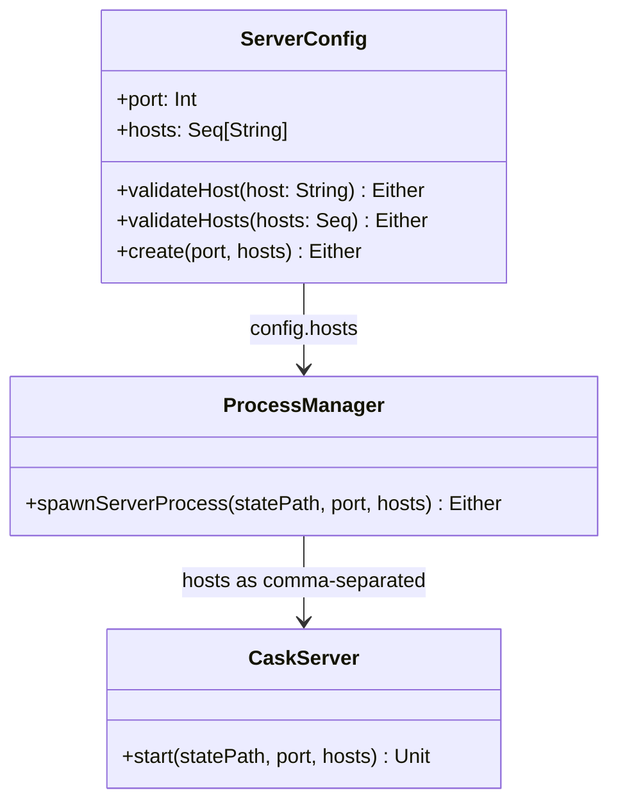
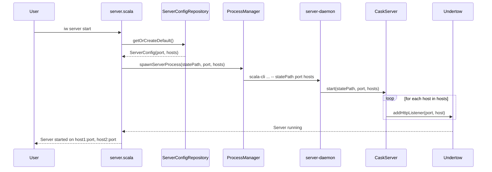
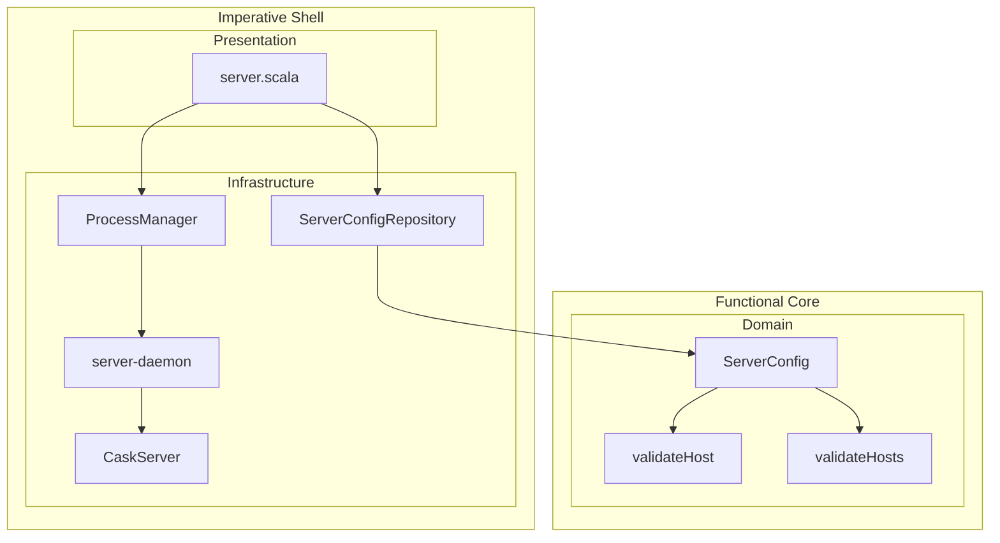

# Review Packet: Phase 1 - Configure dashboard to bind to multiple interfaces

**Issue:** IWLE-110
**Phase:** 1 of 3
**Branch:** IWLE-110-phase-01

## Goals

This phase establishes the foundation for multi-interface binding by:

1. **Extending the configuration model** to support multiple host addresses via `hosts: Seq[String]`
2. **Implementing backward compatibility** so existing configs without `hosts` field continue working
3. **Configuring Undertow** to bind to all specified interfaces
4. **Passing host configuration** through the complete process spawning chain
5. **Updating startup messages** to show all bound addresses

After this phase, users can configure the dashboard to bind to multiple interfaces (e.g., localhost + Tailscale IP) without exposing it on all network interfaces.

## Scenarios

- [ ] Configure multiple hosts for localhost and Tailscale IP
- [ ] Default to localhost when hosts not specified (backward compatibility)
- [ ] Reject invalid host values with clear error message
- [ ] Reject empty hosts array with clear error message
- [ ] Health check always uses localhost regardless of binding config

## Entry Points

| File | Method/Class | Why Start Here |
|------|--------------|----------------|
| `.iw/core/ServerConfig.scala` | `ServerConfig`, `validateHost`, `validateHosts` | Domain model - defines the hosts field and validation logic |
| `.iw/core/ProcessManager.scala` | `spawnServerProcess` | Infrastructure - spawns daemon with hosts parameter |
| `.iw/core/CaskServer.scala` | `CaskServer.start` | Infrastructure - creates multiple Undertow listeners |
| `.iw/commands/server.scala` | `startServer` | Presentation entry point - orchestrates server startup |
| `.iw/commands/server-daemon.scala` | `main` | Daemon entry point - parses hosts from CLI args |

## Diagrams

### Architecture Overview



### Component Relationships



### Host Configuration Flow



### Layer Diagram (FCIS)



## Test Summary

| Test | Type | Verifies |
|------|------|----------|
| `ServerConfigTest."hosts field with default value"` | Unit | Default hosts = Seq("localhost") |
| `ServerConfigTest."validateHost accepts localhost"` | Unit | localhost is valid host |
| `ServerConfigTest."validateHost accepts 127.0.0.1"` | Unit | IPv4 loopback is valid |
| `ServerConfigTest."validateHost accepts ::1"` | Unit | IPv6 loopback is valid |
| `ServerConfigTest."validateHost accepts 0.0.0.0"` | Unit | Bind-all IPv4 is valid |
| `ServerConfigTest."validateHost accepts ::"` | Unit | Bind-all IPv6 is valid |
| `ServerConfigTest."validateHost accepts valid IPv4"` | Unit | Standard IPv4 addresses work |
| `ServerConfigTest."validateHost accepts valid IPv6"` | Unit | Standard IPv6 addresses work |
| `ServerConfigTest."validateHost rejects invalid value"` | Unit | Non-IP strings rejected |
| `ServerConfigTest."validateHost rejects empty string"` | Unit | Empty string rejected |
| `ServerConfigTest."validateHosts accepts non-empty array"` | Unit | Multiple valid hosts work |
| `ServerConfigTest."validateHosts rejects empty array"` | Unit | At least one host required |
| `ServerConfigTest."validateHosts rejects array with invalid"` | Unit | All hosts must be valid |
| `ServerConfigTest."create() validates hosts"` | Unit | create() validates port AND hosts |
| `ServerConfigRepositoryTest."Deserialize without hosts"` | Integration | Backward compatibility: defaults to localhost |
| `ServerConfigRepositoryTest."Deserialize with hosts"` | Integration | Explicit hosts preserved |
| `ServerConfigRepositoryTest."Deserialize empty hosts array"` | Integration | Empty array validation |
| `ServerConfigRepositoryTest."Serialize includes hosts"` | Integration | Hosts written to JSON |

## Files Changed

**13 files changed, +1149 insertions, -17 deletions**

<details>
<summary>Full file list</summary>

**Source Files (Implementation):**
- `.iw/core/ServerConfig.scala` (M) - Added hosts field and validation
- `.iw/core/ProcessManager.scala` (M) - Updated spawnServerProcess signature
- `.iw/core/CaskServer.scala` (M) - Multiple Undertow listeners
- `.iw/core/ServerConfigRepository.scala` (M) - Hosts validation in read/write
- `.iw/core/ServerClient.scala` (M) - Pass hosts when auto-starting
- `.iw/commands/server-daemon.scala` (M) - Parse hosts from CLI args
- `.iw/commands/server.scala` (M) - Pass hosts, update success message

**Test Files:**
- `.iw/core/test/ServerConfigTest.scala` (M) - Host validation tests
- `.iw/core/test/ServerConfigRepositoryTest.scala` (M) - Backward compatibility tests

**Documentation:**
- `project-management/issues/IWLE-110/analysis.md` (A)
- `project-management/issues/IWLE-110/phase-01-context.md` (A)
- `project-management/issues/IWLE-110/phase-01-tasks.md` (A)
- `project-management/issues/IWLE-110/tasks.md` (A)

</details>

## Key Implementation Details

### Host Validation (ServerConfig.scala)

```scala
def validateHost(host: String): Either[String, String] =
  if host.isEmpty then Left("Invalid host: empty string")
  else if host == "localhost" || host == "127.0.0.1" || host == "::1" then Right(host)
  else if host == "0.0.0.0" || host == "::" then Right(host)
  else if isValidIPv4(host) then Right(host)
  else if isValidIPv6(host) then Right(host)
  else Left(s"Invalid host: $host")
```

### Multiple Undertow Listeners (CaskServer.scala)

```scala
def start(statePath: String, port: Int = 9876, hosts: Seq[String] = Seq("localhost")): Unit =
  val builder = hosts.foldLeft(io.undertow.Undertow.builder) { (b, host) =>
    b.addHttpListener(port, host)
  }
  builder.setHandler(server.defaultHandler).build.start()
```

### Success Message Format (server.scala)

```scala
val addresses = config.hosts.map(host => s"$host:${config.port}").mkString(", ")
println(s"Server started on $addresses")
```

## Reviewer Notes

1. **Backward Compatibility**: Existing configs without `hosts` field work unchanged - upickle uses default value
2. **Functional Approach**: Uses fold for building Undertow listeners instead of mutable loop
3. **Validation First**: Host validation happens before spawning daemon process
4. **Health Check Unchanged**: Always uses localhost for reliability

## Next Phases

- **Phase 2**: Display bound hosts in `iw server status` command
- **Phase 3**: Add security warnings for non-localhost bindings
