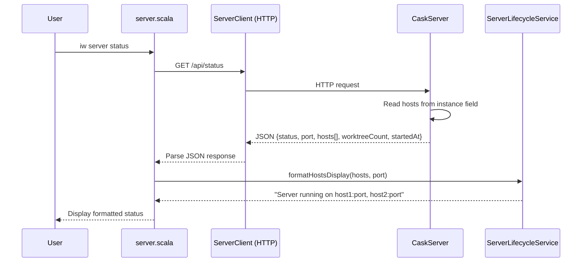
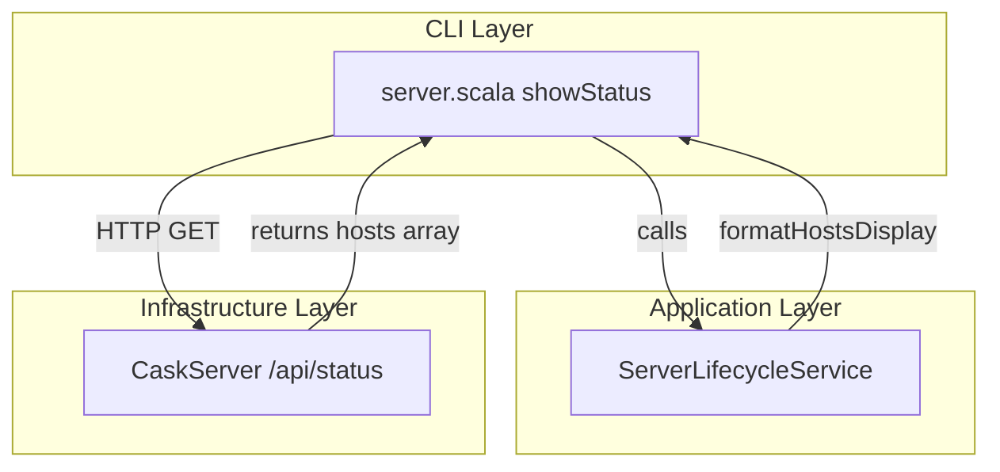
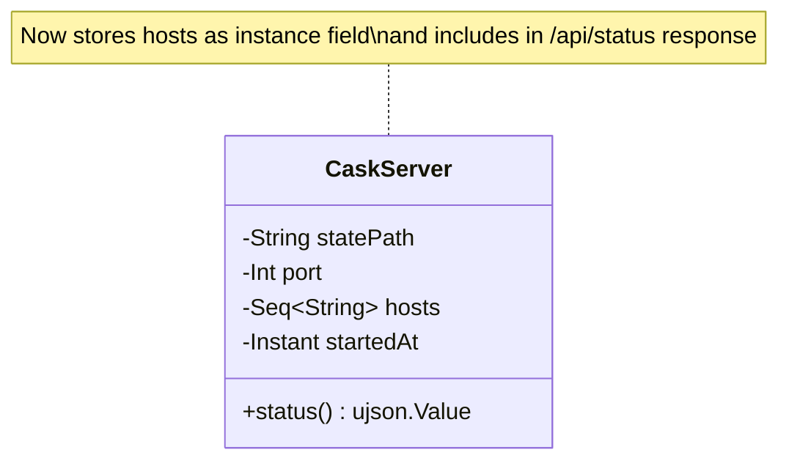

# Review Packet: Phase 2 - Display bound hosts in server status

**Issue:** IWLE-110
**Phase:** 2 of 3
**Branch:** IWLE-110-phase-02

## Goals

Display all bound host interfaces when showing server status, so users know how to access the dashboard from different network locations.

**Specific changes:**
- Update `/api/status` endpoint to include hosts array in response JSON
- Update `iw server status` display to show all "host:port" combinations
- Handle formatting for single and multiple hosts appropriately

## Scenarios

- [ ] Single host case: `Server running on localhost:9876`
- [ ] Multiple hosts case: `Server running on 127.0.0.1:9876, 100.64.1.5:9876`
- [ ] Status shows tracking information and uptime alongside host display
- [ ] Backward compatibility: if hosts field missing in response, fallback works

## Entry Points

| File | Method/Class | Why Start Here |
|------|--------------|----------------|
| `.iw/core/CaskServer.scala:59-72` | `status()` endpoint | HTTP entry point - returns hosts in /api/status JSON |
| `.iw/core/ServerLifecycleService.scala:34-40` | `formatHostsDisplay()` | Pure formatting logic for display message |
| `.iw/commands/server.scala:122-178` | `showStatus()` | CLI entry point - parses and displays status |
| `.iw/core/test/ServerLifecycleServiceTest.scala:101-127` | Format tests | Unit tests for formatting logic |
| `.iw/core/test/CaskServerTest.scala:409-508` | Hosts endpoint tests | Integration tests for status endpoint |

## Diagrams

### Data Flow



### Component Relationships



### CaskServer Constructor Change



## Test Summary

| Test | Type | Verifies |
|------|------|----------|
| `CaskServerTest."GET /api/status includes hosts field with single host"` | Integration | Status endpoint returns hosts array with single host |
| `CaskServerTest."GET /api/status includes hosts field with multiple hosts"` | Integration | Status endpoint returns all configured hosts |
| `ServerLifecycleServiceTest."Format status display with single host"` | Unit | Single host formats as "Server running on localhost:9876" |
| `ServerLifecycleServiceTest."Format status display with multiple hosts"` | Unit | Multiple hosts format as comma-separated list |
| `ServerLifecycleServiceTest."Format status display with three hosts"` | Unit | Three hosts format correctly |
| `ServerLifecycleServiceTest."Format status display with empty hosts defaults to port"` | Unit | Empty hosts fallback to "Server running on port 9876" |

## Files Changed

**5 files changed** (uncommitted)

<details>
<summary>Full file list</summary>

- `.iw/commands/server.scala` (M) - Updated showStatus() to parse hosts and use formatHostsDisplay
- `.iw/core/CaskServer.scala` (M) - Constructor now accepts hosts, status endpoint returns hosts array
- `.iw/core/ServerLifecycleService.scala` (M) - Added formatHostsDisplay() function
- `.iw/core/test/CaskServerTest.scala` (M) - Added 2 tests for hosts in status endpoint
- `.iw/core/test/ServerLifecycleServiceTest.scala` (M) - Added 4 tests for formatHostsDisplay

</details>

## Key Implementation Details

### CaskServer Changes (`.iw/core/CaskServer.scala`)

```scala
// Constructor now stores hosts as instance field
class CaskServer(statePath: String, port: Int, hosts: Seq[String], startedAt: Instant)

// Status endpoint includes hosts in response
@cask.get("/api/status")
def status(): ujson.Value =
  ujson.Obj(
    "status" -> "running",
    "port" -> port,
    "hosts" -> ujson.Arr.from(hosts),  // NEW: hosts array
    "worktreeCount" -> worktreeCount,
    "startedAt" -> startedAt.toString
  )
```

### ServerLifecycleService Changes (`.iw/core/ServerLifecycleService.scala`)

```scala
/** Format server hosts display message */
def formatHostsDisplay(hosts: Seq[String], port: Int): String =
  if hosts.isEmpty then
    s"Server running on port $port"
  else
    val addresses = hosts.map(host => s"$host:$port").mkString(", ")
    s"Server running on $addresses"
```

### server.scala Changes (`.iw/commands/server.scala`)

```scala
// Get hosts from status response, fall back to empty if missing
val hosts = if statusJson.obj.contains("hosts") then
  statusJson("hosts").arr.map(_.str).toSeq
else
  Seq.empty[String]

val hostDisplay = ServerLifecycleService.formatHostsDisplay(hosts, port)
println(hostDisplay)
```

## Acceptance Criteria Verification

| Criterion | Status | Evidence |
|-----------|--------|----------|
| Status displays all bound hosts and port | Ready | `formatHostsDisplay()` formats all hosts with port |
| Single host case works | Ready | Test: "Format status display with single host" |
| Multiple hosts case works | Ready | Test: "Format status display with multiple hosts" |
| Backward compatibility | Ready | Falls back to empty hosts if field missing |

## Notes for Reviewers

1. **Backward compatibility**: The CLI gracefully handles servers that don't return the `hosts` field (older versions)
2. **Pure function**: `formatHostsDisplay()` is a pure function in ServerLifecycleService, easy to test
3. **Minimal changes**: Only adds hosts to existing status flow, no architectural changes
4. **Test coverage**: Both unit tests (formatting logic) and integration tests (endpoint response)
