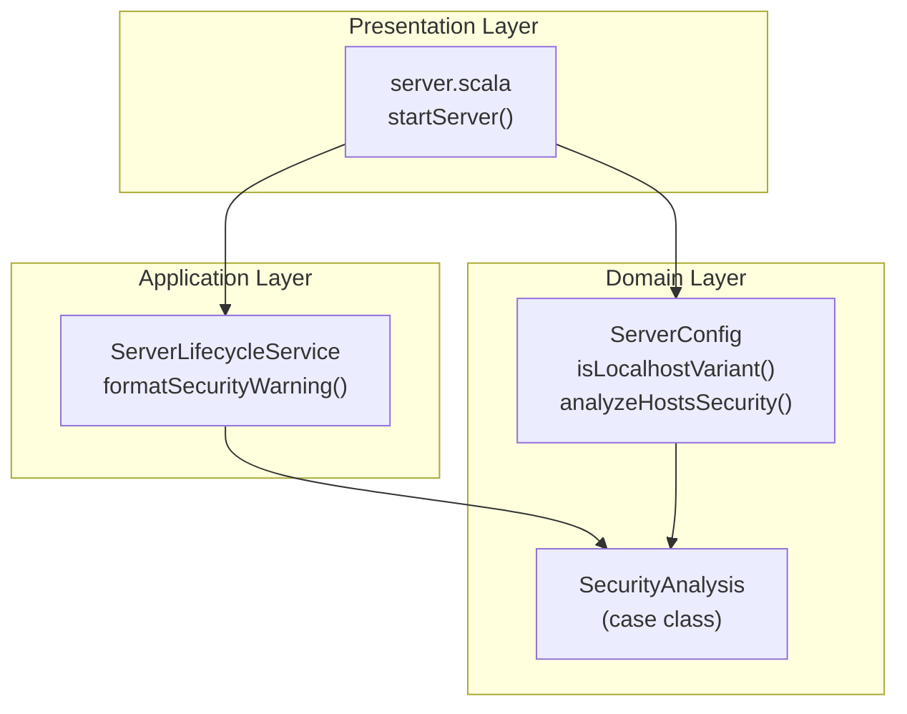
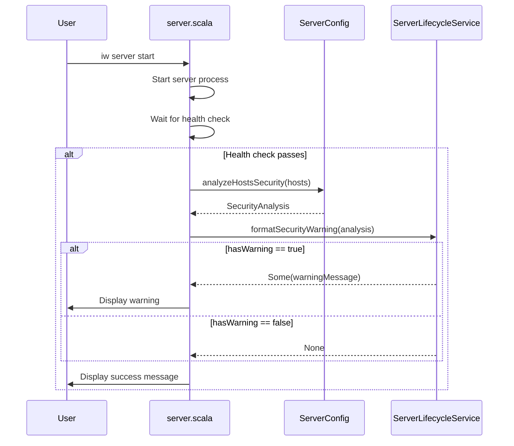
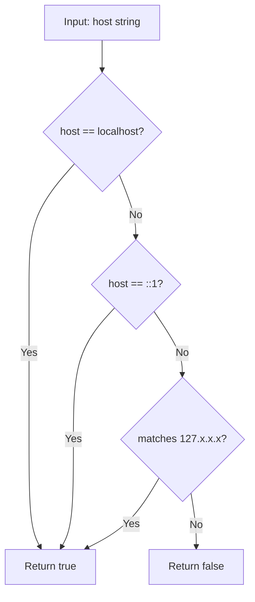
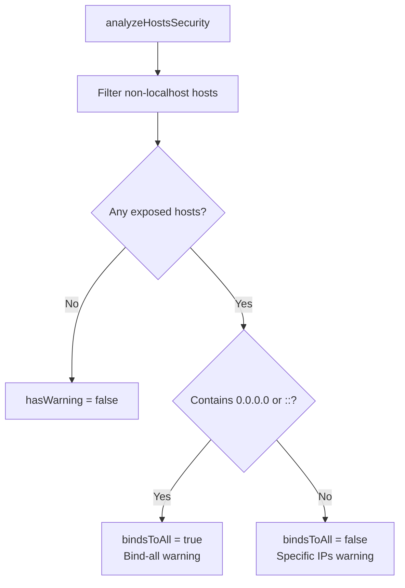

# Review Packet: Phase 3 - Warn users about security implications

**Issue:** IWLE-110
**Phase:** 3 of 3
**Branch:** IWLE-110-phase-03

## Goals

Implement security warnings when users configure the dashboard server to bind to non-localhost interfaces. This helps users understand the security implications of exposing the server to external networks.

**Key objectives:**
- Security warning when binding to `0.0.0.0` or `::` (all interfaces)
- Security warning listing specific non-localhost IPs when configured
- No warning when only localhost variants are configured (localhost, 127.0.0.1, ::1)
- Warning shown at server startup (before server starts successfully)

## Scenarios

- [ ] Scenario 1: When config has `hosts: ["0.0.0.0"]`, warning says "WARNING: Server is accessible from all network interfaces"
- [ ] Scenario 2: When config has `hosts: ["127.0.0.1", "100.64.1.5"]`, warning says "WARNING: Server is accessible from non-localhost interfaces: 100.64.1.5"
- [ ] Scenario 3: When config has `hosts: ["localhost"]` or no hosts field, no security warning is displayed
- [ ] Scenario 4: Warning includes guidance "Ensure your firewall is properly configured"
- [ ] Scenario 5: Warning does not prevent server from starting

## Entry Points

| File | Method/Class | Why Start Here |
|------|--------------|----------------|
| `.iw/core/ServerConfig.scala` | `SecurityAnalysis`, `isLocalhostVariant()`, `analyzeHostsSecurity()` | Core domain logic for host security analysis |
| `.iw/core/ServerLifecycleService.scala` | `formatSecurityWarning()` | Pure function for warning message formatting |
| `.iw/commands/server.scala` | `startServer()` lines 81-88 | Presentation layer integration - where warning is displayed |
| `.iw/core/test/ServerConfigTest.scala` | `isLocalhostVariant` and `analyzeHostsSecurity` tests | Unit test verification for domain logic |
| `.iw/core/test/ServerLifecycleServiceTest.scala` | `formatSecurityWarning` tests | Unit test verification for warning formatting |

## Diagrams

### Component Relationships



### Security Analysis Flow



### Localhost Detection Logic



### Warning Type Decision



## Test Summary

| Test | Type | Verifies |
|------|------|----------|
| `isLocalhostVariant returns true for localhost` | Unit | Localhost string detection |
| `isLocalhostVariant returns true for 127.0.0.1` | Unit | IPv4 loopback detection |
| `isLocalhostVariant returns true for ::1` | Unit | IPv6 loopback detection |
| `isLocalhostVariant returns true for 127.0.0.42` | Unit | Full 127.x.x.x range detection |
| `isLocalhostVariant returns false for 0.0.0.0` | Unit | Bind-all is not localhost |
| `isLocalhostVariant returns false for ::` | Unit | IPv6 bind-all is not localhost |
| `isLocalhostVariant returns false for 100.64.1.5` | Unit | Tailscale IP is not localhost |
| `isLocalhostVariant returns false for 192.168.1.100` | Unit | Private IP is not localhost |
| `analyzeHostsSecurity returns no warning for localhost` | Unit | Safe config detection |
| `analyzeHostsSecurity returns no warning for 127.0.0.1` | Unit | Safe loopback detection |
| `analyzeHostsSecurity returns bind-all warning for 0.0.0.0` | Unit | All-interfaces warning |
| `analyzeHostsSecurity returns bind-all warning for ::` | Unit | IPv6 all-interfaces warning |
| `analyzeHostsSecurity returns exposed hosts warning for mixed` | Unit | Mixed config warning |
| `analyzeHostsSecurity lists all non-localhost IPs` | Unit | Multiple exposed hosts |
| `formatSecurityWarning returns None when no warning` | Unit | No warning for safe config |
| `formatSecurityWarning for bind-all (0.0.0.0)` | Unit | Bind-all message format |
| `formatSecurityWarning for bind-all (::)` | Unit | IPv6 bind-all message format |
| `formatSecurityWarning for specific exposed hosts` | Unit | Specific IPs message format |
| `formatSecurityWarning lists multiple exposed hosts` | Unit | Multiple IPs in warning |

**Test counts:** 19 new tests (14 in ServerConfigTest, 5 in ServerLifecycleServiceTest)

## Files Changed

**Phase 3 specific changes:** 5 files changed

<details>
<summary>Full file list</summary>

**Modified:**
- `.iw/core/ServerConfig.scala` - Added `SecurityAnalysis` case class, `isLocalhostVariant()`, `analyzeHostsSecurity()`
- `.iw/core/ServerLifecycleService.scala` - Added `formatSecurityWarning()`
- `.iw/commands/server.scala` - Added warning display in `startServer()`
- `.iw/core/test/ServerConfigTest.scala` - Added 14 tests for security analysis
- `.iw/core/test/ServerLifecycleServiceTest.scala` - Added 5 tests for warning formatting

</details>

## Implementation Notes

### Design Decisions

1. **Warning placement**: Warning is displayed AFTER successful health check but BEFORE success message, so it's visible without hiding startup info
2. **Pure functions**: All security analysis logic is in pure functions for testability
3. **Localhost variants**: `localhost`, `127.0.0.1`, `::1`, and full `127.x.x.x` range are considered safe
4. **Two warning types**: Different messages for bind-all (`0.0.0.0`/`::`) vs specific exposed IPs

### Warning Format

```
⚠️  WARNING: Server is accessible from all network interfaces (0.0.0.0)
   Ensure your firewall is properly configured.
```

or

```
⚠️  WARNING: Server is accessible from non-localhost interfaces: 100.64.1.5
   Ensure your firewall is properly configured.
```

### Dependencies from Previous Phases

- **Phase 1:** `ServerConfig.hosts` field exists with validation
- **Phase 2:** `ServerLifecycleService.formatHostsDisplay()` for consistent formatting
