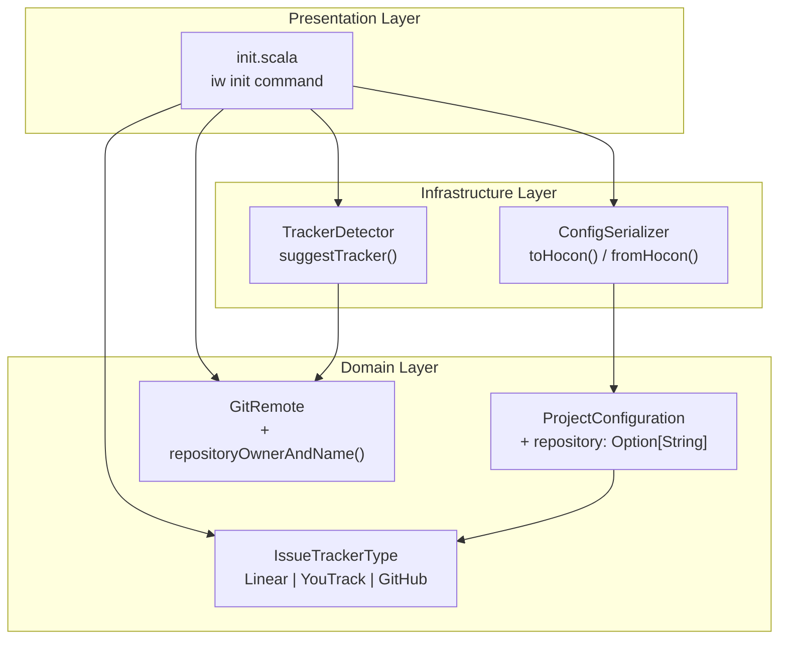
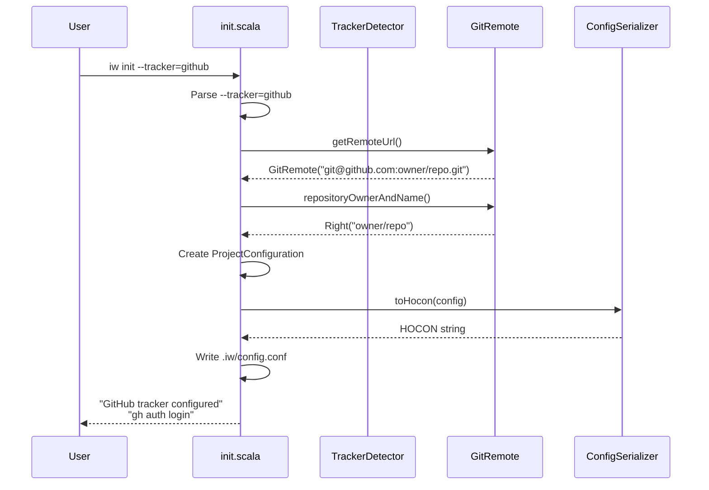
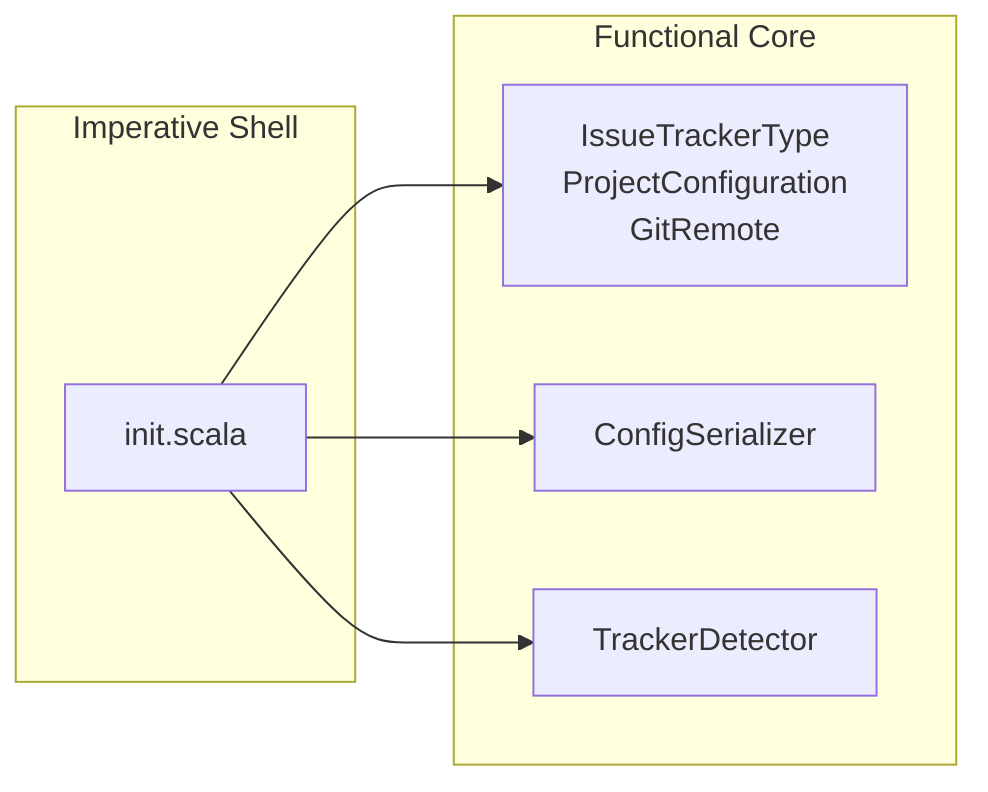

# Review Packet: Phase 1 - Initialize project with GitHub tracker

**Issue:** IWLE-132
**Phase:** 1 of 6
**Branch:** `IWLE-132-phase-01`

## Goals

This phase establishes the foundation for GitHub Issues support by:

1. Adding `GitHub` as a new tracker type in `IssueTrackerType` enum
2. Extending the config schema with a `repository` field for GitHub
3. Updating `iw init` to support `--tracker github`
4. Auto-detecting the repository from git remote (HTTPS and SSH formats)
5. Updating `TrackerDetector` to suggest GitHub for github.com remotes

**Key difference from Linear/YouTrack:** GitHub uses `repository` (owner/repo) instead of `team`, and relies on gh CLI for authentication (no API token required).

## Scenarios

- [ ] User runs `iw init --tracker=github` in a repo with GitHub HTTPS remote → config created with auto-detected repository
- [ ] User runs `iw init --tracker=github` in a repo with GitHub SSH remote → config created with auto-detected repository
- [ ] User runs `iw init` in a repo with github.com remote → GitHub is suggested as tracker
- [ ] User runs `iw init --tracker=github` → no API token instructions shown, gh CLI hint shown instead
- [ ] User runs `iw init --tracker=linear --team=IWLE` → still works (regression test)
- [ ] User runs `iw init --tracker=youtrack --team=TEST` → still works (regression test)
- [ ] Invalid tracker type shows error mentioning all three options: linear, youtrack, github

## Entry Points

| File | Method/Class | Why Start Here |
|------|--------------|----------------|
| `.iw/core/Config.scala` | `IssueTrackerType.GitHub` | Core domain change - new enum case drives all other changes |
| `.iw/core/Config.scala` | `GitRemote.repositoryOwnerAndName` | Extracts owner/repo from GitHub URLs (key new functionality) |
| `.iw/core/Config.scala` | `TrackerDetector.suggestTracker` | Now returns GitHub for github.com (behavioral change) |
| `.iw/commands/init.scala` | `init()` main function | Orchestrates the init flow with new GitHub path |
| `.iw/core/Config.scala` | `ConfigSerializer.toHocon/fromHocon` | Serializes GitHub config with repository field |

## Diagrams

### Architecture Overview



### GitHub Init Flow



### Layer Diagram (FCIS)



## Test Summary

| Test | Type | Verifies |
|------|------|----------|
| `GitRemote extracts owner/repo from HTTPS URL with .git suffix` | Unit | HTTPS URL parsing |
| `GitRemote extracts owner/repo from HTTPS URL without .git suffix` | Unit | HTTPS URL parsing without .git |
| `GitRemote extracts owner/repo from SSH URL with .git suffix` | Unit | SSH URL parsing |
| `GitRemote extracts owner/repo from SSH URL without .git suffix` | Unit | SSH URL parsing without .git |
| `GitRemote returns error for non-GitHub HTTPS URL` | Unit | Rejects non-GitHub URLs |
| `GitRemote returns error for non-GitHub SSH URL` | Unit | Rejects non-GitHub URLs |
| `GitRemote returns error for invalid repository format` | Unit | Validates owner/repo format |
| `ConfigSerializer serializes GitHub config to HOCON` | Unit | GitHub config serialization |
| `ConfigSerializer deserializes HOCON with GitHub tracker` | Unit | GitHub config deserialization |
| `ConfigSerializer round-trip for GitHub config` | Unit | Serialization round-trip |
| `ConfigSerializer fails when GitHub config missing repository` | Unit | Repository required validation |
| `ConfigSerializer fails when GitHub repository has invalid format` | Unit | Repository format validation |
| `ConfigSerializer still handles Linear config correctly` | Unit | Regression test |
| `ConfigSerializer still handles YouTrack config correctly` | Unit | Regression test |
| `TrackerDetector suggests GitHub for github.com HTTPS remote` | Unit | Detection for HTTPS |
| `TrackerDetector suggests GitHub for github.com SSH remote` | Unit | Detection for SSH |
| `init creates config with github tracker and HTTPS remote` | E2E | Full GitHub init flow (HTTPS) |
| `init creates config with github tracker and SSH remote` | E2E | Full GitHub init flow (SSH) |
| `init shows gh CLI hint for github tracker` | E2E | No API token, gh hint shown |
| `init with github validates invalid tracker in error message` | E2E | Error lists all three trackers |
| `init with linear still works (regression test)` | E2E | Regression test |
| `init with youtrack still works (regression test)` | E2E | Regression test |

## Files Changed

**5 files changed, +347 insertions, -19 deletions**

<details>
<summary>Full file list</summary>

| File | Change | Description |
|------|--------|-------------|
| `.iw/core/Config.scala` | M | Added `GitHub` to enum, `repository` field, `repositoryOwnerAndName()`, updated `TrackerDetector` and `ConfigSerializer` |
| `.iw/core/Constants.scala` | M | Added `GitHub` tracker type value and `TrackerRepository` config key |
| `.iw/commands/init.scala` | M | Added GitHub to menu, repository auto-detection, gh CLI hint |
| `.iw/core/test/ConfigTest.scala` | M | Added 16 new tests for GitHub functionality |
| `.iw/test/init.bats` | M | Added 6 new E2E tests for GitHub initialization |

</details>

## Key Implementation Details

### 1. IssueTrackerType Enum Extension

```scala
enum IssueTrackerType:
  case Linear, YouTrack, GitHub  // GitHub added
```

### 2. Repository Extraction from Git Remote

```scala
def repositoryOwnerAndName: Either[String, String] =
  // Validates GitHub URL, extracts owner/repo from path
  // Handles both HTTPS and SSH formats
```

### 3. Config Serialization for GitHub

GitHub config uses `repository` instead of `team`:
```hocon
tracker {
  type = github
  repository = "iterative-works/iw-cli"
}
```

### 4. TrackerDetector Update

```scala
def suggestTracker(remote: GitRemote): Option[IssueTrackerType] =
  remote.host match
    case Right("github.com") => Some(IssueTrackerType.GitHub)  // Changed from Linear
    case Right("gitlab.e-bs.cz") => Some(IssueTrackerType.YouTrack)
    case _ => None
```

## Review Checklist

- [ ] All pattern matches on `IssueTrackerType` handle the new `GitHub` case
- [ ] Repository validation rejects invalid formats (single component, empty parts)
- [ ] GitHub config serialization does NOT include `team` field
- [ ] GitHub init does NOT show API token instructions
- [ ] Linear/YouTrack functionality unchanged (regression tests pass)
- [ ] Error messages include all three tracker types
