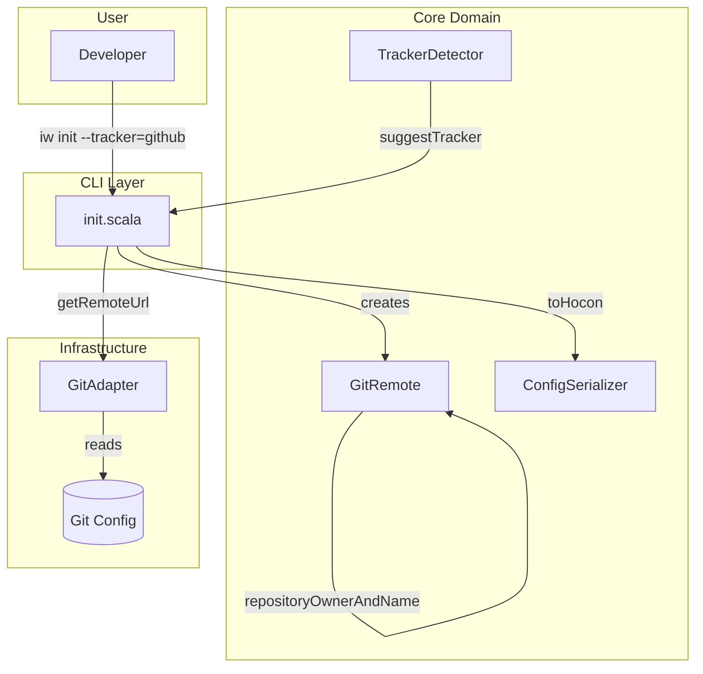
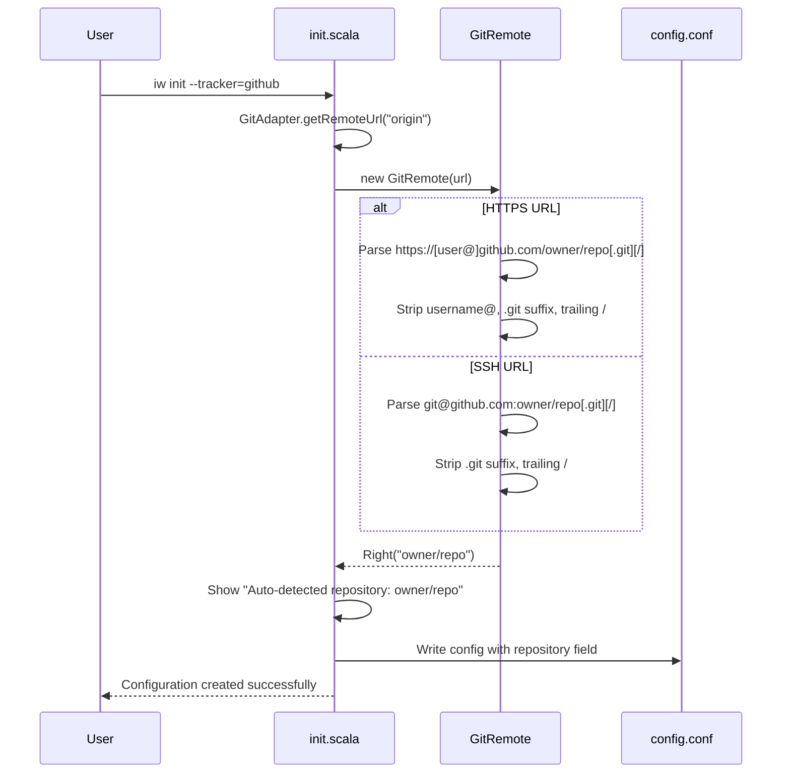
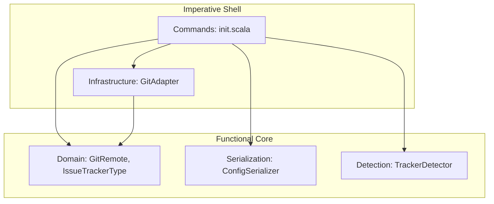

# Review Packet: Phase 2 - Repository auto-detection from git remote

**Issue:** IWLE-132
**Phase:** 2 of 6
**Branch:** IWLE-132-phase-02

## Goals

This phase refines and completes the repository auto-detection functionality started in Phase 1:

1. **Robust URL handling** - Ensure trailing slashes and username prefixes in GitHub URLs work correctly
2. **Multi-remote support** - Verify `origin` remote is always preferred when multiple remotes exist
3. **Comprehensive testing** - Add edge case tests to catch regressions
4. **Documentation** - Help users understand auto-detection behavior

**Note:** Phase 1 implemented core `repositoryOwnerAndName` method. Phase 2 focuses on edge cases, validation, and polish.

## Scenarios

- [x] Auto-detect from HTTPS remote (`https://github.com/owner/repo.git`)
- [x] Auto-detect from SSH remote (`git@github.com:owner/repo.git`)
- [x] Handle HTTPS URL with trailing slash (`https://github.com/owner/repo/`)
- [x] Handle HTTPS URL with username prefix (`https://username@github.com/owner/repo.git`)
- [x] Handle SSH URL with trailing slash (`git@github.com:owner/repo/`)
- [x] Multiple remotes - use origin (not upstream)
- [x] No remote configured - graceful error/prompt
- [x] Non-GitHub remote - warning and manual input prompt
- [x] Malformed SSH URL without colon - error message
- [x] No regression for Linear tracker initialization
- [x] No regression for YouTrack tracker initialization

## Entry Points

| File | Method/Class | Why Start Here |
|------|--------------|----------------|
| `.iw/core/Config.scala:37` | `GitRemote.repositoryOwnerAndName` | Core URL parsing logic - handles all GitHub URL formats |
| `.iw/core/Config.scala:9` | `GitRemote.host` | Extracts host from URLs, handles username prefix |
| `.iw/core/test/ConfigTest.scala:207` | Edge case URL tests | New tests for trailing slash, username prefix |
| `.iw/test/init.bats:292` | Multi-remote E2E test | Tests origin preference with multiple remotes |
| `README.md:65` | GitHub Integration section | New documentation for repository auto-detection |

## Diagrams

### Architecture Overview



### URL Parsing Flow



### Layer Diagram (FCIS)



## Test Summary

| Test | Type | Verifies |
|------|------|----------|
| `GitRemote extracts owner/repo from HTTPS URL with trailing slash` | Unit | Trailing slash handling in HTTPS URLs |
| `GitRemote extracts owner/repo from HTTPS URL with .git and trailing slash` | Unit | Combined .git suffix and trailing slash |
| `GitRemote extracts owner/repo from HTTPS URL with username prefix` | Unit | Username@ prefix stripping |
| `GitRemote extracts owner/repo from HTTPS URL with username and no .git` | Unit | Username prefix without .git suffix |
| `GitRemote handles SSH URL with trailing slash` | Unit | Trailing slash handling in SSH URLs |
| `GitRemote handles SSH URL with .git and trailing slash` | Unit | Combined .git suffix and trailing slash for SSH |
| `GitRemote returns error for malformed SSH URL without colon` | Unit | Malformed SSH URL detection |
| `init with github and multiple remotes uses origin` | E2E | Origin remote preference |
| `init with github and no remote shows error` | E2E | Graceful handling when no remote exists |
| `init with github and HTTPS URL with trailing slash` | E2E | End-to-end trailing slash handling |
| `init with github and HTTPS URL with username prefix` | E2E | End-to-end username prefix handling |
| `init with linear still works (regression test)` | E2E | No regression in Linear support |
| `init with youtrack still works (regression test)` | E2E | No regression in YouTrack support |

**Test Counts:**
- Unit tests: 7 new edge case tests added
- E2E tests: 4 new scenario tests added
- Total tests: 109 tests passing (all suites)

## Files Changed

**4 files changed**, primarily tests and documentation:

<details>
<summary>Full file list</summary>

| File | Change | Description |
|------|--------|-------------|
| `.iw/core/Config.scala` | M | Enhanced `host()` for username prefix, `repositoryOwnerAndName()` for trailing slashes |
| `.iw/core/test/ConfigTest.scala` | M | +7 unit tests for URL edge cases |
| `.iw/test/init.bats` | M | +4 E2E tests for multi-remote, no remote, edge URLs |
| `README.md` | M | +40 lines documenting GitHub integration and URL formats |

</details>

## Key Implementation Details

### URL Parsing Logic (Config.scala)

**Host extraction with username prefix:**
```scala
// Handle username prefix (username@host)
val hostPart = withoutProtocol.takeWhile(_ != '/')
val host = if hostPart.contains('@') then
  hostPart.dropWhile(_ != '@').drop(1) // remove username@
else
  hostPart
```

**Path cleanup with trailing slash:**
```scala
// Clean up path: remove trailing slash and .git suffix
val path = rawPath.stripSuffix("/").stripSuffix(".git").stripSuffix("/")
```

### Supported URL Formats

| Format | Example | Parsed As |
|--------|---------|-----------|
| HTTPS + .git | `https://github.com/owner/repo.git` | `owner/repo` |
| HTTPS plain | `https://github.com/owner/repo` | `owner/repo` |
| HTTPS + slash | `https://github.com/owner/repo/` | `owner/repo` |
| HTTPS + user | `https://user@github.com/owner/repo.git` | `owner/repo` |
| SSH + .git | `git@github.com:owner/repo.git` | `owner/repo` |
| SSH plain | `git@github.com:owner/repo` | `owner/repo` |
| SSH + slash | `git@github.com:owner/repo/` | `owner/repo` |

### Error Cases

| Case | Behavior |
|------|----------|
| Non-GitHub URL | Returns `Left("Not a GitHub URL")` |
| Invalid format (no slash) | Returns `Left("Invalid repository format: expected owner/repo")` |
| Empty owner/repo | Returns `Left("Invalid repository format: expected owner/repo")` |
| SSH without colon | Returns `Left("Unsupported git URL format: ...")` |

## Reviewer Checklist

- [ ] URL parsing handles all documented formats correctly
- [ ] No regression in Linear/YouTrack functionality
- [ ] Error messages are user-friendly
- [ ] README documentation is accurate and helpful
- [ ] Test coverage is comprehensive for edge cases
- [ ] Code follows project conventions (FCIS, functional style)
