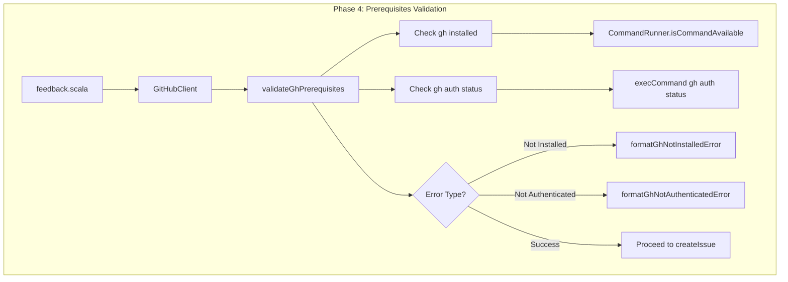
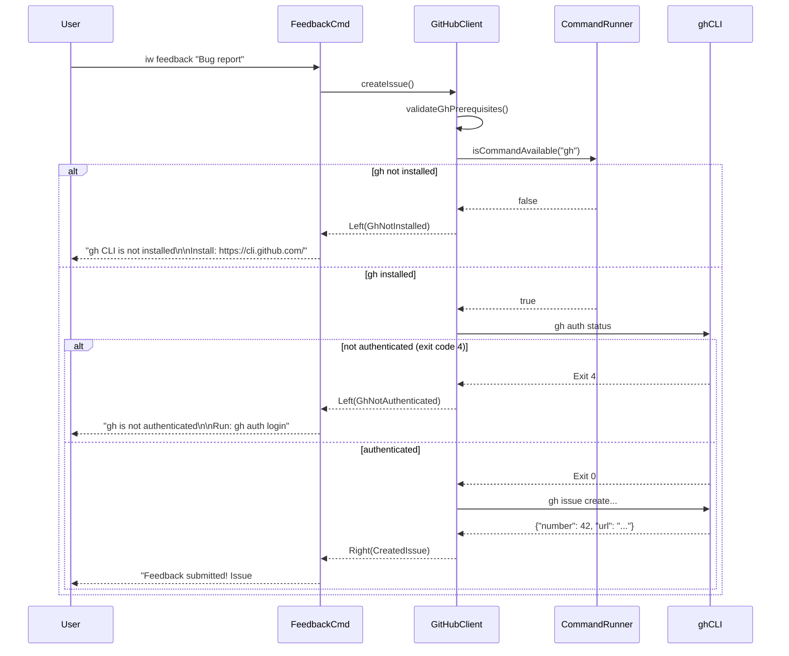
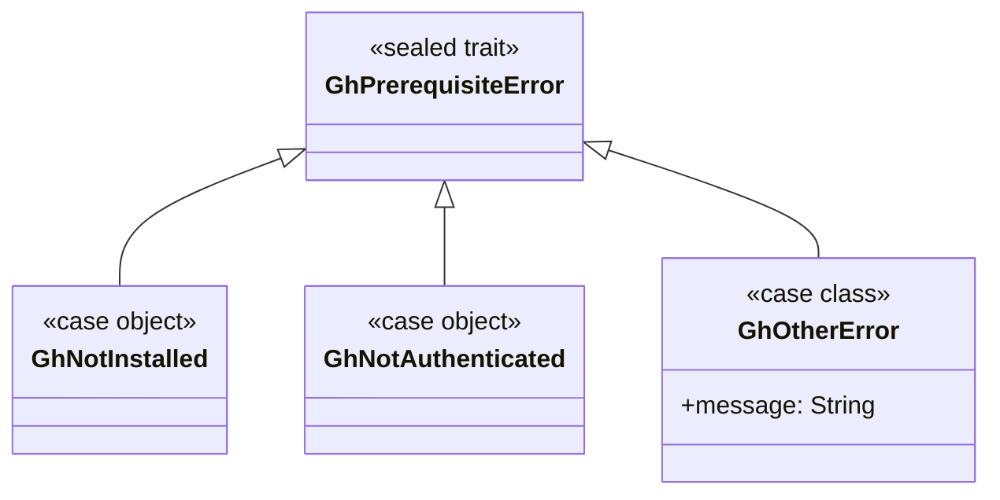

# Review Packet: Phase 4 - Handle gh CLI prerequisites

**Issue:** IWLE-132
**Phase:** 4 of 6
**Story:** GitHub tracker prerequisites validation

---

## Goals

This phase adds comprehensive error detection and user-friendly messaging for GitHub CLI prerequisite failures. The goal is to validate gh CLI availability and authentication BEFORE attempting to create issues, providing clear actionable guidance when prerequisites are not met.

**What this phase accomplishes:**
1. Detect when `gh` CLI is not installed
2. Detect when `gh` is installed but not authenticated
3. Detect when repository is not accessible (permissions)
4. Provide clear error messages with installation/authentication instructions
5. Use proper exit codes for all error scenarios
6. Add prerequisite validation to GitHubClient

**User value:**
- Clear guidance when setup is incomplete (not cryptic error messages)
- Saves time by identifying exact problem (vs debugging unclear failures)
- Lowers barrier to entry for new users (tells them what to do next)

---

## Scenarios

- [ ] User runs `iw feedback` without gh CLI installed → sees installation instructions with link to https://cli.github.com/
- [ ] User runs `iw feedback` with gh installed but not authenticated → sees `gh auth login` instructions
- [ ] User runs `iw feedback` with gh authenticated but repository not accessible → sees repository access error
- [ ] Validation happens BEFORE attempting to create issue (fail fast)
- [ ] All error scenarios result in non-zero exit code
- [ ] Existing Linear/YouTrack feedback is not affected (regression check)

---

## Entry Points

| File | Method/Class | Why Start Here |
|------|--------------|----------------|
| `.iw/core/GitHubClient.scala:27` | `validateGhPrerequisites()` | Core validation logic - checks gh CLI availability and authentication |
| `.iw/core/GitHubClient.scala:58` | `formatGhNotInstalledError()` | User-facing error message for missing gh CLI |
| `.iw/core/GitHubClient.scala:70` | `formatGhNotAuthenticatedError()` | User-facing error message for unauthenticated gh CLI |
| `.iw/core/GitHubClient.scala:185` | `createIssue()` | Integration point - calls validation before creating issues |
| `.iw/core/test/GitHubClientTest.scala:229` | Prerequisite validation tests | Test coverage for all error scenarios |

---

## Diagrams

### Component Overview

### Error Detection Flow

### Error Type Hierarchy

---

## Test Summary

| Test | Type | Verifies |
|------|------|----------|
| `validateGhPrerequisites returns GhNotInstalled when gh not found` | Unit | Detection of missing gh CLI |
| `validateGhPrerequisites returns GhNotAuthenticated when auth status fails` | Unit | Detection of exit code 4 from gh auth status |
| `validateGhPrerequisites returns Right(()) when gh authenticated` | Unit | Success path when prerequisites met |
| `createIssue fails with installation message when gh not installed` | Unit | Integration of validation into createIssue |
| `createIssue fails with auth message when gh not authenticated` | Unit | Integration of validation into createIssue |
| `formatGhNotInstalledError contains installation URL` | Unit | Error message includes https://cli.github.com/ |
| `formatGhNotAuthenticatedError contains auth instruction` | Unit | Error message includes gh auth login |
| `feedback fails with helpful message when gh CLI not installed` | E2E | End-to-end validation with mocked which command |
| `feedback fails with auth instructions when gh not authenticated` | E2E | End-to-end validation with mocked gh returning exit 4 |
| `feedback fails when repository not accessible` | E2E | Permission error handling |

**Test counts:**
- Unit tests: 8 new tests added (22 total in GitHubClientTest)
- E2E tests: 3 new tests added (16 total in feedback.bats)

---

## Files Changed

**3 files changed** for Phase 4 implementation

Full file list

- `.iw/core/GitHubClient.scala` (M) - Added validation logic, error types, and error formatters
- `.iw/core/test/GitHubClientTest.scala` (M) - Added 8 unit tests for prerequisite validation
- `.iw/test/feedback.bats` (M) - Added 3 E2E tests for error scenarios

### Key Changes

**GitHubClient.scala:**
- Added `GhPrerequisiteError` sealed trait with `GhNotInstalled`, `GhNotAuthenticated`, `GhOtherError` cases
- Added `validateGhPrerequisites()` method with function injection for testability
- Added `isAuthenticationError()` helper to detect exit code 4
- Added `formatGhNotInstalledError()` with multi-line help message including installation URL
- Added `formatGhNotAuthenticatedError()` with auth instructions
- Updated `createIssue()` to call validation before proceeding

**GitHubClientTest.scala:**
- 8 new tests covering all validation scenarios
- Mock functions for testing different error conditions
- Tests for error message content validation

**feedback.bats:**
- E2E test for gh not installed scenario (mocks `which` command)
- E2E test for gh not authenticated (mocks `gh` to return exit 4)
- E2E test for repository permission error

---

## Design Decisions

1. **Fail Fast**: Validate prerequisites BEFORE attempting issue creation to give immediate feedback
2. **Function Injection**: Both `isCommandAvailable` and `execCommand` are injected parameters for testability
3. **Clear Error Messages**: Multi-line messages with actionable guidance (not cryptic error output)
4. **Exit Code Detection**: Handles multiple formats for exit code 4 ("exit status 4", "exit value: 4")
5. **No Breaking Changes**: Existing Linear/YouTrack functionality unaffected

---

## Reviewer Checklist

- [ ] Error messages are user-friendly and include actionable next steps
- [ ] Validation happens before any gh CLI issue creation calls
- [ ] Exit codes are non-zero for all error scenarios
- [ ] Function injection pattern maintained for testability
- [ ] No regressions in existing functionality (Linear/YouTrack)
- [ ] All tests pass (unit + E2E)
