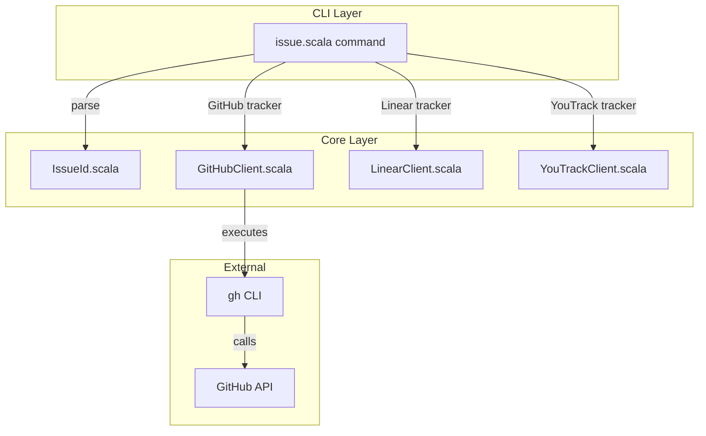
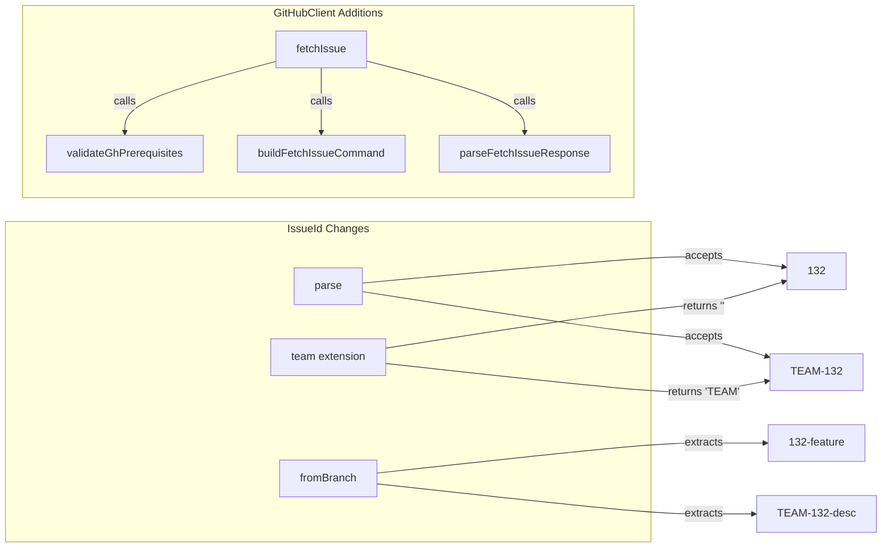
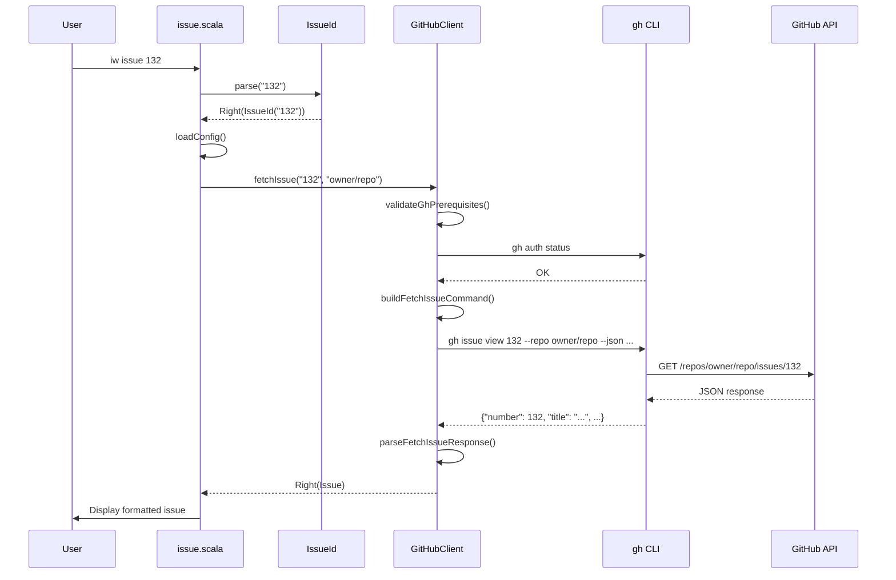
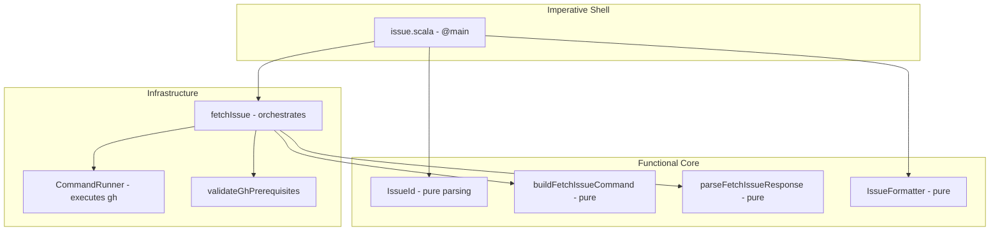

# Review Packet: Phase 5 - Display GitHub issue details

**Issue:** IWLE-132
**Phase:** 5 of 6
**Story:** Story 3 - Display GitHub issue details
**Commit:** `3f80260`

---

## Goals

This phase extends the `iw issue` command to support GitHub tracker, enabling developers to view issue details from GitHub Issues using the `gh` CLI.

**What this phase accomplishes:**

1. **Add `gh issue view` support** - GitHubClient now has `fetchIssue()` method
2. **Extend IssueId parsing** - Accept numeric GitHub issue IDs (e.g., "132")
3. **Add GitHub case to issue command** - Route GitHub tracker to GitHubClient
4. **Map GitHub JSON to Issue model** - Parse state, assignees, body
5. **Support branch inference** - Extract "132" from branch "132-feature-name"
6. **Maintain consistency** - Same display format as Linear/YouTrack

---

## Scenarios

- [ ] **View issue by explicit ID**: `iw issue 132` displays GitHub issue #132 details
- [ ] **View issue inferred from branch**: On branch `132-feature`, `iw issue` shows issue #132
- [ ] **Error when gh not installed**: Clear message with installation URL
- [ ] **Error when gh not authenticated**: Clear message with `gh auth login` instruction
- [ ] **Error when issue not found**: Graceful error message
- [ ] **Error when repository not configured**: Prompts to run `iw init`
- [ ] **Regression: Linear issues still work**: `iw issue IWLE-123` works as before
- [ ] **Regression: YouTrack issues still work**: YouTrack tracker not affected

---

## Entry Points

| File | Method/Class | Why Start Here |
|------|--------------|----------------|
| `.iw/commands/issue.scala:76-88` | `fetchIssue()` GitHub case | Command routing - where GitHub tracker is handled |
| `.iw/core/GitHubClient.scala:299-326` | `fetchIssue()` | Core implementation - orchestrates validation, execution, parsing |
| `.iw/core/IssueId.scala:18-28` | `parse()` | Domain model - now supports numeric GitHub IDs |
| `.iw/core/GitHubClient.scala:255-289` | `parseFetchIssueResponse()` | JSON parsing - maps GitHub response to Issue |
| `.iw/core/GitHubClient.scala:237-245` | `buildFetchIssueCommand()` | Command building - gh CLI argument array |

---

## Diagrams

### Architecture Overview

### Component Relationships - Phase 5 Additions

### Fetch Issue Sequence Diagram

### Layer Diagram (FCIS)

---

## Test Summary

### IssueId Tests (12 new tests)

| Test | Type | Verifies |
|------|------|----------|
| `parse accepts numeric GitHub ID 132` | Unit | Numeric ID parsing works |
| `parse accepts single digit numeric ID 1` | Unit | Edge case: single digit |
| `parse accepts multi-digit numeric ID 999` | Unit | Edge case: larger numbers |
| `parse trims whitespace from numeric ID` | Unit | Whitespace handling |
| `parse does not uppercase numeric IDs` | Unit | Numeric IDs preserved as-is |
| `fromBranch extracts numeric prefix with dash` | Unit | "132-feature" → "132" |
| `fromBranch extracts numeric prefix with underscore` | Unit | "123_bugfix" → "123" |
| `fromBranch extracts single digit numeric prefix` | Unit | "1-test" → "1" |
| `fromBranch regression test TEAM-NNN format` | Unit | "IWLE-132-desc" still works |
| `team returns empty string for numeric GitHub ID` | Unit | No team for numeric IDs |
| `team regression test returns team for TEAM-NNN` | Unit | "IWLE-132" → "IWLE" |

### GitHubClient Tests (19 new tests for fetchIssue)

| Test | Type | Verifies |
|------|------|----------|
| `buildFetchIssueCommand generates correct arguments` | Unit | Command array structure |
| `buildFetchIssueCommand with different issue number` | Unit | Issue number substitution |
| `buildFetchIssueCommand with different repository` | Unit | Repository parameter |
| `parseFetchIssueResponse parses complete valid JSON` | Unit | Full JSON parsing |
| `parseFetchIssueResponse handles empty assignees array` | Unit | No assignee case |
| `parseFetchIssueResponse handles null body` | Unit | Empty description case |
| `parseFetchIssueResponse uses first assignee` | Unit | Multiple assignees handling |
| `parseFetchIssueResponse maps OPEN state to lowercase` | Unit | State normalization |
| `parseFetchIssueResponse maps CLOSED state to lowercase` | Unit | State normalization |
| `parseFetchIssueResponse formats issue ID with # prefix` | Unit | "#132" format |
| `parseFetchIssueResponse returns error for malformed JSON` | Unit | Error handling |
| `parseFetchIssueResponse returns error for missing title` | Unit | Validation |
| `parseFetchIssueResponse returns error for missing state` | Unit | Validation |
| `fetchIssue validates prerequisites - gh not installed` | Unit | Prerequisite check |
| `fetchIssue validates prerequisites - not authenticated` | Unit | Auth check |
| `fetchIssue executes command with correct arguments` | Unit | Integration |
| `fetchIssue parses successful response into Issue` | Unit | Full flow |
| `fetchIssue returns Left when command fails` | Unit | Error handling |
| `fetchIssue returns Left when JSON parsing fails` | Unit | Error handling |

---

## Files Changed

**7 files changed**, +1394 insertions, -4 deletions

Full file list

| File | Status | Description |
|------|--------|-------------|
| `.iw/core/IssueId.scala` | M | Added numeric patterns for GitHub IDs |
| `.iw/core/GitHubClient.scala` | M | Added fetchIssue, buildFetchIssueCommand, parseFetchIssueResponse |
| `.iw/commands/issue.scala` | M | Added IssueTrackerType.GitHub case |
| `.iw/core/test/IssueIdTest.scala` | M | Added 12 tests for numeric ID parsing |
| `.iw/core/test/GitHubClientTest.scala` | M | Added 19 tests for fetchIssue |
| `project-management/issues/IWLE-132/phase-05-context.md` | A | Phase context document |
| `project-management/issues/IWLE-132/phase-05-tasks.md` | A | Phase tasks document |

---

## Key Implementation Decisions

1. **Pattern Priority**: TEAM-NNN patterns tried first, numeric patterns as fallback (backward compatible)
2. **No Uppercasing**: Numeric IDs preserved as-is (not uppercased like TEAM-NNN)
3. **Graceful Degradation**: `team` extension returns empty string for numeric IDs
4. **State Normalization**: GitHub states lowercased for consistency ("OPEN" → "open")
5. **First Assignee**: When multiple assignees exist, use first one
6. **ID Formatting**: GitHub issue IDs formatted with "#" prefix ("#132")
7. **Prerequisite Reuse**: Uses Phase 4's `validateGhPrerequisites()` for consistency

---

## Reviewer Notes

- **Start at issue.scala:76** to see how GitHub tracker is routed
- **The fetchIssue flow mirrors createIssue** from Phase 3 - same patterns
- **IssueId changes are minimal** - just 2 new regex patterns and fallback logic
- **Tests are comprehensive** - 31 new tests covering all edge cases
- **No breaking changes** - Linear/YouTrack paths unchanged
