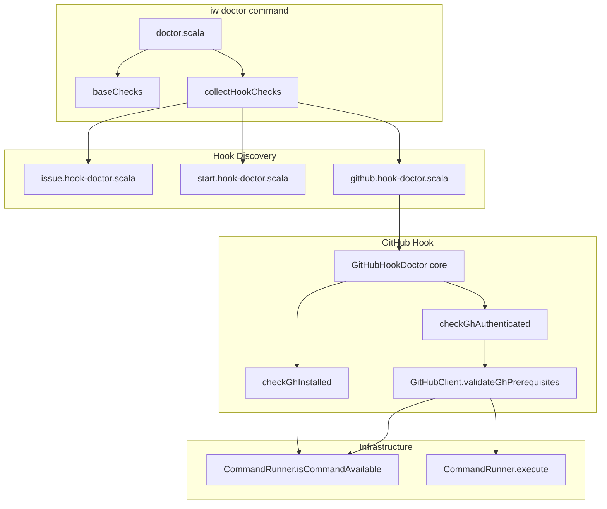
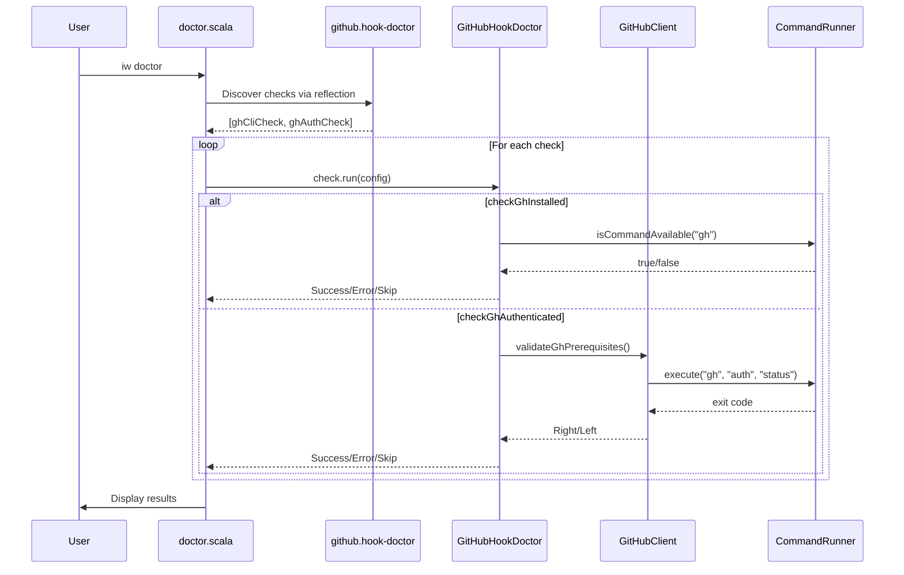
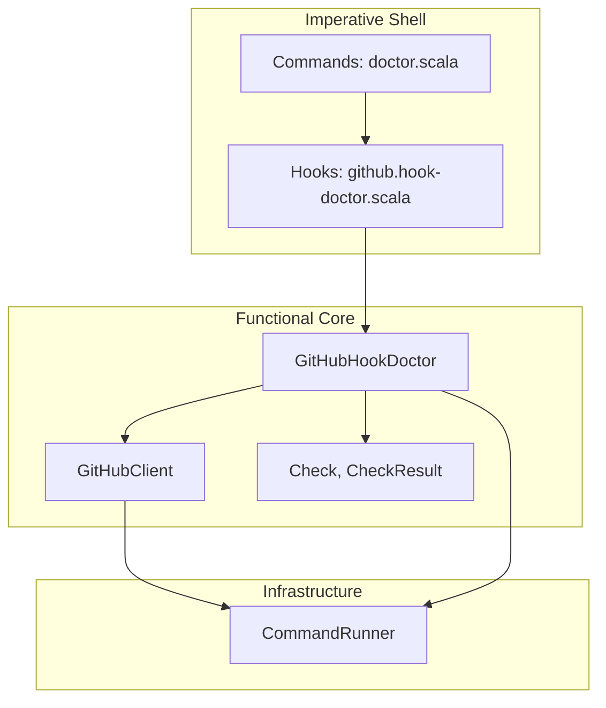

# Review Packet: Phase 6 - Doctor validates GitHub setup

**Issue:** IWLE-132
**Phase:** 6 of 6
**Branch:** IWLE-132-phase-06

---

## Goals

This phase adds GitHub-specific health checks to the `iw doctor` command. When a project is configured with the GitHub tracker, the doctor command validates:

1. **gh CLI is installed** - The `gh` command is available in PATH
2. **gh CLI is authenticated** - User has logged in via `gh auth login`

These checks help users troubleshoot GitHub integration issues by providing clear diagnostic output and actionable instructions.

---

## Scenarios

- [ ] When tracker is GitHub and gh CLI is installed, doctor shows "gh CLI: Installed"
- [ ] When tracker is GitHub and gh CLI is not installed, doctor shows error with installation URL
- [ ] When tracker is GitHub and gh is installed but not authenticated, doctor shows error with "gh auth login" instruction
- [ ] When tracker is GitHub and gh is installed and authenticated, doctor shows "gh auth: Authenticated"
- [ ] When tracker is Linear/YouTrack, gh checks are skipped with "Not using GitHub" message
- [ ] Doctor discovers and runs multiple Check values from a single hook

---

## Entry Points

| File | Method/Class | Why Start Here |
|------|--------------|----------------|
| `.iw/core/GitHubHookDoctor.scala` | `GitHubHookDoctor.checkGhInstalled` | Core check logic for gh CLI installation |
| `.iw/core/GitHubHookDoctor.scala` | `GitHubHookDoctor.checkGhAuthenticated` | Core check logic for gh CLI authentication |
| `.iw/commands/github.hook-doctor.scala` | `GitHubHookDoctor` object | Hook entry point exposing checks for discovery |
| `.iw/commands/doctor.scala` | `collectHookChecks()` | Enhanced to discover multiple checks per hook |

---

## Diagrams

### Architecture Overview

### Check Flow Sequence

### Layer Diagram (FCIS)

---

## Test Summary

| Test | Type | Verifies |
|------|------|----------|
| `checkGhInstalled skips for non-GitHub tracker` | Unit | Skip behavior for Linear/YouTrack |
| `checkGhInstalled succeeds when gh CLI available` | Unit | Success path with gh installed |
| `checkGhInstalled fails when gh CLI not available` | Unit | Error with installation URL |
| `checkGhAuthenticated skips for non-GitHub tracker` | Unit | Skip behavior for Linear/YouTrack |
| `checkGhAuthenticated skips when gh not installed` | Unit | Cascading skip when dependency missing |
| `checkGhAuthenticated succeeds when authenticated` | Unit | Success path with valid auth |
| `checkGhAuthenticated fails when not authenticated` | Unit | Error with auth login instruction |
| `doctor shows gh CLI check passed for GitHub project` | E2E | Integration with real config |
| `doctor skips gh checks for non-GitHub project` | E2E | Skip behavior in full stack |
| `doctor shows gh auth check when gh is installed` | E2E | Auth check integration |

**Test counts:** 7 unit tests + 3 E2E tests = 10 tests total

---

## Files Changed

**5 files changed, +189 insertions**

| Status | File | Description |
|--------|------|-------------|
| A | `.iw/core/GitHubHookDoctor.scala` | Core check functions with dependency injection |
| A | `.iw/commands/github.hook-doctor.scala` | Hook exposing checks for discovery |
| A | `.iw/core/test/GitHubHookDoctorTest.scala` | Unit tests (7 tests) |
| M | `.iw/commands/doctor.scala` | Enhanced hook discovery for multiple checks |
| M | `.iw/test/doctor.bats` | E2E tests (3 tests added) |

Full file list

- `.iw/core/GitHubHookDoctor.scala` (A) - 75 lines
- `.iw/commands/github.hook-doctor.scala` (A) - 10 lines
- `.iw/core/test/GitHubHookDoctorTest.scala` (A) - 84 lines
- `.iw/commands/doctor.scala` (M) - Hook discovery enhancement
- `.iw/test/doctor.bats` (M) - 87 lines added

---

## Implementation Notes

### Design Decisions

1. **Two separate checks**: Used `gh CLI` and `gh auth` as distinct checks (vs. combined) for better diagnostics

2. **Dependency injection**: `checkGhInstalledWith` and `checkGhAuthenticatedWith` accept function parameters for testability without mocking

3. **Reuse Phase 4 utilities**: `checkGhAuthenticated` delegates to `GitHubClient.validateGhPrerequisites()` to avoid code duplication

4. **Enhanced hook discovery**: Modified `collectHookChecks()` to find all `Check`-typed methods, not just one named `check`

### Deferred Scope

- Repository access check (`gh repo view`) deferred - requires network, may be slow

---

## Review Checklist

- [ ] Core logic handles all tracker types (GitHub, Linear, YouTrack)
- [ ] Error messages are actionable with specific instructions
- [ ] Tests cover all branches in check functions
- [ ] Hook discovery enhancement is backwards compatible
- [ ] E2E tests handle both gh-installed and gh-not-installed scenarios
