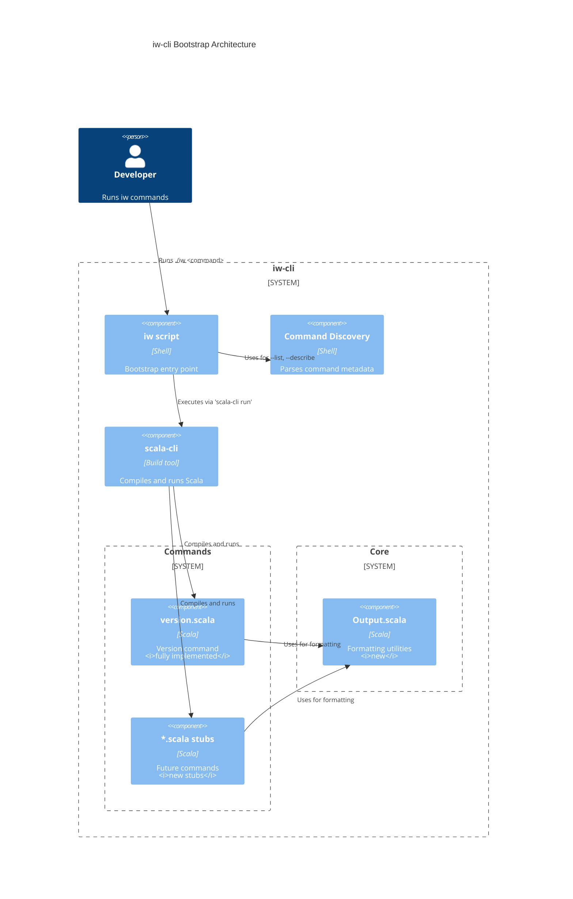
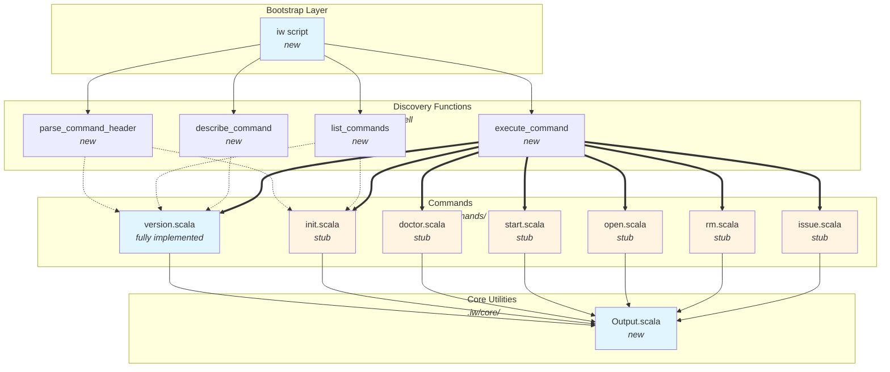
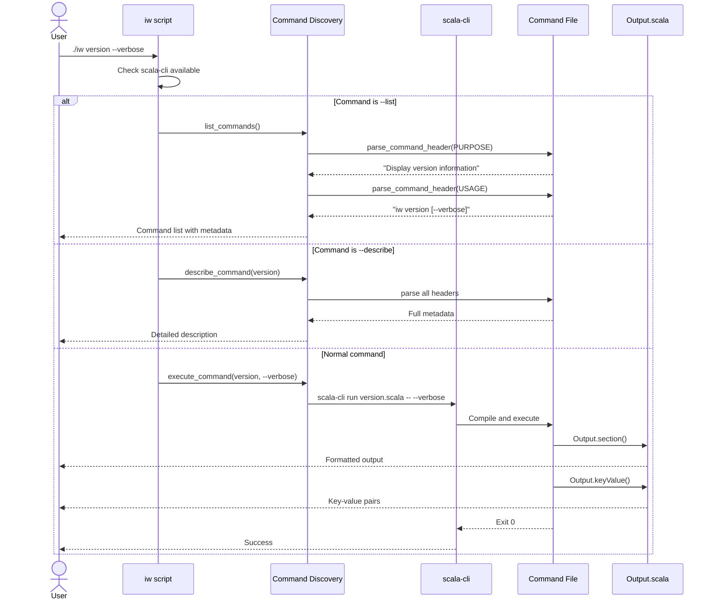

# Phase 01: Bootstrap Foundation & Command Discovery

## Goals

This phase establishes the foundation for iw-cli as a project-local tool that runs via POSIX-compliant shell bootstrap with scala-cli command discovery.

Key objectives:
- Enable execution of iw-cli commands through `./iw` bootstrap script
- Implement command discovery mechanism that parses structured headers from Scala files
- Provide LLM-friendly discoverability through `--list` and `--describe` flags
- Demonstrate working implementation with version command
- Create stub commands for future phases

## Scenarios

- [ ] Shell script is POSIX-compliant and works on Linux and macOS
- [ ] Script invokes scala-cli with correct source paths using `//> using file` directives
- [ ] First run compiles successfully (handled by scala-cli)
- [ ] Subsequent runs use scala-cli's built-in compilation cache
- [ ] Clear error message appears if scala-cli is not installed
- [ ] `./iw version` outputs "iw-cli version 0.1.0"
- [ ] `./iw version --verbose` shows detailed version information
- [ ] `./iw --help` displays usage information
- [ ] `./iw --list` shows all commands with PURPOSE and USAGE metadata
- [ ] `./iw --describe version` shows full command documentation including ARGS and EXAMPLES
- [ ] Unknown commands return non-zero exit code with helpful error message
- [ ] Script is executable (chmod +x)
- [ ] Command stubs return exit code 0 with "Not implemented" message

## Entry Points

Start your review from these locations:

| File | Method/Class | Why Start Here |
|------|--------------|----------------|
| `iw` | `main()` | Shell script entry point - orchestrates command discovery and execution |
| `iw` | `parse_command_header()` | Core discovery mechanism - extracts structured metadata from Scala command files |
| `.iw/commands/version.scala` | `VersionCommand` | Fully implemented command demonstrating the target pattern |
| `.iw/core/Output.scala` | `Output` object | Shared formatting utilities used by all commands |
| `.iw/commands/init.scala` | `InitCommand` | Example stub command showing minimal implementation |

## Architecture Overview

This diagram shows how the bootstrap script integrates with scala-cli to execute commands:

**Key points for reviewer:**
- Bootstrap script is pure shell - no Scala compilation needed for discovery
- Command metadata lives in structured comments (PURPOSE, USAGE, ARGS, EXAMPLES)
- Each command declares its own dependencies via `//> using file` directives
- scala-cli handles compilation caching automatically

## Component Relationships

**Key points for reviewer:**
- Dotted lines represent metadata parsing (grep-based, no execution)
- Solid lines represent runtime dependencies (scala-cli execution)
- All commands depend on Output.scala for consistent formatting
- Command stubs use identical structure to version.scala

## Key Flow: Command Execution

**Key points for reviewer:**
- Discovery operations never execute Scala code (fast, safe)
- Command execution goes through scala-cli (handles compilation)
- Output utilities provide consistent formatting across all commands
- Exit codes propagate correctly from command to user

## Test Summary

| Test | Type | Verifies |
|------|------|----------|
| `OutputTest."info prints message to stdout"` | Unit | Basic stdout output without formatting |
| `OutputTest."error prints message to stderr with Error prefix"` | Unit | Error messages go to stderr with prefix |
| `OutputTest."success prints message with checkmark"` | Unit | Success formatting with ✓ symbol |
| `OutputTest."section prints title with formatting"` | Unit | Section headers with === delimiters |
| `OutputTest."keyValue prints formatted key-value pair"` | Unit | Aligned key-value output formatting |
| `DebugTest` | Debug | Manual exploration of stdout capture behavior |

**E2E verification performed manually:**
- `./iw version` returns "iw-cli version 0.1.0" ✓
- `./iw version --verbose` shows detailed information ✓
- `./iw --help` displays usage ✓
- `./iw --list` shows all commands ✓
- `./iw --describe version` shows full documentation ✓
- `./iw unknown` exits non-zero with error ✓
- `./iw init` stub returns "Not implemented yet" ✓

**Test coverage:**
- Output.scala: 100% coverage of all formatting functions
- version.scala: E2E verified with both modes (normal and verbose)
- iw script: E2E verified all discovery modes and error paths
- Command stubs: E2E verified stub behavior

## Files Changed

**54 files** changed, +3465 insertions, -0 deletions

Full file list - Implementation files

**Core implementation (11 files):**
- `iw` (A) +142 lines - Bootstrap shell script
- `.iw/core/Output.scala` (A) +20 lines - Output formatting utilities
- `.iw/core/test/OutputTest.scala` (A) +67 lines - Unit tests for Output
- `.iw/core/test/DebugTest.scala` (A) +28 lines - Debug test for stdout capture
- `.iw/commands/version.scala` (A) +28 lines - Version command (fully implemented)
- `.iw/commands/init.scala` (A) +15 lines - Init stub
- `.iw/commands/doctor.scala` (A) +15 lines - Doctor stub
- `.iw/commands/start.scala` (A) +15 lines - Start stub
- `.iw/commands/open.scala` (A) +15 lines - Open stub
- `.iw/commands/rm.scala` (A) +15 lines - Rm stub
- `.iw/commands/issue.scala` (A) +15 lines - Issue stub

**Context/planning files (2 files):**
- `project-management/issues/IWLE-72/phase-01-context.md` (A) +143 lines
- `project-management/issues/IWLE-72/phase-01-tasks.md` (A) +68 lines

Full file list - Research files (reference only)

**Research prototypes (41 files, +3152 lines):**
- `research/approach-1-script-discovery/` - 11 files (initial prototype)
- `research/approach-2-git-style/` - 16 files (git-style layout exploration)
- `research/approach-3-hybrid/` - 8 files (hybrid approach)
- `research/approach-4-combined/` - 6 files (final architecture research)

These files informed the implementation but are not part of the review scope.

---

**Review Notes:**

This phase establishes a solid foundation for the iw-cli tool. The key innovation is the structured comment headers that enable LLM discoverability without requiring custom tooling. The bootstrap script is intentionally simple (pure POSIX shell) to minimize maintenance burden.

Critical areas to verify:
1. Shell script portability (POSIX compliance)
2. Command header parsing logic correctness
3. scala-cli integration and error handling
4. Output utility consistency across all commands
5. Stub command structure matches version.scala pattern

The architecture is designed for easy extension - adding new commands requires only creating a new `.scala` file with the structured headers.
