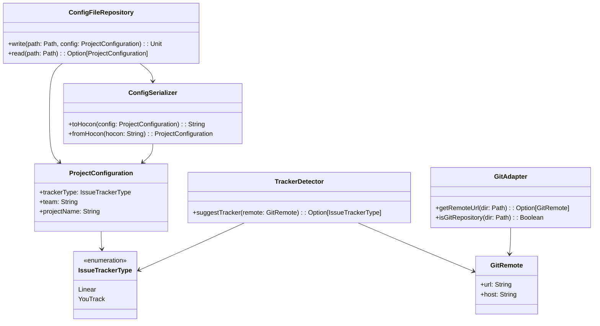
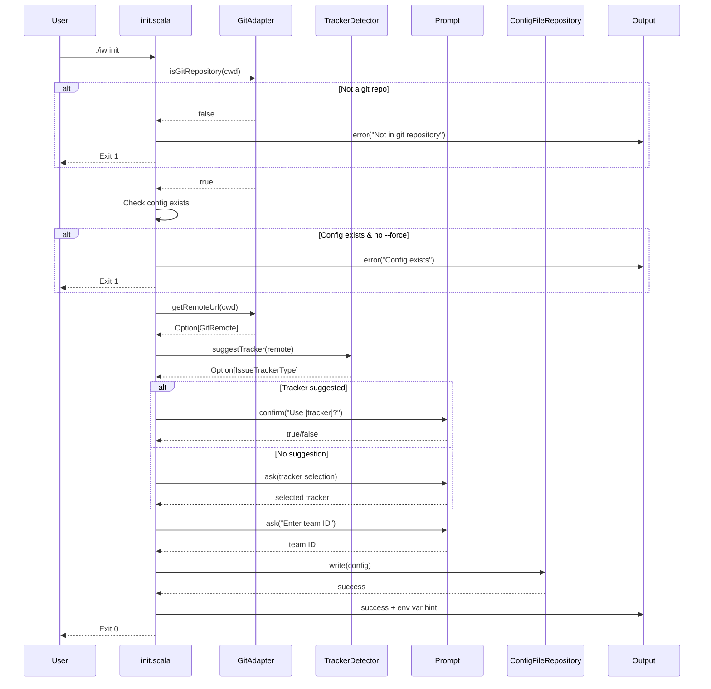
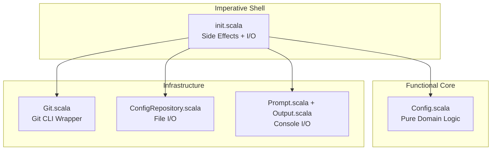

# Review Packet: Phase 2 - Initialize project with issue tracker configuration

**Issue:** IWLE-72
**Phase:** 2 of 7
**Branch:** IWLE-72-phase-02

## Goals

This phase implements the `iw init` command that:
1. Detects git remote to suggest appropriate issue tracker (Linear for github.com, YouTrack for gitlab.e-bs.cz)
2. Guides user through interactive configuration setup
3. Creates `.iw/config.conf` with HOCON format configuration
4. Provides clear instructions for setting API token environment variable

**User Story:** As a developer, I want to configure iw-cli for my project so that the tool knows where to read issues and how to create worktrees.

## Scenarios

- [ ] Running `./iw init` in a git repository creates `.iw/config.conf`
- [ ] Running `./iw init` detects github.com remote and suggests Linear tracker
- [ ] Running `./iw init` detects gitlab.e-bs.cz remote and suggests YouTrack tracker
- [ ] Running `./iw init` outside a git repository shows error message
- [ ] Running `./iw init` when config exists shows error with `--force` suggestion
- [ ] Running `./iw init --force` overwrites existing configuration
- [ ] After initialization, shows appropriate API token environment variable hint

## Entry Points

| File | Method/Class | Why Start Here |
|------|--------------|----------------|
| `.iw/commands/init.scala` | `InitCommand.main()` | Command entry point - orchestrates the entire init workflow |
| `.iw/core/Config.scala` | `GitRemote`, `TrackerDetector` | Domain logic for URL parsing and tracker detection |
| `.iw/core/Config.scala` | `ConfigSerializer` | HOCON serialization/deserialization logic |
| `.iw/core/ConfigRepository.scala` | `ConfigFileRepository` | Persistence layer for config files |
| `.iw/core/Git.scala` | `GitAdapter` | Infrastructure for git operations |

## Diagrams

### Architecture Overview

```mermaid
graph TB
    subgraph "CLI Layer"
        init[init.scala<br/>Command Entry Point]
    end

    subgraph "Domain Layer"
        GitRemote[GitRemote<br/>URL Value Object]
        TrackerType[IssueTrackerType<br/>Linear | YouTrack]
        Config[ProjectConfiguration<br/>Config Value Object]
        Detector[TrackerDetector<br/>Detection Logic]
        Serializer[ConfigSerializer<br/>HOCON Conversion]
    end

    subgraph "Infrastructure Layer"
        GitAdapter[GitAdapter<br/>Git Commands]
        ConfigRepo[ConfigFileRepository<br/>File I/O]
        Prompt[Prompt<br/>User Input]
        Output[Output<br/>Console Output]
    end

    subgraph "External"
        Git[Git CLI]
        FileSystem[File System]
        StdIn[Standard Input]
    end

    init --> Detector
    init --> ConfigRepo
    init --> GitAdapter
    init --> Prompt
    init --> Output

    Detector --> GitRemote
    Detector --> TrackerType

    ConfigRepo --> Serializer
    ConfigRepo --> Config
    ConfigRepo --> FileSystem

    GitAdapter --> GitRemote
    GitAdapter --> Git

    Prompt --> StdIn
```

### Component Relationships



### Init Command Flow



### Layer Diagram (FCIS)



## Test Summary

| Test | Type | Verifies |
|------|------|----------|
| `ConfigTest."GitRemote parses GitHub HTTPS URL"` | Unit | HTTPS URL host extraction |
| `ConfigTest."GitRemote parses GitHub SSH URL"` | Unit | SSH URL host extraction |
| `ConfigTest."GitRemote parses GitLab E-BS HTTPS URL"` | Unit | gitlab.e-bs.cz HTTPS parsing |
| `ConfigTest."GitRemote parses GitLab E-BS SSH URL"` | Unit | gitlab.e-bs.cz SSH parsing |
| `ConfigTest."GitRemote handles URL without .git suffix"` | Unit | URL parsing without .git |
| `ConfigTest."TrackerDetector suggests Linear for github.com"` | Unit | github.com → Linear mapping |
| `ConfigTest."TrackerDetector suggests YouTrack for gitlab.e-bs.cz"` | Unit | gitlab.e-bs.cz → YouTrack mapping |
| `ConfigTest."TrackerDetector returns None for unknown host"` | Unit | Unknown hosts return None |
| `ConfigFileTest."ProjectConfiguration serializes to HOCON"` | Unit | HOCON output format |
| `ConfigFileTest."ProjectConfiguration deserializes from HOCON"` | Unit | HOCON parsing |
| `ConfigFileTest."ProjectConfiguration roundtrip preserves data"` | Unit | Serialization integrity |
| `ConfigFileTest."ConfigSerializer handles YouTrack tracker type"` | Unit | YouTrack type serialization |
| `ConfigFileTest."ConfigSerializer fails on invalid tracker type"` | Unit | Invalid type error handling |
| `ConfigFileTest."ConfigSerializer fails on missing tracker type"` | Unit | Missing field validation |
| `ConfigFileTest."ConfigSerializer fails on missing tracker team"` | Unit | Required field validation |
| `ConfigFileTest."ConfigSerializer fails on missing project name"` | Unit | Required field validation |
| `ConfigRepositoryTest."ConfigFileRepository writes config to file"` | Integration | File write operation |
| `ConfigRepositoryTest."ConfigFileRepository reads config from file"` | Integration | File read operation |
| `ConfigRepositoryTest."ConfigFileRepository roundtrip preserves data"` | Integration | File I/O integrity |
| `ConfigRepositoryTest."ConfigFileRepository returns None for non-existent file"` | Integration | Missing file handling |
| `ConfigRepositoryTest."ConfigFileRepository creates parent directories when writing"` | Integration | Directory creation |
| `GitTest."GitAdapter reads git remote URL"` | Integration | Git remote reading |
| `GitTest."GitAdapter extracts host from remote URL"` | Integration | Host extraction via git |
| `GitTest."GitAdapter returns None for non-git directory"` | Integration | Non-git directory handling |
| `GitTest."GitAdapter returns None for git repo without remote"` | Integration | Missing remote handling |
| `GitTest."GitAdapter checks if directory is in git repo"` | Integration | Repository detection |

**Total: 26 tests (18 Unit, 8 Integration)**

## Files Changed

**10 files changed, +679 insertions, -5 deletions**

<details>
<summary>Full file list</summary>

| File | Status | Description |
|------|--------|-------------|
| `.iw/commands/init.scala` | M | Full interactive init implementation |
| `.iw/core/Config.scala` | A | Domain model (GitRemote, IssueTrackerType, ProjectConfiguration) |
| `.iw/core/ConfigRepository.scala` | A | HOCON file I/O repository |
| `.iw/core/Git.scala` | A | Git infrastructure adapter |
| `.iw/core/Prompt.scala` | A | Interactive console prompts |
| `.iw/core/test/ConfigTest.scala` | A | Domain model unit tests |
| `.iw/core/test/ConfigFileTest.scala` | A | HOCON serialization tests |
| `.iw/core/test/ConfigRepositoryTest.scala` | A | Repository integration tests |
| `.iw/core/test/GitTest.scala` | A | Git adapter integration tests |
| `project-management/issues/IWLE-72/phase-02-tasks.md` | M | Task tracking |

</details>

## Key Implementation Notes

1. **No secrets in config**: The `.iw/config.conf` file does NOT contain API tokens. Tokens are stored in environment variables (`LINEAR_API_TOKEN` or `YOUTRACK_API_TOKEN`).

2. **HOCON format**: Uses Typesafe Config library for standard Scala configuration format that supports comments.

3. **Tracker detection logic**:
   - `github.com` → Linear
   - `gitlab.e-bs.cz` → YouTrack
   - Other hosts → Ask user to choose

4. **Functional Core / Imperative Shell**: Pure domain logic in `Config.scala`, I/O at the edges in `init.scala`.
