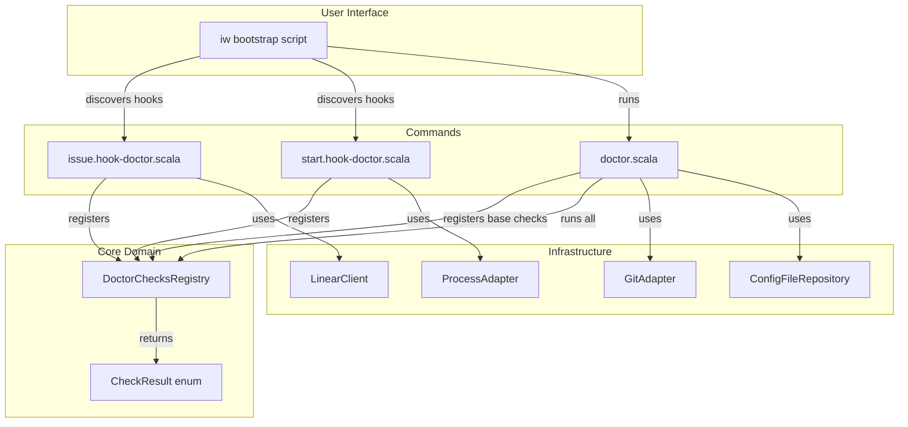
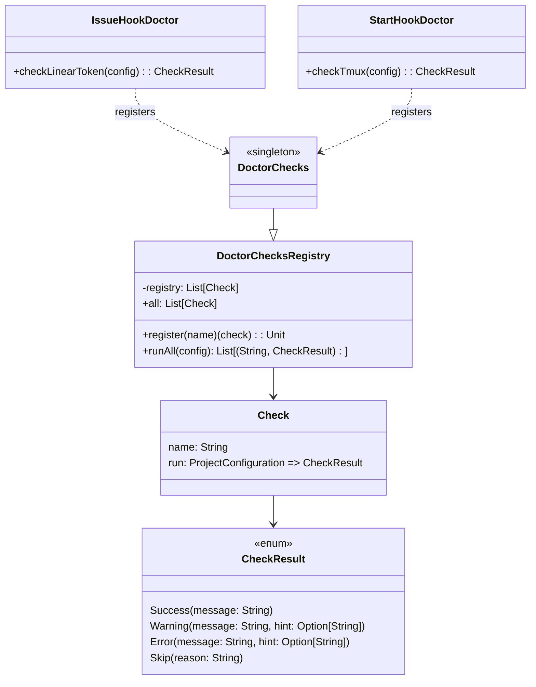
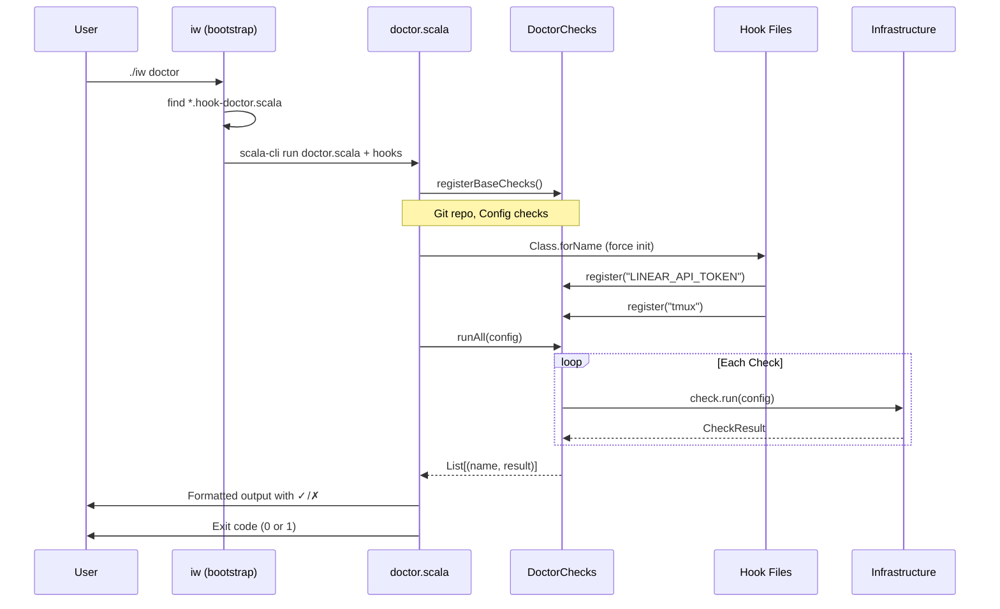
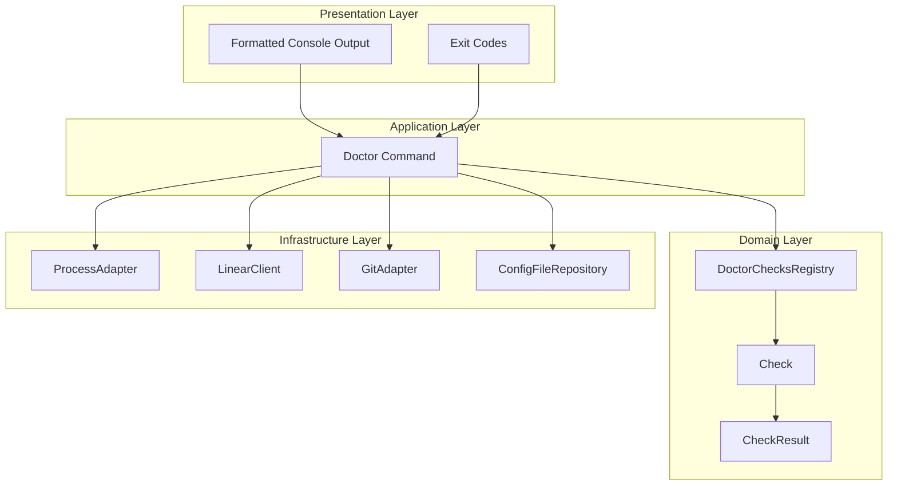

# Review Packet: Phase 3 - Validate environment and configuration

**Issue:** IWLE-72
**Phase:** 3 of 7
**Status:** Ready for Review

---

## Goals

This phase implements the `iw doctor` command that validates the environment is correctly set up for iw-cli operations. The command uses an extensible hook-based architecture where each command can register its own checks.

**Primary Objectives:**
- Implement DoctorChecks registry for extensible check registration
- Update bootstrap script to support hook file discovery (`*.hook-{command}.scala` pattern)
- Create base checks in doctor command (git repo, config file)
- Create command-specific checks as hook files colocated with commands
- Provide clear ✓/✗ reporting with actionable remediation hints
- Return appropriate exit code (0 = all pass, 1 = any failure)

---

## Scenarios

- [ ] Scenario 1: User runs `iw doctor` in a properly configured environment and sees all checks pass with ✓ symbols
- [ ] Scenario 2: User runs `iw doctor` without config file and sees Configuration check fail with remediation hint
- [ ] Scenario 3: User runs `iw doctor` without LINEAR_API_TOKEN and sees token check fail with export hint
- [ ] Scenario 4: User runs `iw doctor` on YouTrack project and LINEAR_API_TOKEN check is skipped
- [ ] Scenario 5: User runs `iw doctor` without tmux installed and sees tmux check fail with installation hint
- [ ] Scenario 6: Doctor returns exit code 0 when all checks pass
- [ ] Scenario 7: Doctor returns exit code 1 when any check fails

---

## Entry Points

| File | Method/Class | Why Start Here |
|------|--------------|----------------|
| `.iw/commands/doctor.scala` | `DoctorCommand.main` | Main entry point - orchestrates check registration, execution, and output formatting |
| `.iw/core/DoctorChecks.scala` | `DoctorChecksRegistry` | Core registry - defines CheckResult enum and registration mechanism |
| `.iw/commands/issue.hook-doctor.scala` | `IssueHookDoctor.checkLinearToken` | Linear API validation - demonstrates hook pattern with pure function |
| `iw` | `execute_command()` | Bootstrap script - shows hook discovery with `find` command |
| `.iw/core/LinearClient.scala` | `LinearClient.validateToken` | External API integration - HTTP client for token validation |

---

## Diagrams

### Architecture Overview



### Component Relationships



### Check Execution Flow



### Layer Diagram (FCIS)



---

## Test Summary

| Test | Type | Verifies |
|------|------|----------|
| `DoctorChecksTest."CheckResult.Success contains message"` | Unit | Success variant stores message |
| `DoctorChecksTest."CheckResult.Warning contains message and optional hint"` | Unit | Warning variant with/without hint |
| `DoctorChecksTest."CheckResult.Error contains message and optional hint"` | Unit | Error variant with/without hint |
| `DoctorChecksTest."CheckResult.Skip contains reason"` | Unit | Skip variant stores reason |
| `DoctorChecksTest."DoctorChecks.register adds check to registry"` | Unit | Registration mechanics |
| `DoctorChecksTest."DoctorChecks.runAll executes all checks in registration order"` | Unit | Execution order preserved |
| `DoctorChecksTest."DoctorChecks.runAll passes config to check functions"` | Unit | Config passed to checks |
| `ProcessTest."commandExists returns true for existing command (sh)"` | Unit | Detects existing command |
| `ProcessTest."commandExists returns false for non-existent command"` | Unit | Returns false for missing |
| `ProcessTest."commandExists handles command with special characters safely"` | Unit | No shell injection |
| `LinearClientTest."validateToken returns false for empty token"` | Integration | Empty token handling |
| `LinearClientTest."validateToken returns false for invalid token"` | Integration | Invalid token rejection |
| `doctor.bats: "doctor fails when no config exists"` | E2E | Missing config detection |
| `doctor.bats: "doctor passes with valid config and all dependencies"` | E2E | Happy path validation |
| `doctor.bats: "doctor shows LINEAR_API_TOKEN error when not set"` | E2E | Token error messaging |
| `doctor.bats: "doctor skips LINEAR_API_TOKEN for YouTrack projects"` | E2E | Skip logic for non-Linear |
| `doctor.bats: "doctor returns exit code 1 when checks fail"` | E2E | Exit code on failure |
| `doctor.bats: "doctor returns exit code 0 when all checks pass"` | E2E | Exit code on success |
| `doctor.bats: "doctor displays formatted output with symbols"` | E2E | Output formatting |

---

## Files Changed

**13 files changed**, +650 insertions, -5 deletions

<details>
<summary>Full file list</summary>

- `.iw/commands/doctor.scala` (M) - Full implementation with base checks and hook loading
- `.iw/commands/issue.hook-doctor.scala` (A) - Linear API token validation hook
- `.iw/commands/start.hook-doctor.scala` (A) - tmux installation check hook
- `.iw/config.conf` (A) - Sample configuration file
- `.iw/core/DoctorChecks.scala` (A) - CheckResult enum and DoctorChecksRegistry
- `.iw/core/LinearClient.scala` (A) - Linear API client with token validation
- `.iw/core/Process.scala` (A) - ProcessAdapter for shell command checks
- `.iw/core/test/DoctorChecksTest.scala` (A) - Unit tests for registry and CheckResult
- `.iw/core/test/LinearClientTest.scala` (A) - Integration tests for Linear API
- `.iw/core/test/ProcessTest.scala` (A) - Unit tests for ProcessAdapter
- `.iw/test/doctor.bats` (A) - E2E BATS tests for doctor command
- `iw` (M) - Hook discovery pattern with `find` command
- `project-management/issues/IWLE-72/phase-03-tasks.md` (M) - Task completion tracking

</details>

---

## Key Design Decisions

### Hook-Based Architecture

Commands register their own doctor checks via colocated `*.hook-doctor.scala` files. This follows the principle of keeping related code together and enables extensibility without modifying the doctor command.

### Pure Check Functions

All check logic is implemented as pure functions (`ProjectConfiguration => CheckResult`) that can be tested in isolation without side effects.

### Bootstrap Hook Discovery

The bootstrap script uses `find` to discover hook files safely:
```bash
hook_files=$(find "$COMMANDS_DIR" -maxdepth 1 -name "*.hook-${cmd_name}.scala" 2>/dev/null || true)
```

This handles empty results gracefully and avoids shell glob issues.

### Class.forName for Hook Loading

Doctor command explicitly loads hook objects via `Class.forName` to ensure their registration code executes at the right time.
