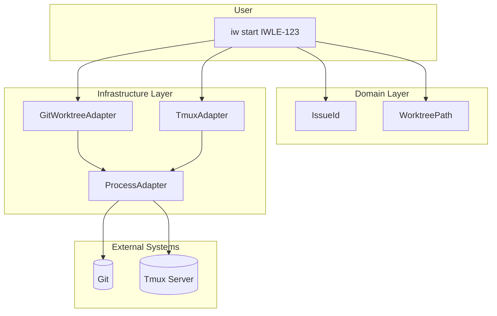
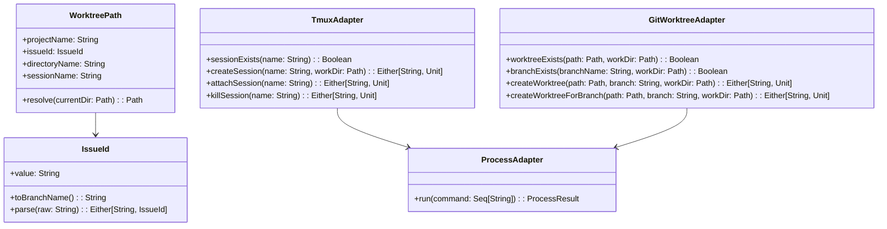
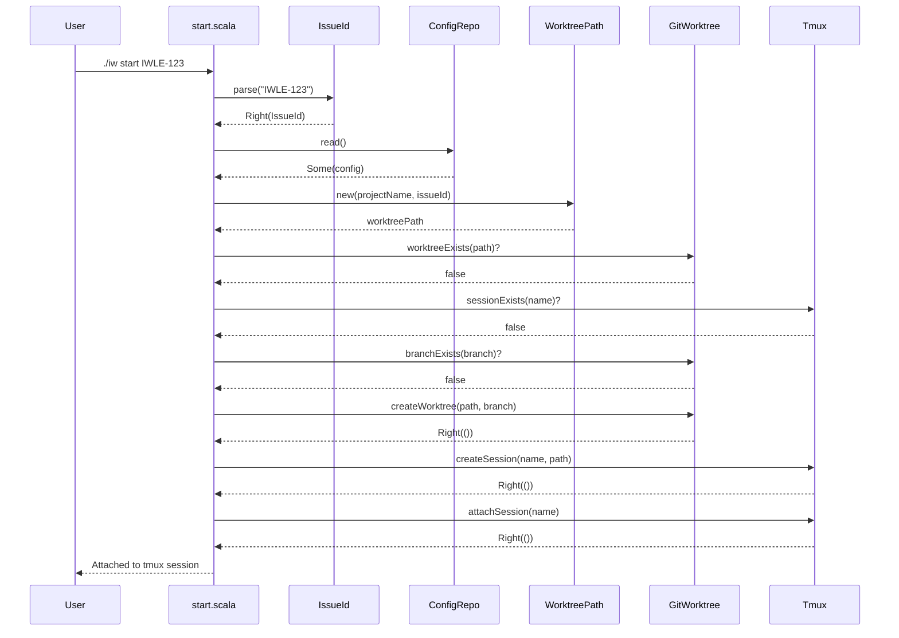
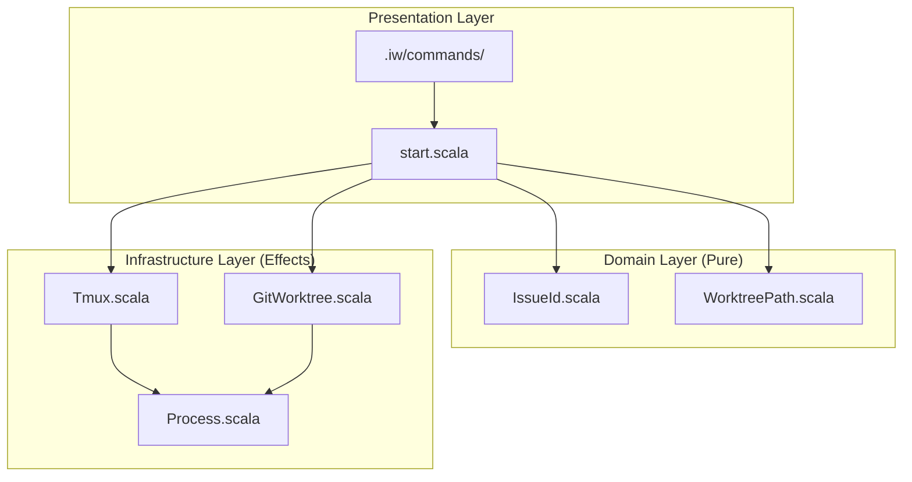

# Review Packet: Phase 4 - Create worktree for issue with tmux session

**Issue:** IWLE-72
**Phase:** 4 of 7
**Branch:** IWLE-72-phase-04

---

## Goals

This phase implements the `iw start <issue-id>` command that creates an isolated worktree for a specific issue and launches a tmux session for it.

**Primary Objectives:**
- Create sibling worktree named `{project}-{ISSUE-ID}` (e.g., `kanon-IWLE-123`)
- Create git branch matching the issue ID
- Create tmux session with the same name as the worktree
- Attach the user to the tmux session with working directory in the new worktree
- Handle edge cases: existing worktree, existing directory, existing branch

---

## Scenarios

End-to-end scenarios to verify during review:

- [ ] `./iw start IWLE-123` creates worktree `{project}-IWLE-123` as sibling directory
- [ ] Worktree has git branch named `IWLE-123`
- [ ] Tmux session `{project}-IWLE-123` is created
- [ ] User is attached to the tmux session
- [ ] Working directory in session is the new worktree
- [ ] `./iw start IWLE-123` with existing directory shows error and exits
- [ ] `./iw start IWLE-123` with existing worktree suggests using `./iw open`
- [ ] `./iw start IWLE-123` with existing tmux session suggests using `./iw open`
- [ ] `./iw start` without arguments shows usage error
- [ ] `./iw start invalid-123` shows invalid format error
- [ ] `./iw start IWLE-123` without config suggests running `./iw init`
- [ ] `./iw start IWLE-123` with existing branch uses the branch (no error)
- [ ] Lowercase input `iwle-123` is converted to uppercase

---

## Entry Points

Start code review from these files:

| File | Method/Class | Why Start Here |
|------|--------------|----------------|
| `.iw/commands/start.scala` | `start()` | CLI entry point - orchestrates the entire worktree creation workflow |
| `.iw/core/IssueId.scala` | `IssueId.parse()` | Domain validation - validates issue ID format (PROJECT-123) |
| `.iw/core/WorktreePath.scala` | `WorktreePath` | Domain calculation - computes sibling directory paths and session names |
| `.iw/core/GitWorktree.scala` | `GitWorktreeAdapter` | Infrastructure - git worktree operations |
| `.iw/core/Tmux.scala` | `TmuxAdapter` | Infrastructure - tmux session management |

---

## Diagrams

### Architecture Overview

### Component Relationships

### Start Command Flow

### Layer Diagram (FCIS)

---

## Test Summary

| Test | Type | Verifies |
|------|------|----------|
| `IssueIdTest."accepts valid format IWLE-123"` | Unit | Valid issue ID parsing |
| `IssueIdTest."converts lowercase to uppercase"` | Unit | Case normalization |
| `IssueIdTest."trims whitespace"` | Unit | Input sanitization |
| `IssueIdTest."rejects missing dash"` | Unit | Format validation |
| `IssueIdTest."rejects missing number"` | Unit | Format validation |
| `IssueIdTest."rejects empty string"` | Unit | Empty input handling |
| `IssueIdTest."rejects multiple dashes"` | Unit | Format strictness |
| `IssueIdTest."toBranchName returns value unchanged"` | Unit | Branch name derivation |
| `WorktreePathTest."directoryName combines project and issue"` | Unit | Directory naming |
| `WorktreePathTest."resolve creates sibling path"` | Unit | Path calculation |
| `WorktreePathTest."sessionName matches directoryName"` | Unit | Tmux session naming |
| `TmuxAdapterTest."sessionExists returns false for non-existent"` | Integration | Session detection |
| `TmuxAdapterTest."sessionExists returns true for existing"` | Integration | Session detection |
| `TmuxAdapterTest."createSession creates detached session"` | Integration | Session creation |
| `TmuxAdapterTest."createSession sets working directory"` | Integration | Session workdir |
| `TmuxAdapterTest."killSession removes existing session"` | Integration | Session cleanup |
| `GitWorktreeAdapterTest."worktreeExists returns false"` | Integration | Worktree detection |
| `GitWorktreeAdapterTest."worktreeExists returns true"` | Integration | Worktree detection |
| `GitWorktreeAdapterTest."branchExists returns false"` | Integration | Branch detection |
| `GitWorktreeAdapterTest."branchExists returns true"` | Integration | Branch detection |
| `GitWorktreeAdapterTest."createWorktree creates with new branch"` | Integration | Worktree creation |
| `GitWorktreeAdapterTest."createWorktreeForBranch uses existing"` | Integration | Existing branch handling |
| `start.bats:"creates worktree for valid issue ID"` | E2E | Full workflow success |
| `start.bats:"fails with missing issue ID"` | E2E | Missing argument error |
| `start.bats:"fails with invalid format"` | E2E | Invalid format error |
| `start.bats:"fails when directory exists"` | E2E | Collision handling |
| `start.bats:"suggests using open for existing worktree"` | E2E | Helpful error hint |
| `start.bats:"fails without config"` | E2E | Config validation |
| `start.bats:"uses existing branch if present"` | E2E | Existing branch reuse |
| `start.bats:"converts lowercase to uppercase"` | E2E | Case normalization |

**Test Counts:**
- Unit tests: 19
- Integration tests: 16
- E2E tests: 14
- **Total: 49 tests**

---

## Files Changed

**12 files changed**

| Status | File | Description |
|--------|------|-------------|
| A | `.iw/core/IssueId.scala` | Issue ID value object with validation |
| A | `.iw/core/WorktreePath.scala` | Worktree path calculation |
| A | `.iw/core/Tmux.scala` | Tmux session management adapter |
| A | `.iw/core/GitWorktree.scala` | Git worktree operations adapter |
| M | `.iw/core/Process.scala` | Added `ProcessResult` case class and `run` method |
| M | `.iw/commands/start.scala` | Full implementation of start command |
| A | `.iw/core/test/IssueIdTest.scala` | Unit tests for IssueId |
| A | `.iw/core/test/WorktreePathTest.scala` | Unit tests for WorktreePath |
| A | `.iw/core/test/TmuxAdapterTest.scala` | Integration tests for Tmux |
| A | `.iw/core/test/GitWorktreeAdapterTest.scala` | Integration tests for GitWorktree |
| A | `.iw/test/start.bats` | E2E tests for start command |
| M | `project-management/issues/IWLE-72/phase-04-tasks.md` | Task tracking updates |

Full file list

- `.iw/core/IssueId.scala` (A)
- `.iw/core/WorktreePath.scala` (A)
- `.iw/core/Tmux.scala` (A)
- `.iw/core/GitWorktree.scala` (A)
- `.iw/core/Process.scala` (M)
- `.iw/commands/start.scala` (M)
- `.iw/core/test/IssueIdTest.scala` (A)
- `.iw/core/test/WorktreePathTest.scala` (A)
- `.iw/core/test/TmuxAdapterTest.scala` (A)
- `.iw/core/test/GitWorktreeAdapterTest.scala` (A)
- `.iw/test/start.bats` (A)
- `project-management/issues/IWLE-72/phase-04-tasks.md` (M)

---

## Key Implementation Notes

1. **Functional Core**: `IssueId` and `WorktreePath` are pure value objects with no side effects
2. **Imperative Shell**: `TmuxAdapter` and `GitWorktreeAdapter` encapsulate all shell interactions
3. **Error Handling**: Uses `Either[String, Unit]` for operations that can fail
4. **Collision Detection**: Checks for existing directory, worktree, and tmux session before creating
5. **Cleanup on Failure**: If tmux session creation fails, the worktree is removed
6. **Case Normalization**: Issue IDs are converted to uppercase for consistency
