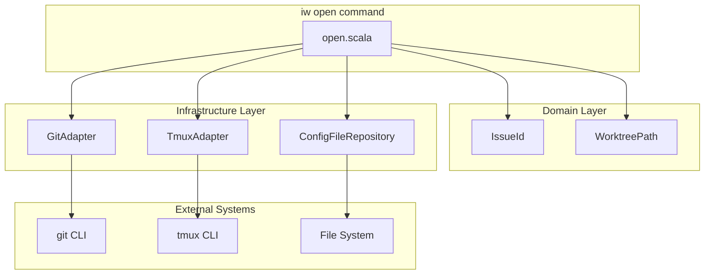
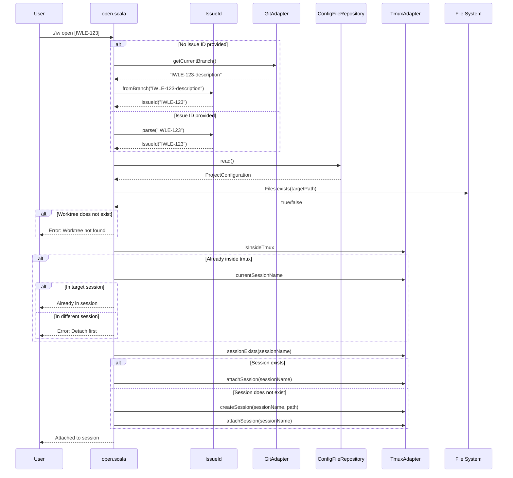
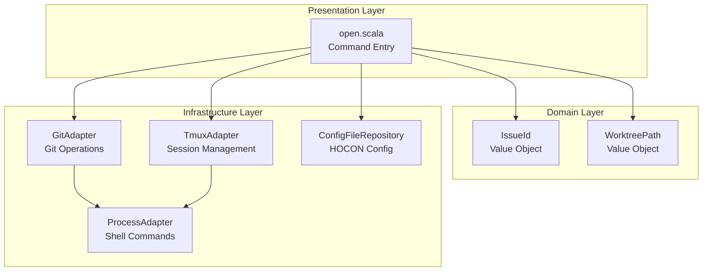

# Review Packet: Phase 5 - Open existing worktree tmux session

## Goals

This phase implements the `iw open [issue-id]` command that:
- Attaches to an existing tmux session for an issue
- Creates a session if the worktree exists but session does not
- Infers issue ID from current branch when no parameter provided
- Handles nested tmux scenarios gracefully with helpful hints

## Scenarios

- [ ] User can open session with explicit issue ID (`./iw open IWLE-123`)
- [ ] User can open session by inferring issue from current branch (`./iw open`)
- [ ] System creates tmux session if worktree exists but session does not
- [ ] System attaches to existing tmux session if already running
- [ ] Error on worktree not found with hint to use `./iw start`
- [ ] Error on invalid issue ID format with descriptive message
- [ ] Error on non-issue branch (main, feature-branch) with clear message
- [ ] Error when already inside different tmux session with detach hint
- [ ] Success message when already in target session (exit 0)
- [ ] Error on missing config with hint to run `./iw init`

## Entry Points

| File | Method/Class | Why Start Here |
|------|--------------|----------------|
| `.iw/commands/open.scala:18` | `@main def open` | Command entry point - orchestrates the full workflow |
| `.iw/core/IssueId.scala:21` | `IssueId.fromBranch` | New method for branch name extraction |
| `.iw/core/Git.scala:26` | `GitAdapter.getCurrentBranch` | New method for current branch detection |
| `.iw/core/Tmux.scala:37` | `TmuxAdapter.isInsideTmux` | New property for nested tmux detection |
| `.iw/core/Tmux.scala:41` | `TmuxAdapter.currentSessionName` | New method for session name retrieval |

## Diagrams

### Architecture Overview

### Command Flow

### Component Layer Diagram

## Test Summary

| Test | Type | Verifies |
|------|------|----------|
| `IssueIdFromBranchTest."extracts from exact match IWLE-123"` | Unit | Basic extraction works |
| `IssueIdFromBranchTest."extracts with suffix IWLE-123-description"` | Unit | Suffix handling |
| `IssueIdFromBranchTest."normalizes lowercase to uppercase"` | Unit | Case normalization |
| `IssueIdFromBranchTest."rejects main/master/develop"` | Unit | Invalid branches rejected |
| `IssueIdFromBranchTest."rejects feature-branch"` | Unit | Non-issue branches rejected |
| `GitTest."gets current branch name"` | Integration | Branch detection on default branch |
| `GitTest."gets current branch on custom branch"` | Integration | Branch detection on issue branch |
| `GitTest."handles detached HEAD"` | Integration | Returns "HEAD" for detached state |
| `GitTest."returns error for non-git directory"` | Integration | Error handling for missing git |
| `TmuxAdapterTest."isInsideTmux returns false"` | Unit | Environment detection without TMUX var |
| `TmuxAdapterTest."currentSessionName returns None"` | Unit | Session name when not in tmux |
| `TmuxAdapterTest."currentSessionName returns name"` | Integration | Session name retrieval inside tmux |
| `open.bats:"creates session for existing worktree"` | E2E | Full session creation flow |
| `open.bats:"attaches to existing session"` | E2E | Attach to running session |
| `open.bats:"infers issue from current branch"` | E2E | Branch inference workflow |
| `open.bats:"fails when worktree does not exist"` | E2E | Error handling for missing worktree |
| `open.bats:"fails with invalid issue ID"` | E2E | Invalid format rejection |
| `open.bats:"fails on non-issue branch"` | E2E | Branch inference error handling |
| `open.bats:"fails without config"` | E2E | Missing config error |
| `open.bats:"converts lowercase to uppercase"` | E2E | Case normalization in full workflow |
| `open.bats:"shows appropriate messages"` | E2E | User feedback messages |

**Test counts:**
- Unit tests: 15 (IssueIdFromBranchTest)
- Integration tests: 7 (GitTest: 4, TmuxAdapterTest: 3)
- E2E tests: 9 (open.bats)
- **Total: 31 tests**

## Files Changed

**6 files changed, +205 insertions, -10 deletions**

Full file list

| File | Status | Changes |
|------|--------|---------|
| `.iw/commands/open.scala` | M | +89 -10 (full implementation) |
| `.iw/core/IssueId.scala` | M | +7 (fromBranch method) |
| `.iw/core/Git.scala` | M | +8 (getCurrentBranch method) |
| `.iw/core/Tmux.scala` | M | +12 (isInsideTmux, currentSessionName) |
| `.iw/core/test/IssueIdFromBranchTest.scala` | A | +89 (new test file) |
| `.iw/core/test/GitTest.scala` | M | +54 (getCurrentBranch tests) |
| `.iw/core/test/TmuxAdapterTest.scala` | M | +35 (environment detection tests) |
| `.iw/test/open.bats` | A | +157 (new E2E test file) |

## Key Implementation Details

### IssueId.fromBranch

Extracts issue ID from branch names using regex pattern `^([A-Z]+-[0-9]+).*`:
- `IWLE-123` → `IWLE-123`
- `IWLE-123-description` → `IWLE-123`
- `main` → Error

### GitAdapter.getCurrentBranch

Uses `git rev-parse --abbrev-ref HEAD`:
- Returns branch name on normal branch
- Returns "HEAD" on detached HEAD
- Returns error for non-git directory

### TmuxAdapter Environment Detection

- `isInsideTmux`: Checks `TMUX` environment variable
- `currentSessionName`: Uses `tmux display-message -p "#S"` to get session name

### open.scala Workflow

1. Resolve issue ID (from args or infer from branch)
2. Read project config for project name
3. Calculate worktree path and session name
4. Verify worktree exists (error if not)
5. Check nested tmux (error if in different session)
6. Attach to session (create first if needed)

## Reviewer Notes

1. **Branch inference** - The `fromBranch` method only extracts the first `PROJECT-123` pattern, so branches like `feature/IWLE-123` won't match. This is intentional based on the standard branch naming.

2. **Nested tmux handling** - Users inside a different tmux session get a clear error with detach instructions. Users already in the target session get a success message and exit 0.

3. **Session creation** - If worktree exists but session doesn't, we create the session then attach. This handles the case where user manually killed a tmux session.

4. **Error messages** - All errors provide actionable hints (use `./iw start`, `./iw init`, or detach instructions).
