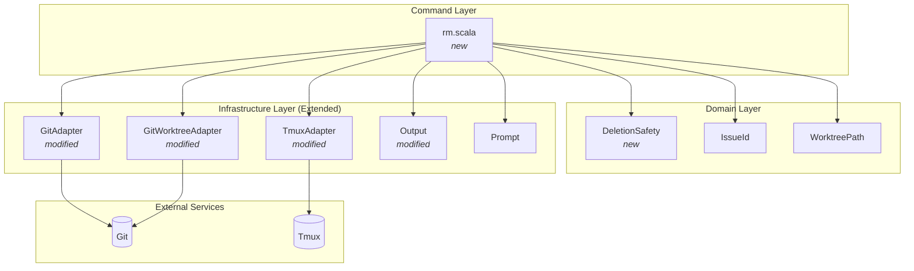
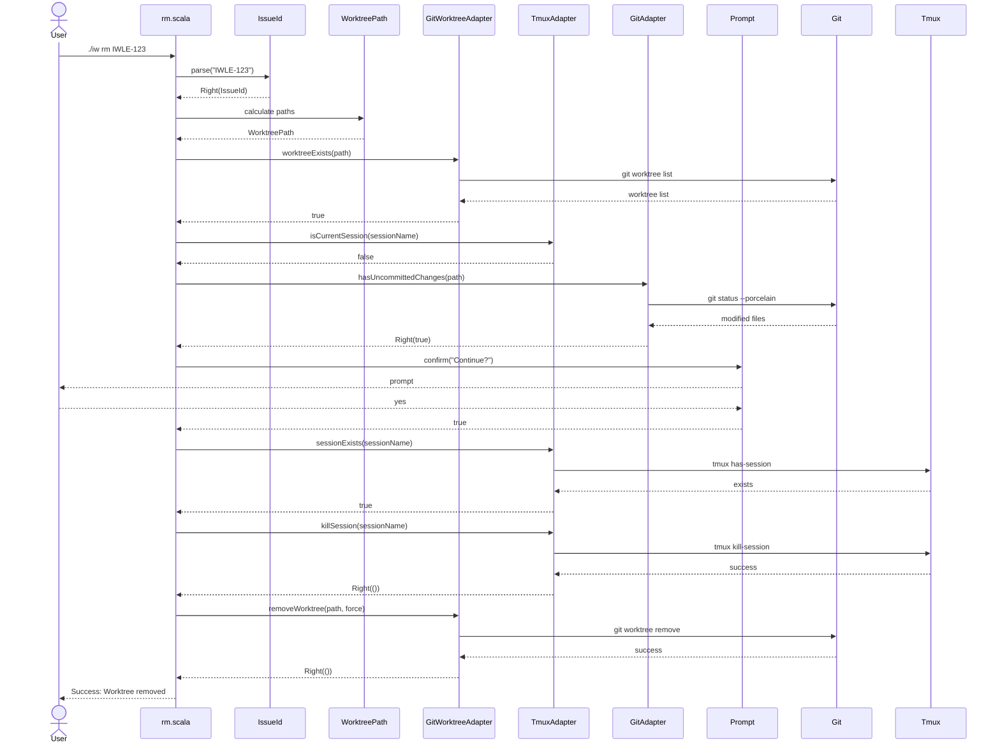
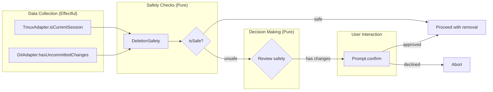

# Phase 6: Remove worktree and cleanup resources

## Goals

This phase implements the `./iw rm <issue-id>` command that cleanly removes a worktree and its associated tmux session with comprehensive safety checks to prevent data loss.

Key objectives:
- Kill the tmux session associated with an issue's worktree
- Remove the git worktree directory using `git worktree remove`
- Prevent removal of the currently active tmux session (user is attached)
- Warn about uncommitted changes and require confirmation before deletion
- Support `--force` flag to bypass safety confirmations
- Explicitly preserve git branches (branch lifecycle tied to PR/MR process)

## Scenarios

- [ ] User removes worktree with running tmux session - both are cleaned up
- [ ] User removes worktree without tmux session - only worktree removed
- [ ] User attempts to remove active session - receives error and helpful hint
- [ ] Worktree has uncommitted changes - user sees warning and confirmation prompt
- [ ] User provides `--force` flag - bypasses uncommitted changes confirmation
- [ ] User attempts to remove non-existent worktree - receives clear error message
- [ ] User provides invalid issue ID format - receives validation error
- [ ] Session kill fails - warning shown but worktree removal continues
- [ ] After removal, git branch still exists (not automatically deleted)
- [ ] User provides lowercase issue ID - automatically converted to uppercase

## Entry Points

Start your review from these locations:

| File | Method/Class | Why Start Here |
|------|--------------|----------------|
| `.iw/commands/rm.scala` | `@main def rm` | CLI entry point - orchestrates the complete removal workflow |
| `.iw/core/DeletionSafety.scala` | `DeletionSafety` | Domain value object representing safety conditions |
| `.iw/core/Git.scala` | `hasUncommittedChanges()` | Detects uncommitted changes in worktree |
| `.iw/core/Tmux.scala` | `isCurrentSession()` | Prevents removal of active session |
| `.iw/core/GitWorktree.scala` | `removeWorktree()` | Executes git worktree removal command |

## Component Relationships

This diagram shows how the rm command integrates with existing infrastructure and new components:

**Key points for reviewer:**
- `DeletionSafety` is a pure value object - encapsulates safety conditions
- New methods added to existing adapters maintain functional boundaries
- All git and tmux operations remain in infrastructure layer
- Command layer orchestrates but doesn't directly execute effects

## Removal Workflow

This sequence diagram shows the complete removal process with safety checks:

**Key points for reviewer:**
- Safety checks happen before any destructive operations
- Active session check prevents user from removing current workspace
- Uncommitted changes prompt allows informed decision
- Session kill failure doesn't block worktree removal (logged as warning)
- All operations use Either for error handling
- Branch is explicitly NOT deleted (see line 99 in rm.scala)

## Architecture: Safety Check Integration

**Key points for reviewer:**
- DeletionSafety separates data from decision logic
- Safety evaluation is pure (line 10-11 in DeletionSafety.scala)
- Effectful operations (git, tmux) happen at edges
- User confirmation only for uncommitted changes (not active session)

## Test Summary

| Test | Type | Verifies |
|------|------|----------|
| `DeletionSafety.isSafe returns true when no issues` | Unit | Safe deletion when both checks pass |
| `DeletionSafety.isSafe returns false with uncommitted changes` | Unit | Unsafe when uncommitted changes exist |
| `DeletionSafety.isSafe returns false when in active session` | Unit | Unsafe when in active tmux session |
| `DeletionSafety.isSafe returns false when both conditions` | Unit | Unsafe when multiple conditions fail |
| `hasUncommittedChanges returns false for clean worktree` | Integration | Git status check on clean directory |
| `hasUncommittedChanges returns true for modified files` | Integration | Detects modified tracked files |
| `hasUncommittedChanges returns true for untracked files` | Integration | Detects new untracked files |
| `hasUncommittedChanges returns error for non-git directory` | Integration | Error handling for invalid directories |
| `isCurrentSession returns true when in matching session` | Integration | Detects current tmux session match |
| `isCurrentSession returns false when in different session` | Integration | Distinguishes between sessions |
| `isCurrentSession returns false when not in tmux` | Integration | Handles non-tmux environment |
| `removeWorktree succeeds for clean worktree` | Integration | Standard git worktree removal |
| `removeWorktree with force succeeds even with uncommitted changes` | Integration | Force flag bypasses git checks |
| `removeWorktree fails for non-existent worktree` | Integration | Error handling for missing worktree |
| `warning prints message to stdout with Warning prefix` | Unit | Output formatting for warnings |
| `rm successfully removes worktree with session` | E2E | Complete workflow: session + worktree cleanup |
| `rm successfully removes worktree without session` | E2E | Worktree-only cleanup path |
| `rm --force bypasses confirmation for uncommitted changes` | E2E | Force flag integration |
| `rm fails for non-existent worktree` | E2E | Error handling and user messaging |
| `rm fails for invalid issue ID format` | E2E | Input validation |
| `rm fails without config file` | E2E | Configuration dependency |
| `rm converts lowercase issue ID to uppercase` | E2E | Issue ID normalization |
| `rm shows appropriate messages` | E2E | User feedback quality |
| `rm does not delete git branch` | E2E | Branch preservation verification |

Coverage: 24 tests spanning unit, integration, and E2E levels. All critical paths covered including error cases, safety checks, and cleanup operations.

## Files Changed

**12 files** changed in Phase 6

### Phase 6 Specific Changes

Phase 6 file details (12 files)

**New files:**
- `.iw/commands/rm.scala` (A) +100 lines - Main rm command implementation
- `.iw/core/DeletionSafety.scala` (A) +13 lines - Safety check value object
- `.iw/core/test/DeletionSafetyTest.scala` (A) +38 lines - Unit tests for safety logic
- `.iw/test/rm.bats` (A) +178 lines - E2E tests for rm command

**Modified files:**
- `.iw/core/Git.scala` (M) - Added `hasUncommittedChanges()` method
- `.iw/core/GitWorktree.scala` (M) - Added `removeWorktree()` method
- `.iw/core/Tmux.scala` (M) - Added `isCurrentSession()` method
- `.iw/core/Output.scala` (M) - Added `warning()` method
- `.iw/core/test/GitTest.scala` (M) - Added 4 tests for uncommitted changes detection
- `.iw/core/test/GitWorktreeAdapterTest.scala` (M) - Added 3 tests for worktree removal
- `.iw/core/test/TmuxAdapterTest.scala` (M) - Added 3 tests for current session detection
- `.iw/core/test/OutputTest.scala` (M) - Added 1 test for warning output

---

**Review Guidance:**

1. **Start with domain logic** - Review `DeletionSafety.scala` to understand safety model
2. **Check safety implementations** - Verify `hasUncommittedChanges()` and `isCurrentSession()` correctly detect unsafe conditions
3. **Follow the workflow** - Trace through `rm.scala` from argument parsing to final cleanup
4. **Verify error handling** - Each git/tmux operation returns `Either[String, T]` - check all paths
5. **Confirm branch preservation** - Line 99 of `rm.scala` explicitly states branches are not deleted
6. **Test coverage** - All scenarios from acceptance criteria have corresponding tests

**Critical Behaviors to Verify:**

- Active session check happens BEFORE any destructive operations (line 63-66 in rm.scala)
- Uncommitted changes prompt allows abort (line 69-78 in rm.scala)
- Session kill failure logs warning but doesn't abort worktree removal (line 82-90 in rm.scala)
- Force flag bypasses confirmation but not active session check (line 69 in rm.scala)
- Worktree removal uses `--force` flag when command-level force is set (line 94 in rm.scala)
