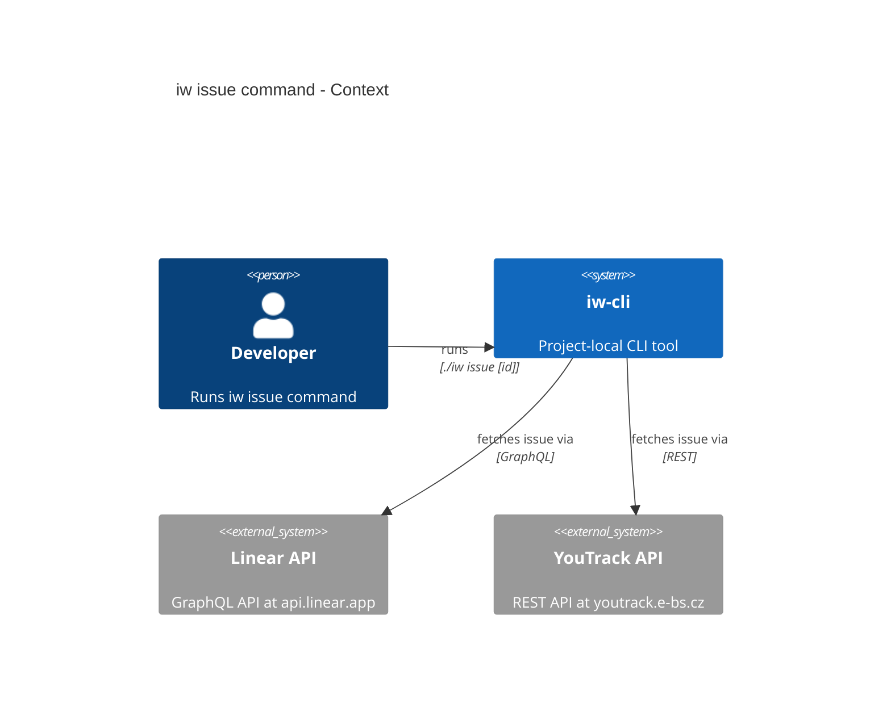
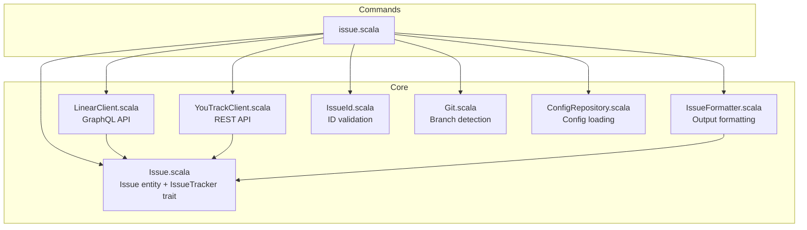
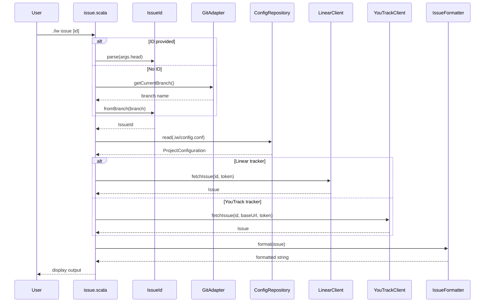
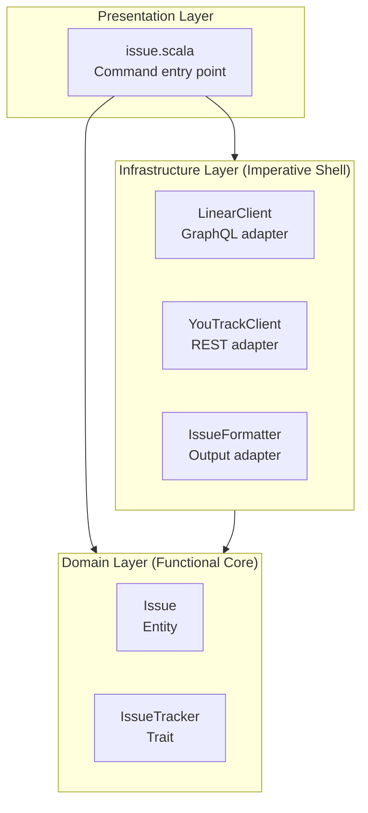

# Review Packet: Phase 7 - Fetch and display issue details

**Issue:** IWLE-72
**Phase:** 7 of 7
**Status:** Ready for Review

---

## 1. Goals

This phase implements the `./iw issue [issue-id]` command that fetches and displays issue details from configured issue trackers (Linear and YouTrack).

**Primary objectives:**
- Fetch issue details from Linear API using GraphQL
- Fetch issue details from YouTrack API using REST
- Display key fields: ID, title, status, assignee, description
- Infer issue ID from current git branch when not provided explicitly
- Clean formatting with proper Unicode rendering

---

## 2. Scenarios

- [ ] **Scenario 1**: User provides explicit issue ID - displays issue details
- [ ] **Scenario 2**: User omits issue ID on feature branch - infers from branch name
- [ ] **Scenario 3**: User provides invalid issue ID format - shows format error
- [ ] **Scenario 4**: Issue not found in tracker - shows "not found" error
- [ ] **Scenario 5**: API token not set - shows token error with hint
- [ ] **Scenario 6**: Config file missing - shows "run init first" error
- [ ] **Scenario 7**: Issue has no assignee - displays "None" for assignee
- [ ] **Scenario 8**: Issue has no description - omits description section

---

## 3. Entry Points

| File | Method/Class | Why Start Here |
|------|--------------|----------------|
| `.iw/commands/issue.scala` | `@main def issue` | **Command entry point** - orchestrates the full workflow |
| `.iw/core/LinearClient.scala` | `fetchIssue()` | **Linear API integration** - GraphQL query and response parsing |
| `.iw/core/YouTrackClient.scala` | `fetchIssue()` | **YouTrack API integration** - REST endpoint and customFields parsing |
| `.iw/core/Issue.scala` | `Issue`, `IssueTracker` | **Domain model** - entity and abstraction |
| `.iw/core/IssueFormatter.scala` | `format()` | **Output formatting** - Unicode border rendering |

---

## 4. Diagrams

### 4.1 Architecture Overview



### 4.2 Component Relationships



### 4.3 Fetch Issue Flow



### 4.4 Layer Diagram (FCIS)



---

## 5. Test Summary

| Test | Type | Verifies |
|------|------|----------|
| `IssueTest."Issue constructs with all fields populated"` | Unit | Issue entity with full data |
| `IssueTest."Issue constructs with no assignee"` | Unit | Issue entity with None assignee |
| `IssueTest."Issue constructs with no description"` | Unit | Issue entity with None description |
| `IssueTest."Issue constructs with no assignee and no description"` | Unit | Issue entity with both optional fields as None |
| `IssueFormatterTest."format displays all fields with Unicode border"` | Unit | Full output formatting with Unicode |
| `IssueFormatterTest."format displays issue with no assignee"` | Unit | "None" displayed for missing assignee |
| `IssueFormatterTest."format displays issue with no description"` | Unit | Description section omitted |
| `IssueFormatterTest."format handles multiline description"` | Unit | Description line wrapping |
| `LinearIssueTrackerTest."parseLinearResponse extracts all fields"` | Unit | GraphQL response parsing |
| `LinearIssueTrackerTest."parseLinearResponse handles missing assignee"` | Unit | Null assignee handling |
| `LinearIssueTrackerTest."parseLinearResponse handles missing description"` | Unit | Null description handling |
| `LinearIssueTrackerTest."parseLinearResponse returns error for issue not found"` | Unit | Null issue handling |
| `LinearIssueTrackerTest."buildLinearQuery creates valid GraphQL query"` | Unit | Query construction |
| `YouTrackIssueTrackerTest."parseYouTrackResponse extracts all fields"` | Unit | REST response parsing with customFields |
| `YouTrackIssueTrackerTest."parseYouTrackResponse handles missing assignee"` | Unit | Missing Assignee customField |
| `YouTrackIssueTrackerTest."parseYouTrackResponse handles missing State field"` | Unit | "Unknown" for missing State |
| `YouTrackIssueTrackerTest."buildYouTrackUrl creates correct REST URL"` | Unit | URL construction with fields param |
| `issue.bats."issue returns error for invalid issue ID format"` | E2E | Invalid format error message |
| `issue.bats."issue returns error when config file missing"` | E2E | Missing config error message |
| `issue.bats."issue returns error when LINEAR_API_TOKEN not set"` | E2E | Token error for Linear |
| `issue.bats."issue returns error when YOUTRACK_API_TOKEN not set"` | E2E | Token error for YouTrack |
| `issue.bats."issue infers issue ID from branch name"` | E2E | Branch inference works |
| `issue.bats."issue returns error when cannot infer from branch"` | E2E | Main branch error |

**Test counts:**
- Unit tests: 17
- E2E tests: 6
- Total: 23 tests

---

## 6. Files Changed

**10 files changed** for Phase 7

<details>
<summary>Full file list</summary>

**New Files:**
- `.iw/core/Issue.scala` (A) - Issue entity and IssueTracker trait
- `.iw/core/IssueFormatter.scala` (A) - Output formatting with Unicode
- `.iw/core/YouTrackClient.scala` (A) - YouTrack REST API client
- `.iw/core/test/IssueTest.scala` (A) - Issue entity tests
- `.iw/core/test/IssueFormatterTest.scala` (A) - Formatter tests
- `.iw/core/test/LinearIssueTrackerTest.scala` (A) - Linear API tests
- `.iw/core/test/YouTrackIssueTrackerTest.scala` (A) - YouTrack API tests
- `.iw/test/issue.bats` (A) - E2E tests

**Modified Files:**
- `.iw/core/LinearClient.scala` (M) - Added fetchIssue method
- `.iw/commands/issue.scala` (M) - Full implementation

</details>

---

## 7. Dependencies Added

```scala
//> using dep com.lihaoyi::upickle:4.0.2  // JSON parsing for API responses
```

Note: sttp was already a dependency from Phase 3 (LinearClient.validateToken).

---

## 8. Output Format

```
━━━━━━━━━━━━━━━━━━━━━━━━━━━━━━━━━━━━━━━━
IWLE-123: Add user login
━━━━━━━━━━━━━━━━━━━━━━━━━━━━━━━━━━━━━━━━

Status:     In Progress
Assignee:   Michal Příhoda

Description:
  Users need to be able to log in to the application
  using their email and password.
```

---

## 9. Reviewer Notes

1. **API Authentication patterns differ:**
   - Linear: Token in `Authorization` header directly (no "Bearer" prefix)
   - YouTrack: Token with `Bearer ` prefix

2. **YouTrack customFields parsing:**
   - State and Assignee are customFields, not top-level fields
   - Need to search through customFields array by name
   - Handle missing fields gracefully (return "Unknown" for status, None for assignee)

3. **Branch inference reuses existing code:**
   - `IssueId.fromBranch()` from Phase 4
   - `GitAdapter.getCurrentBranch()` from Phase 5
