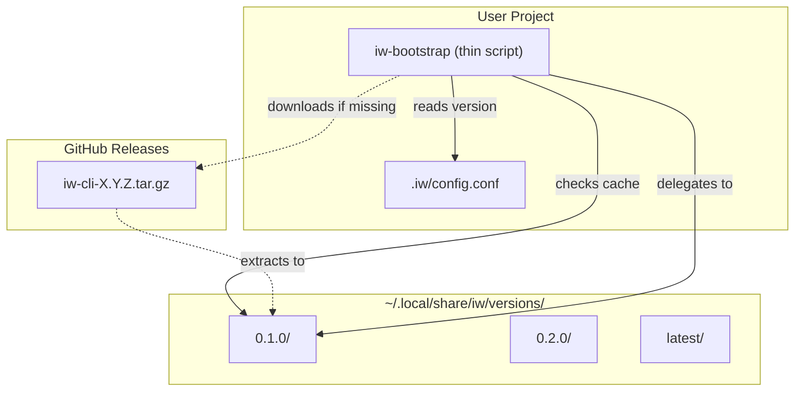
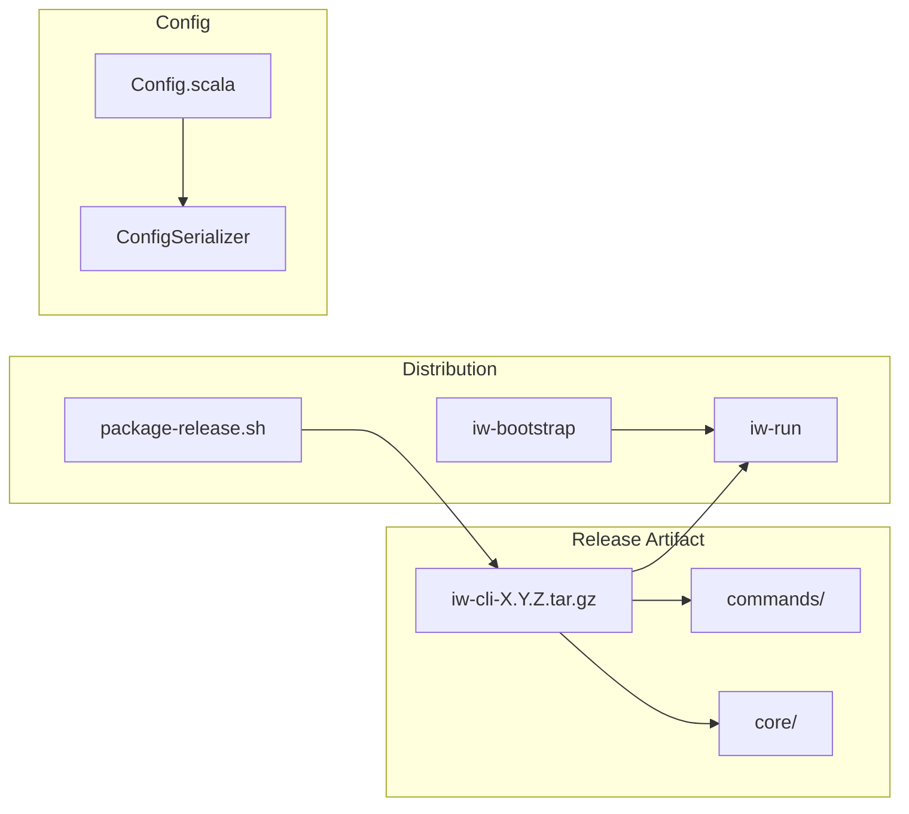
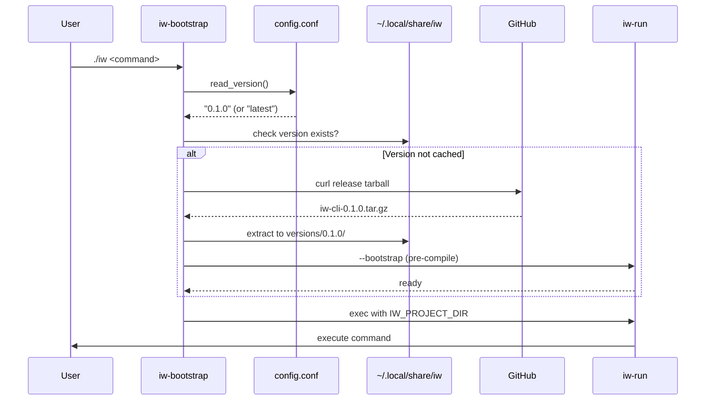
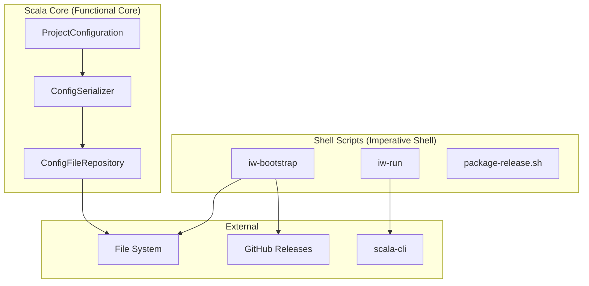

# Review Packet: Phase 8 - Distribution and Versioning

**Issue:** IWLE-72
**Phase:** 8 of 8
**Branch:** phase-08-distribution

## Goals

Enable iw-cli to be easily installed and used across multiple projects with:

1. **Version pinning per project** - Each project can specify which version of iw-cli to use
2. **Shared installation** - Multiple projects share a single installation in `~/.local/share/iw/versions/`
3. **Offline capability** - After first run, iw-cli works without network access
4. **Simple bootstrap** - Projects only need a thin shell script (~70 lines)

This follows the Mill bootstrap model where a thin script downloads and caches the actual tool.

## Scenarios

- [x] Fresh project can bootstrap iw-cli from GitHub releases
- [x] Version can be pinned in `.iw/config.conf` via `version = "X.Y.Z"`
- [x] Default version is "latest" when not specified
- [x] Multiple projects share cached installations
- [x] After bootstrap, commands work offline
- [x] Release tarball contains proper structure (iw-run, commands/, core/)
- [x] Existing E2E tests continue to pass (backward compatible)

## Entry Points

| File | Method/Class | Why Start Here |
|------|--------------|----------------|
| `iw-bootstrap` | `main()` | Entry point for projects using distributed iw-cli - shows download/cache flow |
| `iw-run` | `main()` | Launcher that executes commands - understands installation vs project directory |
| `iw-run` | `bootstrap()` | Pre-compilation logic for offline capability |
| `.iw/core/Config.scala` | `ProjectConfiguration` | Domain model showing new `version` field |
| `.iw/scripts/package-release.sh` | (script) | Shows how release artifacts are packaged |

## Diagrams

### Architecture Overview



### Component Relationships



### Bootstrap Flow Sequence



### Layer Diagram (FCIS)



## Test Summary

| Test | Type | Verifies |
|------|------|----------|
| `ConfigRepositoryTest."writes config with version field"` | Unit | Version field serializes to HOCON |
| `ConfigRepositoryTest."reads config with version field"` | Unit | Version field deserializes from HOCON |
| `ConfigRepositoryTest."defaults to 'latest' when version is missing"` | Unit | Backward compatibility for configs without version |
| `bootstrap.bats."iw-run lists commands from installation directory"` | Integration | iw-run works from extracted release |
| `bootstrap.bats."iw-run --bootstrap pre-compiles successfully"` | Integration | Offline preparation works |
| `bootstrap.bats."iw-run executes commands from installation directory"` | Integration | Commands execute with IW_PROJECT_DIR |
| `bootstrap.bats."release package contains required structure"` | Integration | Tarball has correct directory structure |
| `init.bats.*` (all 9 tests) | E2E | Backward compatibility - existing tests still pass |

## Files Changed

**10 files changed**, +450 insertions, +3 deletions

<details>
<summary>Full file list</summary>

| File | Status | Description |
|------|--------|-------------|
| `iw-bootstrap` | A | Thin bootstrap script (71 lines) for projects |
| `iw-run` | A | Main launcher (224 lines) with command execution |
| `.iw/scripts/package-release.sh` | A | Release packaging script |
| `.iw/test/bootstrap.bats` | A | Integration tests for distribution |
| `RELEASE.md` | A | Release process documentation |
| `.iw/core/Config.scala` | M | Added `version` field to `ProjectConfiguration` |
| `.iw/core/test/ConfigRepositoryTest.scala` | M | Added version field tests |
| `README.md` | M | Updated with installation instructions |
| `.gitignore` | M | Added `release/` directory |
| `project-management/issues/IWLE-72/phase-08-tasks.md` | M | Task checkboxes |

</details>

## Key Implementation Details

### Version Field in Config

```scala
case class ProjectConfiguration(
  trackerType: IssueTrackerType,
  team: String,
  projectName: String,
  version: Option[String] = Some("latest")  // NEW
)
```

- Defaults to `"latest"` for backward compatibility
- Serialized at root level in HOCON: `version = "0.1.0"`

### Bootstrap Script Design

- **~70 lines** of pure bash (no external dependencies beyond curl)
- Reads version from `.iw/config.conf`
- Downloads from `https://github.com/iterative-works/iw-cli/releases/download/v{version}/iw-cli-{version}.tar.gz`
- Extracts to `~/.local/share/iw/versions/{version}/`
- Passes `IW_PROJECT_DIR` environment variable to iw-run

### iw-run Design

- Contains all logic from original `iw` script
- Works from installation directory (not project directory)
- Uses `IW_PROJECT_DIR` to find project's `.iw/` folder
- Added `--bootstrap` command for pre-compilation

## Review Notes

1. **Backward Compatibility**: The existing `iw` script is unchanged - projects can continue using it directly for development
2. **No GitHub Actions Yet**: Release workflow is manual (documented in RELEASE.md) - can be automated later
3. **Pre-compilation**: Uses `scala-cli compile` with `--server=false` to ensure offline capability
4. **E2E Tests Unchanged**: Existing tests use the original `iw` script and continue to pass
