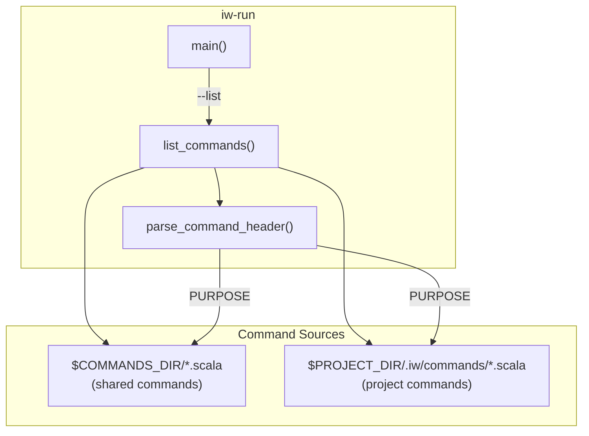
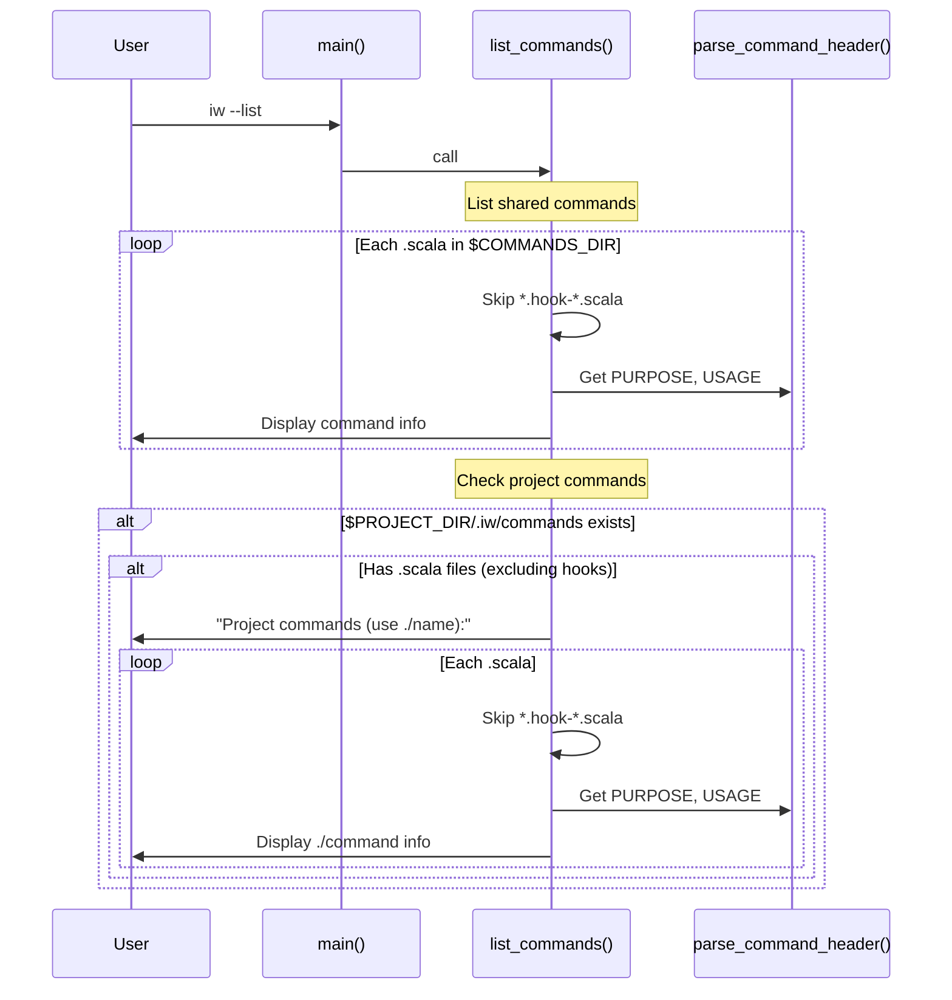
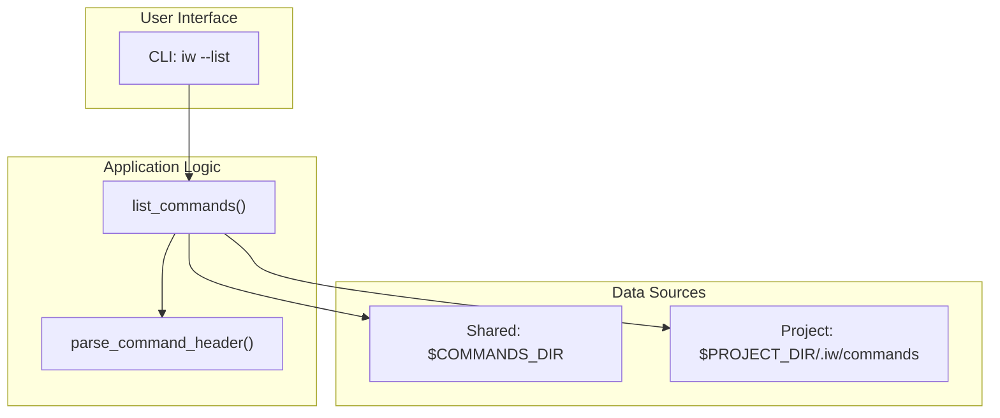

# Review Packet: Phase 1 - Project Command Discovery

**Issue:** IWLE-74
**Phase:** 1 of 3
**Branch:** `IWLE-74-phase-01`

## Goals

Enable users to discover both shared and project-specific commands when running `iw --list`. This establishes the foundation for the project command functionality that will be extended in subsequent phases.

**User Value:** Projects can add custom commands in `.iw/commands/` and users can see them listed alongside shared commands with a clear `./` prefix indicating project scope.

## Scenarios

- [x] Scenario 1: User runs `iw --list` in a project with custom commands → sees both shared commands and project commands in separate sections
- [x] Scenario 2: User runs `iw --list` in a project without `.iw/commands/` directory → sees only shared commands, no error
- [x] Scenario 3: User runs `iw --list` with empty `.iw/commands/` directory → sees only shared commands, no empty section
- [x] Scenario 4: Project command displays correct PURPOSE metadata in listing
- [x] Scenario 5: Project commands show `./` prefix to distinguish from shared commands

## Entry Points

| File | Function/Section | Why Start Here |
|------|------------------|----------------|
| `iw-run:55-119` | `list_commands()` | Main implementation - handles command discovery and output formatting |
| `iw-run:78-118` | Project commands block | New code - adds project command listing with `./` prefix |
| `.iw/test/project-commands-list.bats` | Test suite | Verifies all scenarios - 5 comprehensive E2E tests |

## Diagrams

### Component Relationships

### List Commands Flow

### Layer Diagram

## Test Summary

| Test | Type | Verifies |
|------|------|----------|
| `list commands shows project commands section when project commands exist` | E2E | Project section appears when commands present |
| `list commands shows ./prefix for project commands` | E2E | Commands listed with `./` namespace prefix |
| `list commands shows no project section when .iw/commands directory missing` | E2E | Graceful handling of missing directory |
| `list commands shows no project section when .iw/commands directory empty` | E2E | No empty section for empty directory |
| `project command PURPOSE metadata displayed correctly` | E2E | Metadata parsing works for project commands |

**Test Coverage:** 5 E2E tests covering all acceptance criteria

## Files Changed

**1 file modified, 42 insertions**

Full file list

- `iw-run` (M) - Added project command listing to `list_commands()` function
- `.iw/test/project-commands-list.bats` (A) - New test file with 5 E2E tests

## Implementation Notes

### Key Design Decisions

1. **Separate section for project commands**: Project commands appear under "Project commands (use ./name):" header to clearly distinguish from shared commands
2. **Hook file filtering**: Project commands also skip `*.hook-*.scala` files, consistent with shared command behavior
3. **Two-pass detection**: First pass checks if any project commands exist before printing the section header, avoiding empty sections
4. **Reuse existing parser**: `parse_command_header()` is reused for project commands, ensuring consistent metadata display

### Edge Cases Handled

- Missing `.iw/commands/` directory: Silently skipped, no error
- Empty `.iw/commands/` directory: No "Project commands" section shown
- Directory exists but only has hook files: No "Project commands" section shown
- Mixed content (commands + hooks): Only non-hook commands listed

## Review Checklist

- [ ] Code follows existing patterns in `iw-run`
- [ ] Hook files are properly filtered in project commands
- [ ] Empty directory case doesn't produce empty section
- [ ] Tests cover all acceptance criteria
- [ ] No regressions to existing shared command listing
