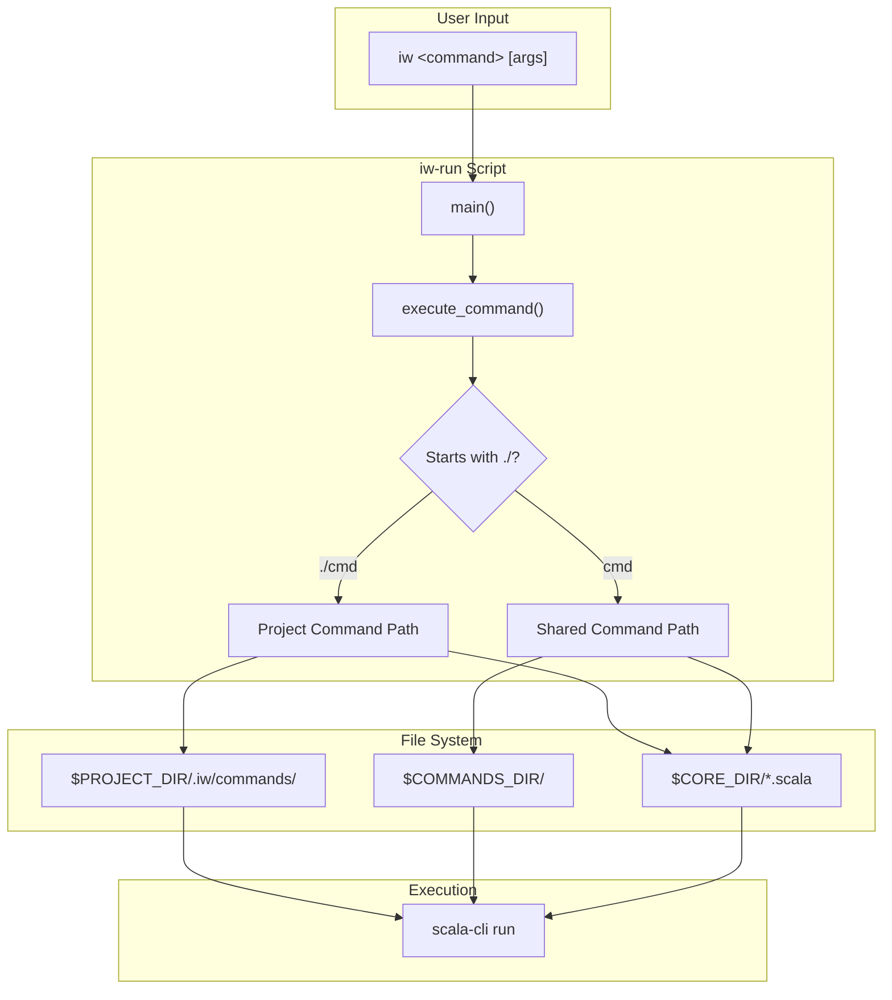
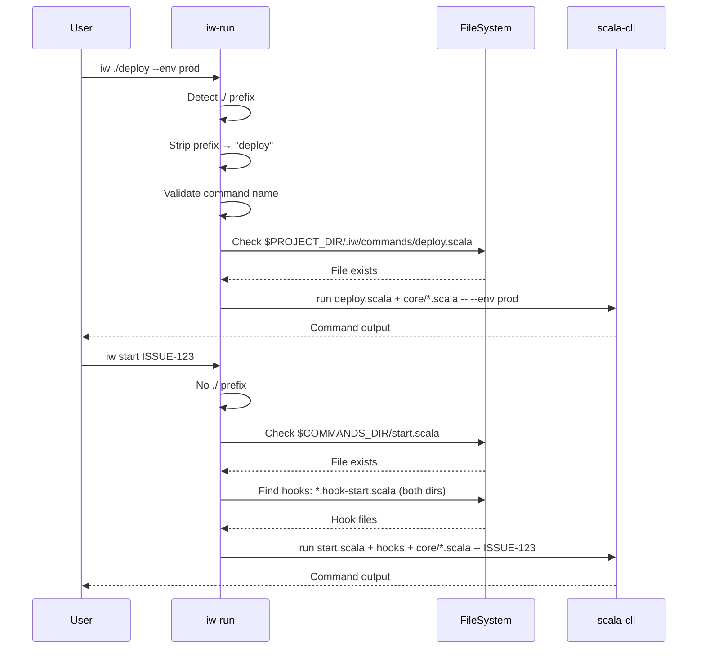
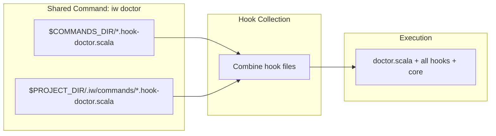
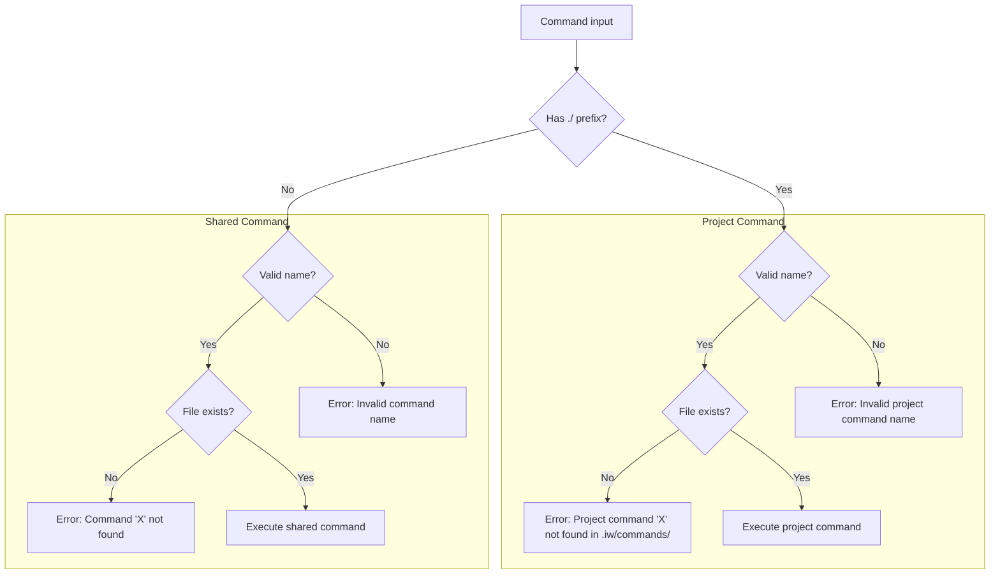

# Review Packet: Phase 2 - Execute project command with ./ prefix

## Goals

Enable users to execute project-specific commands using the explicit `./` prefix syntax. This phase delivers the core value of the feature - actually running custom project commands with access to the shared core library.

**User Story:**
> As a developer using iw-cli, I want to execute project-specific commands using the ./ prefix so that I can run custom workflows specific to my project.

## Scenarios

- [x] Execute project command with `./` prefix successfully
- [x] Project command receives all CLI arguments correctly
- [x] Project command can import and use core library classes (Config, etc.)
- [x] Project command not found shows clear error with namespace indication
- [x] Shared command without prefix executes normally (no change to existing behavior)
- [x] Shared command not found shows clear error (distinct from project command errors)
- [x] Same name in both namespaces - each invoked independently without conflict
- [x] Invalid project command syntax (e.g., `./`, `./invalid$name`) shows error
- [x] Shared commands discover hooks from BOTH shared and project directories

## Entry Points

| File | Method/Function | Why Start Here |
|------|-----------------|----------------|
| `iw-run:190` | `execute_command()` | Core routing logic - detects `./` prefix and routes to correct namespace |
| `iw-run:199-221` | Project command branch | Project command execution path - validation, file lookup, scala-cli invocation |
| `iw-run:223-277` | Shared command branch | Shared command execution with enhanced hook discovery from both directories |
| `.iw/test/project-commands-execute.bats` | Test setup | E2E test infrastructure - understand how commands are tested |

## Diagrams

### Architecture Overview



### Namespace Routing Flow



### Hook Discovery (Enhanced for Shared Commands)



### Error Handling Flow



## Test Summary

| Test | Type | Verifies |
|------|------|----------|
| `execute project command with ./ prefix successfully` | E2E | Basic project command execution |
| `project command receives CLI arguments correctly` | E2E | Argument passing through to project command |
| `project command can import core library (Config)` | E2E | Core library availability for project commands |
| `project command not found shows clear error` | E2E | Namespace-specific error messages |
| `shared command without prefix executes normally` | E2E | No regression to existing shared commands |
| `shared command not found shows clear error` | E2E | Distinct error message for shared namespace |
| `same name in both namespaces - each invoked correctly` | E2E | Namespace isolation |
| `invalid project command syntax ./ alone shows error` | E2E | Validation for empty command name |
| `invalid project command syntax with special chars shows error` | E2E | Validation for invalid characters |
| `shared command discovers hooks from project directory` | E2E | Enhanced hook discovery |

**Test Coverage:**
- 10 E2E tests covering all acceptance criteria
- 79 total non-bootstrap tests passing (no regressions)

## Files Changed

**Summary:** 2 code files changed, 1 test file added

| Status | File | Description |
|--------|------|-------------|
| M | `iw-run` | Updated `execute_command()` with namespace routing |
| A | `.iw/test/project-commands-execute.bats` | E2E tests for project command execution |

<details>
<summary>Full file list (from main...HEAD)</summary>

- `.iw/test/project-commands-execute.bats` (A) - E2E tests for Phase 2
- `.iw/test/project-commands-list.bats` (A) - E2E tests for Phase 1
- `iw-run` (M) - Main implementation
- `project-management/issues/IWLE-74/analysis.md` (A)
- `project-management/issues/IWLE-74/implementation-log.md` (A)
- `project-management/issues/IWLE-74/phase-01-context.md` (A)
- `project-management/issues/IWLE-74/phase-01-tasks.md` (A)
- `project-management/issues/IWLE-74/phase-02-context.md` (A)
- `project-management/issues/IWLE-74/phase-02-tasks.md` (A)
- `project-management/issues/IWLE-74/review-packet-phase-01.md` (A)
- `project-management/issues/IWLE-74/review-phase-01-2025-12-18-143301.md` (A)
- `project-management/issues/IWLE-74/review-phase-02-2025-12-18.md` (A)
- `project-management/issues/IWLE-74/tasks.md` (A)

</details>

## Key Implementation Details

### Namespace Routing Logic

```bash
# iw-run:199-222
if [[ "$cmd_name" == ./* ]]; then
    # Project command - strip ./ prefix
    is_project_cmd=true
    actual_name="${cmd_name:2}"
    # Validate and execute from $PROJECT_DIR/.iw/commands/
else
    # Shared command - use existing $COMMANDS_DIR
```

### Core Library Inclusion

Project commands include the core library for imports:
```bash
exec scala-cli run "$cmd_file" "$CORE_DIR"/*.scala -- "$@"
```

### Enhanced Hook Discovery

Shared commands now discover hooks from both directories:
```bash
# Find shared hooks
shared_hooks=$(find "$COMMANDS_DIR" -name "*.hook-${actual_name}.scala")
# Find project hooks
project_hooks=$(find "$PROJECT_DIR/.iw/commands" -name "*.hook-${actual_name}.scala")
# Combine and include all
```

## Code Review Notes

- **Code review file:** `review-phase-02-2025-12-18.md`
- **Iterations:** 1 (passed)
- **Critical issues:** None
- **Warnings:** 2 (minor, documented)
