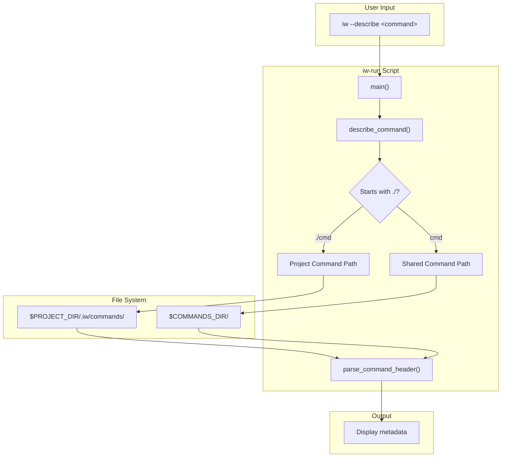
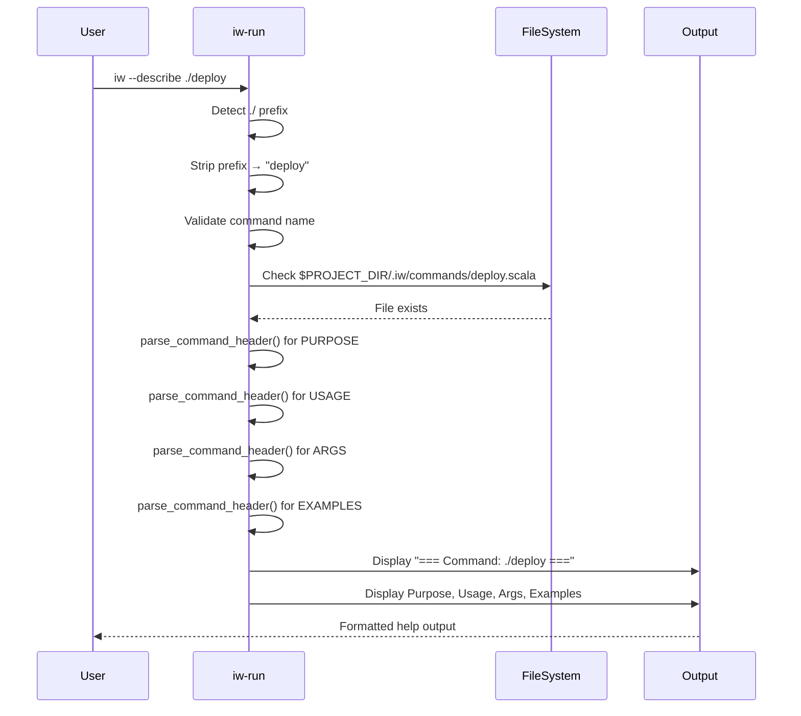
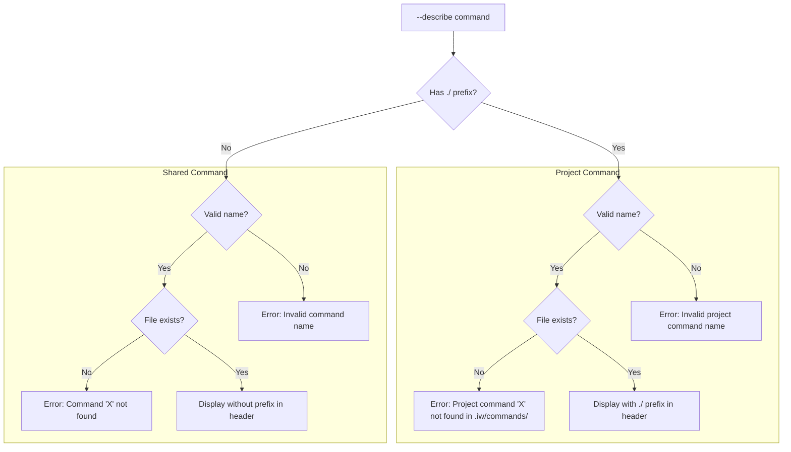
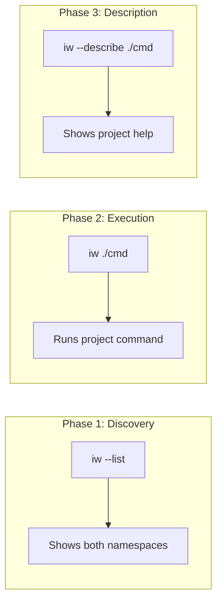

# Review Packet: Phase 3 - Describe project command with `./` prefix

## Goals

Enable users to get detailed help for project-specific commands using the `./` prefix syntax with `--describe`. This completes the feature by providing discoverability for project commands.

**User Story:**
> As a developer using iw-cli, I want to describe project-specific commands using the ./ prefix so that I can see detailed help for my project's commands.

## Scenarios

- [x] Describe project command shows full metadata (PURPOSE, USAGE, ARGS, EXAMPLES)
- [x] Describe project command with minimal metadata shows what's available
- [x] Describe project command not found shows clear error with namespace indication
- [x] Describe shared command (no prefix) works normally (no regression)
- [x] Invalid project command syntax (e.g., `./`, `./invalid$name`) shows error
- [x] Command names with dashes work correctly

## Entry Points

| File | Method/Function | Why Start Here |
|------|-----------------|----------------|
| `iw-run:122` | `describe_command()` | Core routing logic - detects `./` prefix and routes to correct namespace |
| `iw-run:125-148` | Project command branch | Project command description path - validation, file lookup, display |
| `iw-run:149-162` | Shared command branch | Shared command description (unchanged, for comparison) |
| `.iw/test/project-commands-describe.bats` | Test setup/scenarios | E2E test infrastructure - understand how describe is tested |

## Diagrams

### Architecture Overview



### Describe Command Flow



### Error Handling Flow



### Feature Complete Overview (All 3 Phases)



## Test Summary

| Test | Type | Verifies |
|------|------|----------|
| `describe project command shows full metadata` | E2E | All metadata fields (PURPOSE, USAGE, ARGS, EXAMPLES) displayed |
| `describe project command with minimal metadata` | E2E | Graceful handling of commands with only PURPOSE/USAGE |
| `describe project command not found shows clear error` | E2E | Namespace-specific error message |
| `describe shared command (no prefix) works normally` | E2E | No regression to existing shared command describe |
| `describe invalid project command syntax ./ alone` | E2E | Validation for empty command name |
| `describe invalid project command syntax with special chars` | E2E | Validation for invalid characters |
| `describe project command with dashes in name works` | E2E | Support for command names with dashes |

**Test Coverage:**
- 7 E2E tests covering all acceptance criteria
- 86 total non-bootstrap tests passing (no regressions)

## Files Changed

**Summary:** 2 code files changed, 1 test file added

| Status | File | Description |
|--------|------|-------------|
| M | `iw-run` | Updated `describe_command()` with namespace routing |
| A | `.iw/test/project-commands-describe.bats` | E2E tests for project command description |

<details>
<summary>Full file list (Phase 3 specific)</summary>

- `.iw/test/project-commands-describe.bats` (A) - E2E tests for Phase 3
- `iw-run` (M) - describe_command() updated
- `project-management/issues/IWLE-74/implementation-log.md` (M) - Phase 3 entry added
- `project-management/issues/IWLE-74/phase-03-context.md` (A) - Phase context
- `project-management/issues/IWLE-74/phase-03-tasks.md` (A) - Phase tasks
- `project-management/issues/IWLE-74/review-phase-03-2025-12-18.md` (A) - Code review

</details>

## Key Implementation Details

### Namespace Routing Logic (same pattern as execute_command)

```bash
# iw-run:125-148
if [[ "$cmd_name" == ./* ]]; then
    # Project command - strip ./ prefix
    local actual_name="${cmd_name:2}"
    # Validate
    if [[ -z "$actual_name" ]] || [[ ! "$actual_name" =~ ^[a-zA-Z0-9_-]+$ ]]; then
        echo "Error: Invalid project command name '$cmd_name'" >&2
        exit 1
    fi
    cmd_file="$PROJECT_DIR/.iw/commands/${actual_name}.scala"
    display_name="./$actual_name"
    # ... check file exists and display
```

### Output Header Shows Namespace

Project commands display with `./` prefix:
```
=== Command: ./deploy ===

Purpose:
Deploy application to production environment
...
```

Shared commands display without prefix:
```
=== Command: version ===

Purpose:
Show version information
...
```

## Code Review Notes

- **Code review file:** `review-phase-03-2025-12-18.md`
- **Iterations:** 1 (passed)
- **Critical issues:** None
- **Warnings:** 1 (acceptable - shell logic tested via E2E)

## Feature Completion

This is the **final phase** of IWLE-74. With Phase 3 complete, the full feature set is:

| Capability | Command | Status |
|------------|---------|--------|
| Discovery | `iw --list` | ✅ Phase 1 |
| Execution | `iw ./cmd` | ✅ Phase 2 |
| Description | `iw --describe ./cmd` | ✅ Phase 3 |

All phases use consistent `./` prefix for project commands, following the explicit namespacing design decision.
