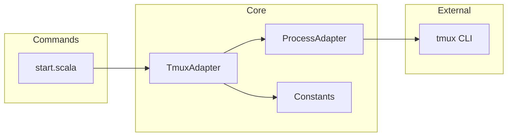
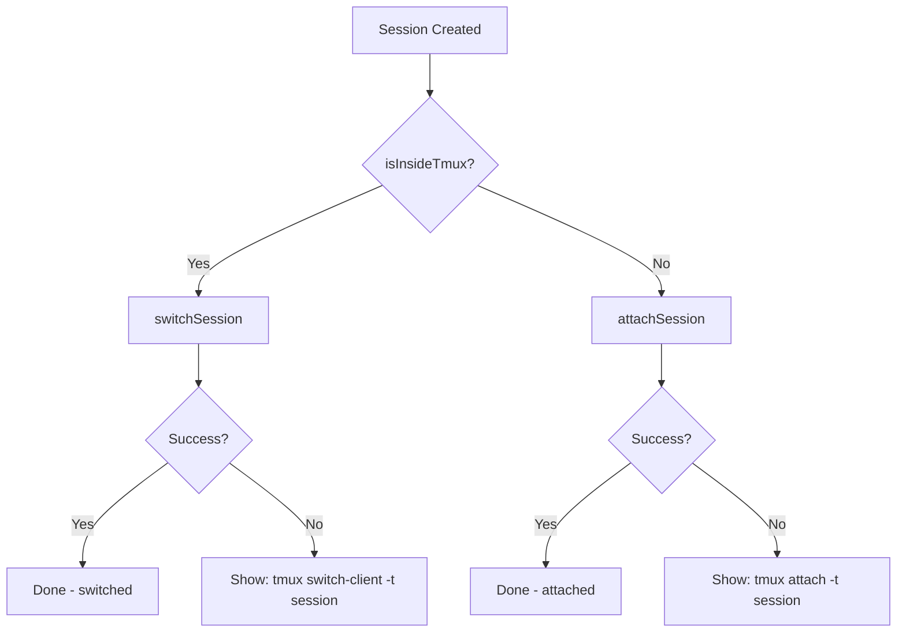
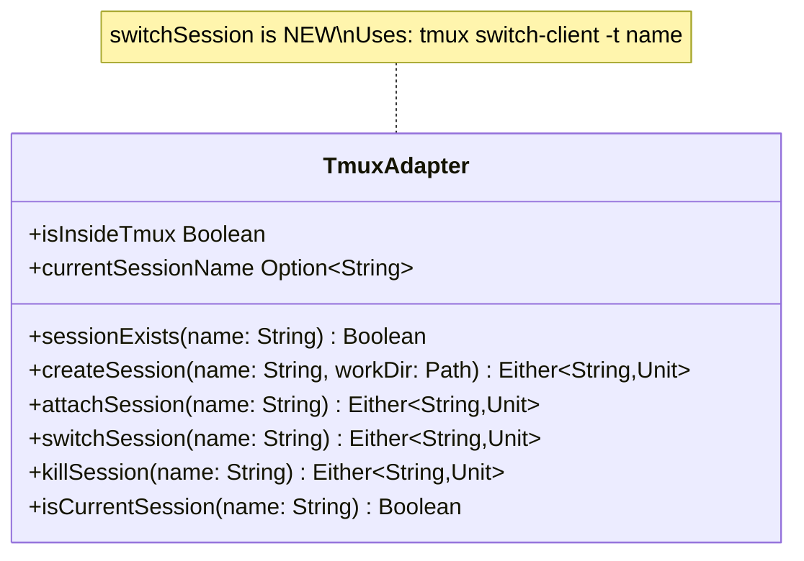

# Review Packet: Phase 1 - Core switch functionality for start.scala

**Issue:** IWLE-75
**Phase:** 1 of 2
**Branch:** IWLE-75-phase-01

## Goals

This phase delivers the core fix for the reported bug: when `iw start` is run inside an existing tmux session, it should automatically switch to the new session instead of failing when trying to attach.

**Value delivered:** Developers working in tmux can seamlessly start new worktree sessions without manual intervention.

**Key changes:**
- Add `TmuxAdapter.switchSession()` method using `tmux switch-client`
- Modify `start.scala` to detect tmux environment and choose switch vs attach
- Preserve existing behavior when running outside tmux

## Scenarios

- [ ] When inside tmux, `iw start ISSUE-123` switches to the new session automatically
- [ ] When outside tmux, `iw start ISSUE-123` attaches to the new session (existing behavior)
- [ ] When switch fails inside tmux, user sees actionable error with manual command
- [ ] When attach fails outside tmux, user sees actionable error with manual command (existing behavior)

## Entry Points

| File | Method/Class | Why Start Here |
|------|--------------|----------------|
| `.iw/commands/start.scala` | `createWorktreeForIssue()` lines 80-98 | Main change: conditional switch/attach logic |
| `.iw/core/Tmux.scala` | `TmuxAdapter.switchSession()` | New method: core switch functionality |
| `.iw/core/test/TmuxAdapterTest.scala` | Tests at lines 157-177 | New tests: verify switchSession behavior |

## Diagrams

### Component Relationships



### Session Join Flow (New Logic)



### TmuxAdapter Methods



## Test Summary

| Test | Type | Verifies |
|------|------|----------|
| `TmuxAdapter.switchSession returns Left when session doesn't exist` | Unit | switchSession fails gracefully for non-existent session |
| `TmuxAdapter.switchSession returns Left when not in tmux` | Unit | switchSession fails gracefully when called outside tmux |

**Total tests:** 2 new tests added
**All existing tests:** Continue to pass (verified: 157 tests total)

## Files Changed

**6 files changed**, +428 insertions, -9 deletions

<details>
<summary>Full file list</summary>

| File | Status | Changes |
|------|--------|---------|
| `.iw/commands/start.scala` | M | +19/-9 - Added conditional switch/attach logic |
| `.iw/core/Tmux.scala` | M | +6 - Added switchSession method |
| `.iw/core/test/TmuxAdapterTest.scala` | M | +21 - Added 2 tests for switchSession |
| `project-management/issues/IWLE-75/analysis.md` | A | +310 - Analysis document |
| `project-management/issues/IWLE-75/phase-01-tasks.md` | A | +29 - Phase 1 tasks |
| `project-management/issues/IWLE-75/tasks.md` | A | +43 - Task index |

</details>

## Key Code Changes

### 1. New `switchSession` method (Tmux.scala:25-29)

```scala
/** Switch to an existing tmux session (when already inside tmux) */
def switchSession(name: String): Either[String, Unit] =
  val result = ProcessAdapter.run(Seq("tmux", "switch-client", "-t", name))
  if result.exitCode == 0 then Right(())
  else Left(s"Failed to switch to session: ${result.stderr}")
```

Follows exact pattern of existing `attachSession` method.

### 2. Conditional session join (start.scala:80-98)

```scala
// Join session (switch if inside tmux, attach if outside)
if TmuxAdapter.isInsideTmux then
  Output.info(s"Switching to session '$sessionName'...")
  TmuxAdapter.switchSession(sessionName) match
    case Left(error) =>
      Output.error(error)
      Output.info(s"Session created. Switch manually with: tmux switch-client -t $sessionName")
      sys.exit(1)
    case Right(_) =>
      () // Successfully switched
else
  Output.info(s"Attaching to session...")
  TmuxAdapter.attachSession(sessionName) match
    // ... existing attach logic preserved
```

## Review Checklist

- [ ] `switchSession` follows the pattern of `attachSession`
- [ ] Error messages are actionable (include exact manual command)
- [ ] Existing behavior preserved when outside tmux
- [ ] Tests verify both failure scenarios
- [ ] No changes to `open.scala` (deferred to Phase 2)
