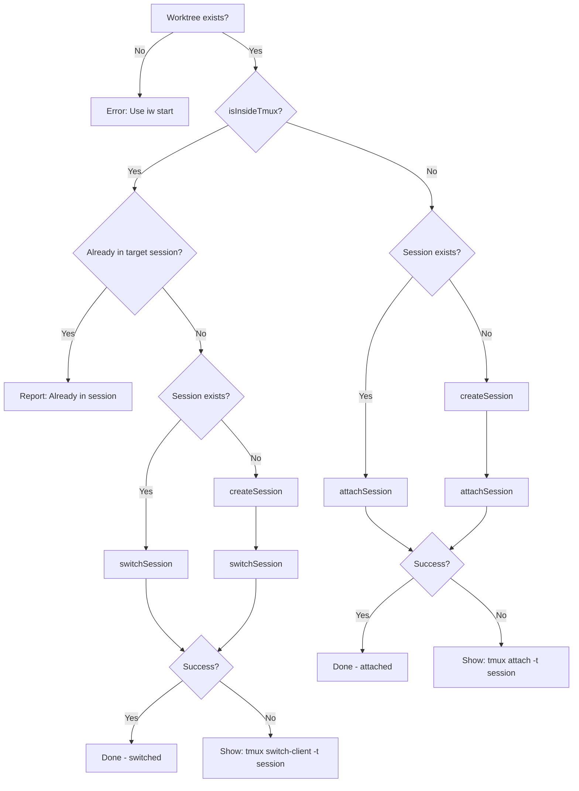

# Review Packet: Phase 2 - Apply switch pattern to open.scala

**Issue:** IWLE-75
**Phase:** 2 of 2
**Branch:** IWLE-75-phase-02

## Goals

Apply the same tmux session switching pattern from Phase 1 to `open.scala`, replacing the current "please detach" error with automatic session switching for consistent UX across both commands.

**Value delivered:** Developers can use `iw open` seamlessly when already inside a tmux session, matching the behavior of `iw start`.

## Scenarios

- [ ] When inside tmux and target session exists: switches to it
- [ ] When inside tmux and target session doesn't exist: creates and switches
- [ ] When inside tmux and already in target session: reports "Already in session" (unchanged)
- [ ] When outside tmux: attaches normally (existing behavior preserved)
- [ ] On switch failure: shows manual `tmux switch-client -t <session>` command

## Entry Points

| File | Method/Class | Why Start Here |
|------|--------------|----------------|
| `.iw/commands/open.scala` | `openWorktreeSession()` lines 45-104 | All session handling logic - switch vs attach |

## Diagrams

### Session Join Flow (Updated for open.scala)



## Test Summary

| Test | Type | Verifies |
|------|------|----------|
| (No new tests) | - | Phase 1 tests cover `switchSession` method |

**All existing tests:** 172 tests passing

## Files Changed

**1 file changed**

<details>
<summary>Full file list</summary>

| File | Status | Changes |
|------|--------|---------|
| `.iw/commands/open.scala` | M | Replaced "Detach first" error with automatic switch logic |

</details>

## Key Code Changes

### Before (lines 45-58) - Error on nested tmux

```scala
// Handle nested tmux scenario
if TmuxAdapter.isInsideTmux then
  TmuxAdapter.currentSessionName match
    case Some(current) if current == sessionName =>
      Output.info(s"Already in session '$sessionName'")
      sys.exit(0)
    case Some(current) =>
      Output.error(s"Already inside tmux session '$current'")
      Output.info("Detach first with: Ctrl+B, D")
      Output.info(s"Then run: ./iw open ${issueId.value}")
      sys.exit(1)
    case None =>
      Output.error("Inside tmux but cannot determine session name")
      sys.exit(1)
```

### After (lines 45-79) - Automatic switch

```scala
// Handle session joining (switch if inside tmux, attach if outside)
if TmuxAdapter.isInsideTmux then
  // Check if we're already in the target session
  TmuxAdapter.currentSessionName match
    case Some(current) if current == sessionName =>
      Output.info(s"Already in session '$sessionName'")
      sys.exit(0)
    case _ =>
      // Inside tmux but in different session - switch to target
      if TmuxAdapter.sessionExists(sessionName) then
        Output.info(s"Switching to session '$sessionName'...")
        TmuxAdapter.switchSession(sessionName) match
          case Left(error) =>
            Output.error(error)
            Output.info(s"Switch manually with: tmux switch-client -t $sessionName")
            sys.exit(1)
          case Right(_) =>
            () // Successfully switched
      else
        // Session doesn't exist, create it then switch
        ...
```

## Review Checklist

- [ ] Switch logic follows same pattern as `start.scala` (Phase 1)
- [ ] "Already in session" check preserved (lines 48-51)
- [ ] Outside-tmux attach behavior preserved (lines 80-104)
- [ ] Error messages are actionable (include manual commands)
- [ ] All 4 code paths covered: inside/outside tmux × session exists/doesn't exist
