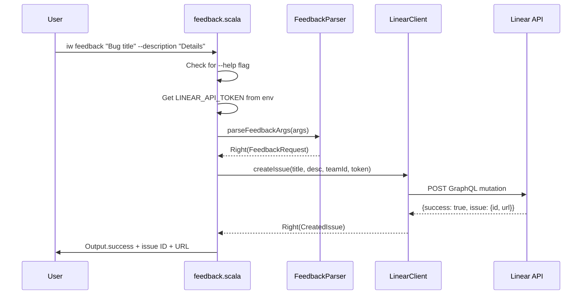
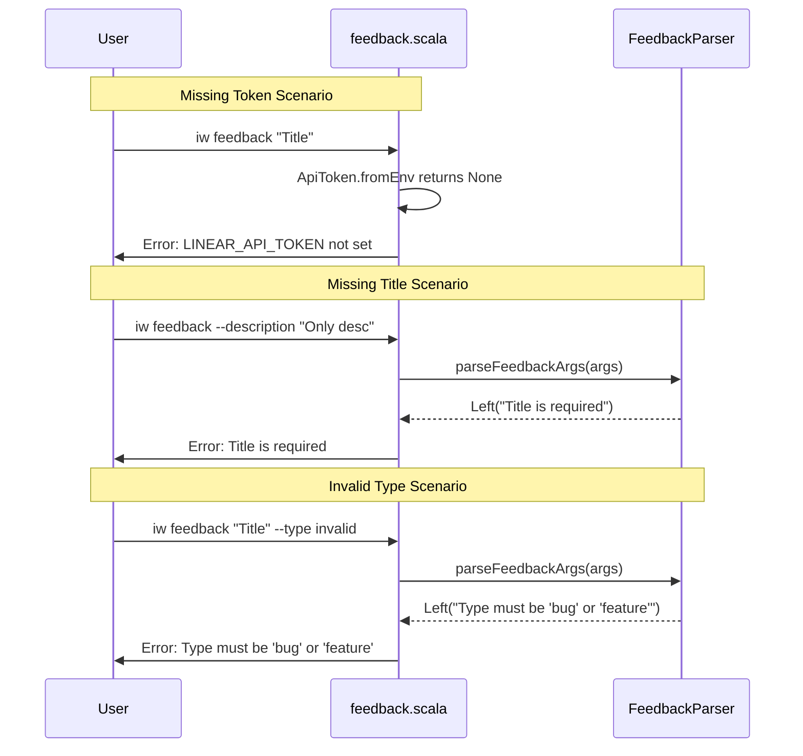

# Review Packet: Phase 2 - Feedback Command Implementation

**Issue:** IWLE-76
**Phase:** 2 of 2
**Branch:** IWLE-76-phase-02

## Goals

This phase implements the user-facing `feedback` command that allows users and agents to create Linear issues for iw-cli directly from any project. The command:

1. Provides a convenient way to report bugs or request features for iw-cli itself
2. Works for both human users and LLM agents (argument-based, not interactive)
3. Integrates with the LinearClient.createIssue infrastructure built in Phase 1
4. Includes comprehensive error handling and help text

## Scenarios

- [ ] User can submit feedback with just a title
- [ ] User can submit feedback with title and description using `--description` flag
- [ ] User can specify issue type (bug/feature) using `--type` flag
- [ ] Command shows clear error when LINEAR_API_TOKEN is not set
- [ ] Command shows clear error when title is missing
- [ ] Command shows clear error when invalid type is provided
- [ ] Command displays help text with `--help` flag
- [ ] Successful submission shows issue ID and URL

## Entry Points

| File | Method/Class | Why Start Here |
|------|--------------|----------------|
| `.iw/commands/feedback.scala` | `@main def feedback` | Command entry point - orchestrates argument parsing, API call, and output |
| `.iw/core/FeedbackParser.scala` | `parseFeedbackArgs` | Pure argument parsing logic - validates and transforms CLI args to FeedbackRequest |
| `.iw/core/FeedbackParser.scala` | `IssueType.fromString` | Type enum parsing - validates bug/feature type strings |
| `.iw/core/LinearClient.scala` | `createIssue` | API integration (from Phase 1) - sends mutation to Linear |

## Diagrams

### Component Diagram

```mermaid
graph TB
    subgraph "User Interface"
        CLI[iw feedback command]
    end

    subgraph "Application Layer"
        FB[feedback.scala<br/>@main entry point]
        FP[FeedbackParser<br/>Argument parsing]
    end

    subgraph "Core Layer"
        LC[LinearClient<br/>API integration]
        OUT[Output<br/>Console formatting]
        CONST[Constants<br/>IwCliTeamId]
    end

    subgraph "External"
        LINEAR[Linear GraphQL API]
    end

    CLI --> FB
    FB --> FP
    FB --> LC
    FB --> OUT
    FB --> CONST
    LC --> LINEAR
```

### Sequence Diagram: Successful Feedback Submission



### Sequence Diagram: Error Handling



### Layer Diagram (FCIS Pattern)

```mermaid
graph TB
    subgraph "Imperative Shell"
        FB[feedback.scala<br/>Side effects: env vars, API calls, console output]
    end

    subgraph "Functional Core"
        FP[FeedbackParser<br/>Pure parsing: args → Either[Error, Request]]
        IT[IssueType<br/>Pure enum: string → Either[Error, Type]]
    end

    FB --> FP
    FP --> IT
```

## Test Summary

| Test | Type | Verifies |
|------|------|----------|
| `parseFeedbackArgs_TitleOnly` | Unit | Multi-word title parsing, default type=feature |
| `parseFeedbackArgs_WithDescription` | Unit | --description flag parsing |
| `parseFeedbackArgs_WithType` | Unit | --type bug flag parsing |
| `parseFeedbackArgs_EmptyTitle` | Unit | Error when title missing |
| `parseFeedbackArgs_InvalidType` | Unit | Error for invalid type value |
| `feedback without LINEAR_API_TOKEN fails` | E2E | Token requirement enforcement |
| `feedback without title fails` | E2E | Title requirement enforcement |
| `feedback with invalid type fails` | E2E | Type validation |
| `feedback creates issue successfully` | E2E | Full flow with real API |
| `feedback with description creates issue` | E2E | Description flag with real API |
| `feedback with bug type creates issue` | E2E | Bug type with real API |
| `feedback --help shows usage` | E2E | Help text display |

**Test counts:**
- Unit tests: 5 tests (FeedbackParserTest.scala)
- E2E tests: 7 tests (feedback.bats)

## Files Changed

**4 files changed** (all new)

<details>
<summary>Full file list</summary>

- `.iw/commands/feedback.scala` (A) - Command entry point with @main function
- `.iw/core/FeedbackParser.scala` (A) - Argument parsing logic with IssueType enum
- `.iw/core/test/FeedbackParserTest.scala` (A) - Unit tests for parser
- `.iw/test/feedback.bats` (A) - E2E tests for full command

</details>

## Architecture Notes

### Separation of Concerns

The implementation follows FCIS (Functional Core, Imperative Shell):

- **Functional Core** (`FeedbackParser.scala`): Pure functions for argument parsing. Takes `Seq[String]`, returns `Either[String, FeedbackRequest]`. No side effects, fully testable.

- **Imperative Shell** (`feedback.scala`): Handles all side effects - reading environment variables, calling LinearClient (HTTP), writing to console. Orchestrates the flow.

### Error Handling

All errors use `Either[String, T]` pattern consistent with existing codebase:
- Parser returns `Left(error)` for validation failures
- LinearClient returns `Left(error)` for API failures
- Command exits with status 1 on any error

### Integration with Phase 1

Phase 2 uses these Phase 1 components:
- `LinearClient.createIssue(title, description, teamId, token)`
- `CreatedIssue(id: String, url: String)` case class
- `Constants.IwCliTeamId` for IWLE team
- `ApiToken.fromEnv()` for token extraction

## Review Checklist

- [ ] FeedbackParser is pure (no side effects)
- [ ] Error messages are clear and actionable
- [ ] Help text is comprehensive
- [ ] E2E tests cover both success and error paths
- [ ] Command follows existing iw-cli patterns
- [ ] No compilation warnings
